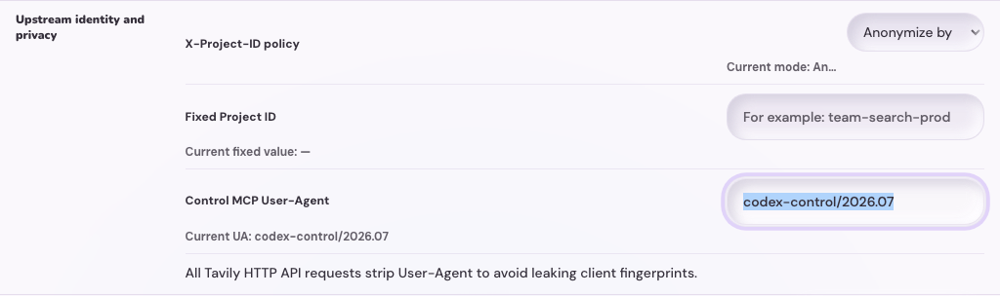
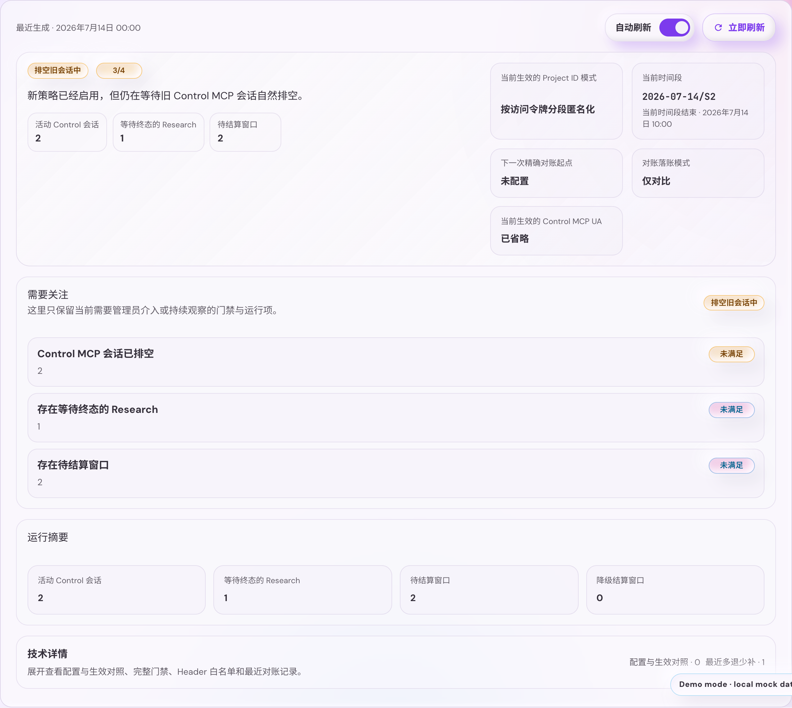
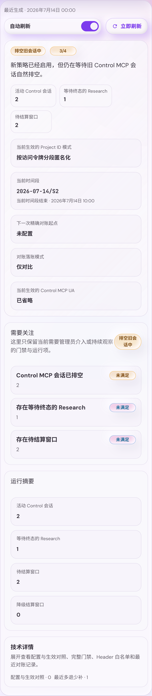

# 上游身份隐私与分段积分对账（#3s7ku）

> 当前有效规范以本文为准；实现覆盖与当前状态见 `./IMPLEMENTATION.md`，关键演进原因见 `./HISTORY.md`。

## 背景 / 问题陈述

- 现有 HTTP Header sanitizer 仍允许客户端 UA、浏览器指纹及部分未知 `x-*` 字段进入上游请求。
- 既有 HTTP 规格要求原样透传 `X-Project-ID`，固定 MCP UA 也直接暴露项目身份。
- Research 使用本地估算 credits；共享上游 Key 下无法仅靠账户累计 usage 精确归属单次请求。
- 管理员缺少 configured/effective/draining 状态面，无法确认隐私设置与精准对账是否真正生效。

## 目标 / 非目标

### Goals

- 所有 Tavily 出站调用统一通过严格 Header 白名单。
- `X-Project-ID` 支持 `passthrough / fixed / accessToken`，默认 `accessToken`。
- 使用稳定 token id 与业务时间段派生不可逆上游项目标识，并在 HA 节点间保持一致。
- 在完整窗口、API/MCP Rebalance 开关均启用且旧 Control session 排空后执行一次幂等多退少补。
- 提供只读“系统状态”管理页，明确展示配置、实际生效状态、门禁与结算队列。

### Non-goals

- 不支持 `project` 派生模式或按原始 `X-Project-ID` 查询调用量。
- 不允许管理员编辑 Header 白名单。
- 不承诺隐藏上游通过 Key、出口 IP 或流量时序得到的统计推断。
- 不强制中断既有 Control MCP session，不对不完整窗口结算，不执行第二轮自动复核。

## 范围（Scope）

### In scope

- System settings、HA secret 同步、出站 Header policy 与三种 Project ID 模式。
- 业务时间段、使用组合追踪、Research 等待、`/usage` 限速队列与 signed adjustment 账本。
- 账户和未绑定 Token 的小时、日、月额度读取与审计整合。
- 管理状态 API、系统设置控件、状态子路由、Storybook 与视觉证据。
- README 与高匿名代理文档更新；新增可复用 solution。

### Out of scope

- Tavily 生产端点验证。
- 原始项目名的用户侧统计或任意历史窗口回填。

## 需求（Requirements）

### MUST

- HTTP API 与 Rebalance MCP 转换请求只发送必要 HTTP 字段和 Hikari 注入鉴权，永不发送 UA。
- Control MCP 只发送 MCP 协议必要字段；配置 UA 为空时省略，否则使用管理员固定值。
- 未知 `x-*`、客户端 UA、IP/CDN、浏览器、Origin/Referer、Cookie 默认丢弃。
- `accessToken` 使用 `HMAC-SHA256(secret, "v1" + token_id + period_code)` 的完整 Base64URL-no-pad 输出。
- secret 为自动生成的 32 字节 HA 同步秘密，任何 API、日志与状态页均不得返回。
- 窗口按服务器业务时区划分为 `S1=00-11`、`S2=11-22`、`S3=22-24`。
- 精准对账仅在 `accessToken`、API/MCP Rebalance 均启用（新流量全量走 rebalance）、Control session 为 0 且进入下一完整窗口时启用。
- 结算只查询实际使用过的 `(token_id, upstream_key_id, period_code)`，每个 settlement key 只成功一次。
- adjustment 支持正负值，归属原业务窗口并参与对应额度、HA billing 同步和审计。

### SHOULD

- `/usage` 队列按 upstream Key 遵守每 10 分钟 10 次并解析 `Retry-After`。
- 无 Research 在窗口结束 10 分钟后结算；有 Research 在全部终态后 10 分钟结算，最长等待 24 小时后 degraded 结算。
- 状态页使用门禁清单和 `n/m`，同时覆盖 loading、empty、error 与 degraded 状态。

## 功能与行为规格（Functional/Behavior Spec）

### Header policy

- `HttpApi` 与 `RebalanceHttp` 白名单为 `accept`、`accept-encoding`、`content-type`；鉴权由 Hikari 独立注入。
- `ControlMcp` 白名单为 `accept`、`accept-encoding`、`cache-control`、`content-type`、`last-event-id`、
  `mcp-protocol-version`、`mcp-session-id`、`pragma`；不再允许通配 `x-mcp-*`、`x-tavily-*` 或 `tavily-*`。
- 三种模式只作用于 REST API 与 Rebalance HTTP：
  - `passthrough`: 客户端存在非空 `X-Project-ID` 时原样发送。
  - `fixed`: 发送管理员配置的合法非空固定值。
  - `accessToken`: 忽略客户端值，发送分段匿名值。
- `fixed` 最大 128 字节，UA 最大 256 字节；两者拒绝控制字符。

### 生效 epoch 与业务窗口

- Header 配置保存后立即影响新请求。
- 精准对账 eligibility 从保存后下一时间段边界计算；边界前请求不进入精准窗口。
- 任一门禁中途失效时，当前未结算窗口标记不完整且不结算；恢复后仍等待下一完整窗口。
- period code 使用服务器现有业务时区，格式 `YYYY-MM-DD/S1|S2|S3`。

### 对账与 adjustment

- 请求入口固定 period code；实际上游后记录所用 token、key、匿名 project id、业务 credits 与 Research 终态。
- 每个 token/period 汇总实际使用过的 key；以该匿名 project id 调用每把 key 的 `/usage`，只采用 `key.usage` 并跨 key 求和。
- `delta = upstream_usage - local_billed_credits`；正值补扣，负值返还，零值只记录 settled 状态。
- 唯一 settlement key 至少包含版本、token id、period code，重复任务与 HA 接管不得重复调整。
- S3 可在次日执行，但 adjustment 的 `attributed_at` 仍落在原业务日末，不能增加次日额度。

### 状态页

- canonical route 为 `/admin/system-settings/status`，系统设置下级标签为“系统状态”。
- 状态 API 区分 `configured / effective / pending / draining / active / degraded`。
- 页面展示 Header policy、UA 实际值、Project ID 模式、API/MCP Rebalance 与 Control session 排空门禁、下一 epoch、当前 period、
  Research 等待、usage 队列、最近 adjustment 和 degraded 原因。

## 接口契约（Interfaces & Contracts）

### 接口清单（Inventory）

| 接口（Name）          | 类型（Kind） | 范围（Scope） | 变更（Change） | 契约文档（Contract Doc）   | 负责人（Owner） | 使用方（Consumers） | 备注（Notes）            |
| --------------------- | ------------ | ------------- | -------------- | -------------------------- | --------------- | ------------------- | ------------------------ |
| System settings       | HTTP API     | internal      | Modify         | `./contracts/http-apis.md` | backend         | admin web           | 新增三项隐私设置         |
| System status         | HTTP API     | internal      | New            | `./contracts/http-apis.md` | backend         | admin web           | 只读、脱敏状态           |
| Reconciliation tables | SQLite/HA    | internal      | New            | `./contracts/db.md`        | backend         | quota/audit/HA      | signed adjustment 与队列 |

### 契约文档（按 Kind 拆分）

- `./contracts/http-apis.md`
- `./contracts/db.md`

## 验收标准（Acceptance Criteria）

- Given 任意客户端指纹与未知 `x-*` Header，When 请求通过三条出站路径，Then 上游只收到该路径白名单字段。
- Given UA 为空或非空，When Control MCP 新建连接，Then 分别省略 UA 或发送配置值；HTTP API 始终无 UA。
- Given token secret 轮换、HA 节点切换或相同窗口重试，When 计算匿名 ID，Then 输出稳定一致；不同 token/窗口输出不同。
- Given 任一门禁不是完整窗口持续满足，When 结算调度执行，Then 不产生 adjustment。
- Given 多 Key、Research 等待、Retry-After、重启或 HA 接管，When 窗口结算，Then 最终只产生一条幂等 signed adjustment。
- Given 退款或补扣，When 查询账户或未绑定 Token 的相关额度，Then 原业务窗口统计立即反映差额，S3 不增加次日额度。
- Given 状态 API 与页面，When secret、官方 key 或 token 存在，Then 任何响应与 UI 都不显示完整敏感值。

## 验收清单（Acceptance checklist）

- [x] 核心路径的长期行为已被明确描述。
- [x] 关键边界/错误场景已被覆盖。
- [x] 涉及的接口/契约已写清楚。
- [x] 相关验收条件已经可以用于实现与 review 对齐。

## 非功能性验收 / 质量门槛（Quality Gates）

### Testing

- Rust unit/integration: Header 白名单、派生稳定性、边界、eligibility、限速、Research、幂等与额度整合。
- Web: route、settings、status states、Storybook interaction。
- Full: `cargo test`、`cargo clippy -- -D warnings`、`bun test`、`bun run build`、`bun run build-storybook`。

### UI / Storybook

- 更新 System Settings stories；新增 system status 正常、pending、draining、degraded、empty、error gallery。
- 手动刷新 interaction 覆盖；桌面与移动 mock-only 视觉证据。

### Quality checks

- `cargo fmt --check`
- `cargo clippy -- -D warnings`
- `cd web && bun run build`

## Visual Evidence

- source: `ui_demo` (`http://127.0.0.1:55174`, mock-only browser demo)
- desktop system settings upstream identity section

  

- desktop system status page

  

- mobile system status page

  

## Related PRs

- None

## 风险 / 开放问题 / 假设（Risks, Open Questions, Assumptions）

- 风险：上游 `/usage` 为累计接口，精准归属依赖每个 token/period 使用唯一匿名 project id。
- 风险：SQLite 写竞争可能延迟结算；队列必须可恢复且不阻塞请求主路径。
- 假设：上游对缺失 `X-Project-ID` 与按该 Header 查询 `/usage` 均保持官方支持。

## 参考（References）

- `../34pgu-mcp-session-privacy-affinity-hardening/SPEC.md`
- `../m30lm-http-project-affinity-x-project-id/SPEC.md`
- `../cp8s9-upstream-agnostic-api-rebalance/SPEC.md`
- `../xm3dh-rebalance-mcp-gateway/SPEC.md`
