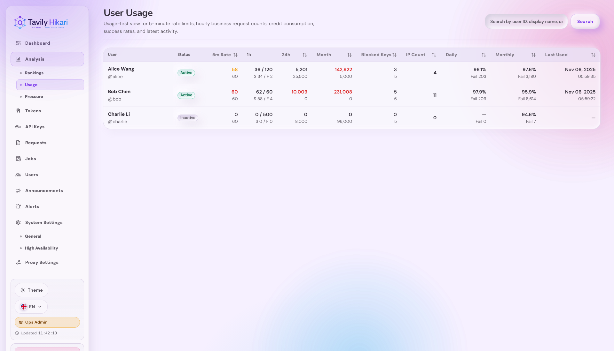
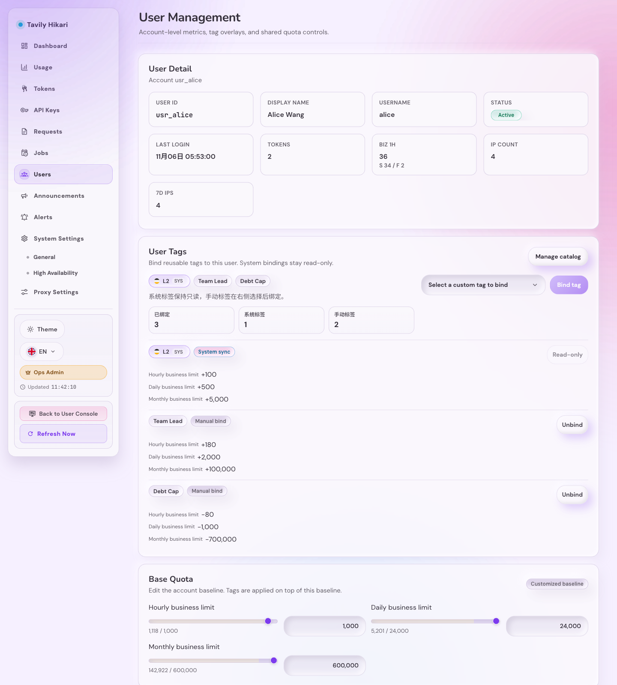
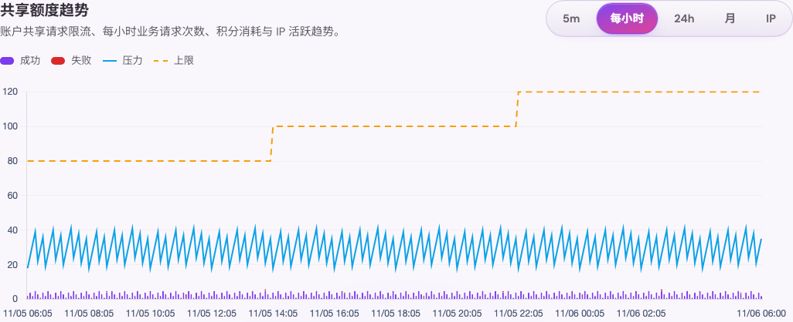

# Admin 用户共享额度趋势、业务调用 rolling 1h 与 Token 列表语义纠偏（#3zky1）

## 状态

- Status: 进行中（快车道）
- Created: 2026-04-23
- Last: 2026-05-23

## 背景

- 当前 `/admin/users/:id` 的 token 列表把账户共享额度直接展示在 token 行内，容易让运营误以为这些额度属于单个 token。
- 用户详情页缺少账户级共享额度的趋势视图，无法快速判断 5 分钟限流、1 小时额度、24 小时额度与月度额度的消耗节奏。
- 运营还缺少一套真实 user 维度的“业务调用 rolling 1h”口径，无法在 `/admin/users/usage` 与 `/admin/users/:id` 之间稳定核对某个账户最近 1 小时实际上游的业务调用压力。
- 现有临时 bucket 与即时扫日志不适合支撑最近 7 天 / 12 个月的稳定图表，因此需要持久化 rollup 读模型。
- 图表上限线若直接复用“当前额度”，会把账户历史额度变更抹平，无法正确解释历史 bucket 的真实阈值。
- `account_usage_rollup_buckets` 当前仅作为用户中心读模型，后续 dashboard 若要做固定分组分析，必须走独立读模型，不继续挤进这张表。

## Goals

- 在用户详情页新增独立的“共享额度趋势”面板，位于有效额度拆解之后、token 列表之前。
- 共享趋势使用 `5m / 每小时 / 24h / 月` 四个 tab，默认仍激活 `每小时`，并按需加载数据。
- 在 `/admin/analysis/usage` 新增只读 `业务 1h` 列，在 `/admin/users/:id` 新增同口径摘要；旧 `/admin/users/usage` 保留为兼容别名。
- 在用户详情共享趋势面板新增 `每小时` tab，展示 5 分钟 success/failure 堆叠柱、rolling 1h pressure 折线与历史小时额度 limit 虚线。
- 后端新增用户级共享额度趋势接口 `GET /api/users/:id/usage-series`，返回稳定 bucket 序列、当前 limit 与按 bucket 回放的历史 `limitValue`。
- 后端新增真实 `businessCalls1h` 真相源：以 `request_logs` 原始事件为基础，按 user 维度维护最近 25h 的单实例内存滑动窗口，并在启动时 bounded 回填最近 25h 符合条件的实际上游业务调用。
- `businessCalls1h` 继续作为用户级 pressure 真相源，复用到新的 `分析 -> 压力` 子模块的“当前 1h 用户 pressure 分布”，不再额外维护第二套用户压力统计口径。
- 新增持久化 rollup 表 `account_usage_rollup_buckets`，分别承载账户共享请求频率与业务 credits 聚合。
- 新增额度历史快照表，按时间回放请求限流与账户有效额度。
- 用户详情 token 列表只展示 token 自有字段，移除账户共享额度字段，新增 `累计请求` 与 `创建时间`。
- 管理员可在用户详情 token 列表区直接添加 token，并对非最后一个 token 执行删除；最后一个 token 的删除必须被前后端共同阻止。

## Non-goals

- 不修改 token 详情页自身的额度趋势接口或展示口径。
- 不修改 `/admin/users` 管理总览布局；集合页逻辑仍只覆盖原 users usage surface，但 canonical 入口迁到 `/admin/analysis/usage`。
- 不伪造不可考的更早额度历史；在无法确认的时间段内，limit 线显示缺口（`null`）而不是平铺当前值。
- 不伪造超出可追溯窗口的月度历史；历史缺口使用 `null` 呈现无数据。
- 不把 `quota_exhausted`、本地 pre-upstream block 或其他未实际上游的请求计入业务调用 success/failure。

## 范围

### In scope

- 后端持久化 rollup 表、bounded rebuild、retention cleanup 与用户详情趋势接口。
- 后端 user 维度业务调用 rolling 1h 内存窗口、25h bounded 回填、`/api/users` 与 `/api/users/:id` 新摘要字段，以及 `businessCalls1h` usage series。
- 用户详情页新增共享额度趋势卡片、tabs 懒加载缓存、limit 虚线与空/错/部分历史态。
- `/admin/analysis/usage` 新增只读 `业务 1h` 列与对应 mobile 卡片文案，并保留 `/admin/users/usage` alias。
- 用户详情 token 列表的字段调整、i18n 文案更新、Storybook 画布与截图证据。

### Out of scope

- 用户控制台与 token 详情页的额度语义。
- 历史 limit 回放、任意新的 token 级统计口径、额外图表库引入。

## 数据契约

### `account_usage_rollup_buckets`

- 主键：`(user_id, metric_kind, bucket_kind, bucket_start)`
- `metric_kind`:
  - `request_count`
  - `primary_success`
  - `secondary_success`
  - `business_credits`
- `bucket_kind`:
  - `five_minute`
  - `hour`
  - `day`
  - `month`
- `value` 为整数累计值。

### `request_rate_limit_snapshots`

- 字段：
  - `changed_at`
  - `limit_value`
- 用于按时间回放 5 分钟共享请求频率的历史上限。

### `account_quota_limit_snapshots`

- 字段：
  - `user_id`
  - `changed_at`
  - `hourly_any_limit`
  - `hourly_limit`
  - `daily_limit`
  - `monthly_limit`
- 保存用户当时的**有效额度**快照（base quota + 当前绑定标签影响后的结果）。

### 写入路径

- 每次已认证请求命中已绑定用户时，累加 `request_count/five_minute` 与 `request_count/day`。
- 每次成功请求按现有分类累加 `primary_success` 或 `secondary_success` 的 `five_minute/day`。
- 每次账户计费结算完成时，累加 `business_credits/hour|day|month`。
- 全局请求频率阈值变更时，追加 `request_rate_limit_snapshots`。
- 用户有效额度发生变化时（基础额度、标签绑定、标签定义或系统标签同步影响），追加 `account_quota_limit_snapshots`。

### 回填路径

- `business_credits/*`：从 `auth_token_logs` 中 `billing_subject=account:<user_id>` 的历史已计费记录精确回填。
- `request_count/five_minute`：仅回填最近 24 小时内能 best-effort 归属到账户的请求。
- rebuild 必须可重复执行且幂等：先清理覆盖窗口后重写，再更新 coverage meta。
- 历史 limit 快照的补种同样必须幂等：
  - 若没有历史快照，则以当前持久化状态推导一个 `known_since` 后写入当前有效额度；
  - 更早且不可证明的区间保持 `null`；
  - 请求频率若从未设置过自定义值，则默认值可视为长期有效。

### 保留策略

- `five_minute`：至少保留 48 小时
- `hour`：至少保留 8 天
- `day`：至少保留 400 天
- `month`：至少保留 24 个月

## API 契约

### `GET /api/users/:id/usage-series?series=<key>`

- admin-only。
- `series` 允许：
  - `rate5m`
  - `quota1h`
  - `quota24h`
  - `quotaMonth`
  - `businessCalls1h`
- 响应：
  - quota-like series:
    - `kind: "quotaLike"`
    - `limit: number`
    - `points: Array<{ bucketStart: number, value: number | null, limitValue: number | null }>`
  - `businessCalls1h`:
    - `kind: "businessCalls1h"`
    - `limit: 0`
    - `points: Array<{ bucketStart: number, bars: { success: number | null, failure: number | null }, pressure: number | null, limitValue: null }>`

### 统计窗口

- `rate5m`：最近 24 小时，5 分钟粒度，共 288 个 bucket；`limit` 为当前全局 `requestRate.limit`，`points[].limitValue` 使用 `changed_at < bucket_end` 的最新请求频率快照。
- `quota1h`：最近 72 小时，按小时 bucket；`limit` 为当前账户 `effectiveQuota.hourlyLimit`，`points[].limitValue` 使用 `changed_at < bucket_end` 的最新小时额度快照。
- `quota24h`：最近 7 天，按本地日 bucket；`limit` 为当前账户 `effectiveQuota.dailyLimit`，`points[].limitValue` 使用 `changed_at < bucket_end` 的最新日额度快照。
- `quotaMonth`：最近 12 个月，按 UTC 月 bucket；`limit` 为当前账户 `effectiveQuota.monthlyLimit`，`points[].limitValue` 使用 `changed_at < bucket_end` 的最新月额度快照。
- `businessCalls1h`：最近 24 小时、每 5 分钟采样，共 288 个点；`bars.success / bars.failure` 表示该 5 分钟自然桶内实际上游业务调用次数；`pressure` 表示该采样点向前 60 分钟窗口的总调用压力（`success + failure`）；`limitValue` 使用 `changed_at < point_end` 的最新小时额度快照回放，其中当前进行中的最后一个点按 `changed_at < now+1` 解析，避免提前泄露未来变更。
- 若 bucket 无聚合值：
  - `bucketStart >= coverage_start` => 返回 `0`
  - `bucketStart < coverage_start` => 返回 `null`
- 若 bucket 无可追溯的历史 limit 快照：
  - `limitValue` 返回 `null`
  - 前端应显示缺口而不是平铺当前上限

- “业务调用”语义固定为：`request_user_id IS NOT NULL`、`counts_business_quota = 1`、`upstream_operation IS NOT NULL`。
- `success` 仅指 `result_status = success`。
- `failure` 指已经实际上游、但 `result_status != success && result_status != quota_exhausted` 的业务调用。
- `quota_exhausted` 与所有 pre-upstream blocked 请求完全排除，不进入 success/failure，也不进入 pressure。
- 同一语义也作为 `分析 -> 压力` 子模块里用户分布图的用户侧真相源，避免同一“压力”概念在 admin 内部分叉。

### `GET /api/users/:id`

- `tokens[]` 仅返回 token 自有字段：
  - `tokenId`
  - `enabled`
  - `note`
  - `createdAt`
  - `lastUsedAt`
  - `totalRequests`
  - `dailySuccess`
  - `dailyFailure`
  - `monthlySuccess`
- 移除共享 `requestRate`、`hourlyAny*`、`quota*` 字段。

## UI 规格

- 用户详情页新增“共享额度趋势”区块，放在用户级额度/拆解之后、token 列表之前。
- tabs 文案简写：`5m / 每小时 / 24h / 月`，默认激活 `每小时`。
- `每小时` tab 继续绑定 `businessCalls1h`，不恢复独立 `quota1h` tab。
- 首屏只请求 `businessCalls1h`；其他 tab 首次点开才请求，二次切回复用缓存。
- 图表使用现有 `SegmentedTabs` + `chart.js`：
  - 主数据使用柱状图
  - limit 使用独立虚线 dataset，数据源为 `points[].limitValue`
- `每小时` 图表例外：
  - success / failure 使用同一根柱子的上下堆叠段
  - `pressure` 使用独立实线 dataset
  - `limit` 使用独立虚线 dataset，并与 `pressure` 用不同颜色区分
- 月度历史缺口显示为无数据提示，不伪装成 `0`。
- `/admin/analysis/usage` 保留 `5m 限流` 列，并只保留一个小时语义列，列表短标签显示为 `1h`；不再额外显示独立 `1h` 额度列。该列继续承载 `业务 1h` 语义，只展示 `totalCount` 与 `success/failure` 摘要，不提供排序；旧 `/admin/users/usage` 仍渲染同一列与同一页面逻辑。
- token 列表说明文案需明确：这里只展示 token 自己的状态、时间与成功统计，共享额度请看上方趋势图。
- token 列表右上角提供“添加令牌”按钮；每行操作区提供删除按钮，但当用户仅剩 1 个 token 时必须禁用删除。

## 验收标准

- 用户详情首屏默认展示 `每小时` 图，且只请求一次 `businessCalls1h`。
- 切换到 `5m / 24h / 月` 时才触发对应接口请求，二次切回不重复请求。
- 四张图都带明显的上限虚线；虚线必须按 bucket 对应的历史 `limitValue` 绘制，不能整图平铺当前 limit。
- token 列表不再出现任何账户共享额度字段或易误导文案。
- 用户详情 token 列表包含添加入口；多 token 时可删除指定 token，单 token 时删除按钮禁用且后端拒绝删除最后一个 token。
- `quotaMonth` 对不可追溯月份返回 `null`，前端显示缺口/提示，而不是伪造 `0`。
- `cargo test`、`cargo clippy -- -D warnings`、`cd web && bun test`、`cd web && bun run build`、`cd web && bun run build-storybook` 全部通过。
- Storybook 与真实 `/admin/users/:id` 浏览器复核完成，并在本 spec 记录最终视觉证据。

## Quality Gates

- `cargo test`
- `cargo clippy -- -D warnings`
- `cd web && bun test`
- `cd web && bun run build`
- `cd web && bun run build-storybook`

## Visual Evidence

### 共享额度趋势布局修复

- asset:
  `docs/specs/3zky1-admin-user-shared-usage-charts/assets/user-detail-shared-usage-layout-repaired.png`
- source_type: `storybook_canvas`
- story_id_or_title: `admin-pages--user-detail`
- target_program: `mock-only`
- capture_scope: `element`
- requested_viewport: `1600x1000`
- viewport_strategy: `devtools-emulate`
- submission_gate: `pending-owner-approval`
- evidence_note:
  共享额度趋势面板已去除内层卡片 surface，只保留外层 `surface panel` 作为唯一卡片边界；图表区高度与内侧留白已稳定，横轴末尾刻度改为末尾优先并让邻近刻度让位，避免右侧标签挤压。

### 共享额度趋势说明文案收敛

- asset: `docs/specs/3zky1-admin-user-shared-usage-charts/assets/user-detail-shared-usage-copy-refined.png`
- source_type: `storybook_canvas`
- story_id_or_title: `admin-pages--user-detail`
- target_program: `mock-only`
- capture_scope: `browser-viewport`
- requested_viewport: `none`
- viewport_strategy: `storybook-viewport`
- submission_gate: `approved`
- evidence_note: 共享额度趋势说明文案已收敛为业务指标摘要 `账户共享请求频率、业务额度消耗与 IP 活跃趋势。`；常驻面板不再展示历史缺口提示，也不再包含 `按时间窗口切换查看` 这类交互说明。

### 共享额度趋势时间窗口顺序

- asset: `docs/specs/3zky1-admin-user-shared-usage-charts/assets/user-detail-shared-usage-tabs-order.png`
- source_type: `storybook_canvas`
- story_id_or_title: `admin-pages--user-detail`
- target_program: `mock-only`
- capture_scope: `browser-viewport`
- requested_viewport: `1600x1000`
- viewport_strategy: `devtools-emulate`
- submission_gate: `approved`
- evidence_note: 共享额度趋势 tab 已按时间尺度调整为 `5m / 每小时 / 24h / 月`；默认激活为 `每小时`，说明文案明确区分 5m 请求频率与每小时/24h/月业务额度；空白裁剪脚本返回 `ambiguous_border`，因此按原图保留；证据绑定当前实现提交。

### 共享额度趋势（默认每小时）

- asset: `docs/specs/3zky1-admin-user-shared-usage-charts/assets/user-detail-shared-usage-default.png`
- source_type: `storybook_canvas`
- story_id_or_title: `admin-pages--user-detail`
- target_program: `mock-only`
- capture_scope: `element`
- requested_viewport: `none`
- viewport_strategy: `storybook-viewport`
- submission_gate: `approved`
- evidence_note: 当前 Storybook 用户详情默认落在 `每小时` tab，图中业务额度柱状值上方的虚线使用 `points[].limitValue` 按 bucket 回放历史小时额度快照，而不是整图平铺当前 limit；已检查空白裁剪，无需额外裁切；证据绑定当前实现提交。

### 共享额度趋势浮层明细

- asset: `docs/specs/3zky1-admin-user-shared-usage-charts/assets/user-detail-shared-usage-tooltip.png`
- source_type: `storybook_canvas`
- story_id_or_title: `admin-pages--user-detail-shared-usage-tooltip`
- target_program: `mock-only`
- capture_scope: `browser-viewport`
- requested_viewport: `none`
- viewport_strategy: `storybook-viewport`
- submission_gate: `pending-owner-approval`
- evidence_note: 该截图已按当前 Storybook 暗色主题重新覆盖旧图；为同时保留图表与浮层的相对位置关系，这里使用浏览器视口截图而不是元素裁切；悬浮或点击图表时会弹出浮层，显示对应 bucket 的详细时间、已用值与历史 limit 快照值，且阴影已收敛为深色投影，不再出现发白发亮的重阴影。

### 暗色主题浮层定位与阴影收敛

- asset: `docs/specs/3zky1-admin-user-shared-usage-charts/assets/user-detail-shared-usage-tooltip-position-fixed.png`
- source_type: `storybook_canvas`
- story_id_or_title: `admin-pages--user-detail-shared-usage-tooltip`
- target_program: `mock-only`
- capture_scope: `browser-viewport`
- requested_viewport: `none`
- viewport_strategy: `storybook-viewport`
- submission_gate: `pending-owner-approval`
- evidence_note: 该证据已按当前 Storybook 暗色主题重新截图并覆盖旧图：浮层继续保持无尾巴、贴近指针的定位，同时阴影改为深色投影，不再出现暗色主题下发白发亮的重阴影；空白裁剪脚本返回 `ambiguous_border`，因此按原图保留，证据绑定 `e9f9df93e4b7a0f0493769d2979c8bfa8707599f`。

### Token 列表语义纠偏

- asset: `docs/specs/3zky1-admin-user-shared-usage-charts/assets/user-detail-token-table.png`
- source_type: `storybook_canvas`
- story_id_or_title: `admin-pages--user-detail`
- target_program: `mock-only`
- capture_scope: `element`
- requested_viewport: `none`
- viewport_strategy: `storybook-viewport`
- submission_gate: `pending-owner-approval`
- evidence_note: Token 列表已移除账户共享额度列，替换为 token 自有的 `累计请求` 与 `创建时间`，并保留状态、最近使用、日成功/失败、月成功等字段；桌面表格列宽已收紧，Storybook proof 中对应 section 的 `scrollWidth <= clientWidth`，不再依赖横向滚动条；已检查空白裁剪，无需额外裁切。

### Token 管理控件

- asset: `docs/specs/3zky1-admin-user-shared-usage-charts/assets/user-detail-token-controls-demo.png`
- source_type: `demo_web_service`
- story_id_or_title: `http://127.0.0.1:55174/admin/users/usr_alice`
- target_program: `local-demo-web`
- capture_scope: `element`
- requested_viewport: `none`
- viewport_strategy: `playwright-element-screenshot`
- submission_gate: `approved`
- evidence_note: 用户详情 Token 区域的局部证据：可见 `Add token` 按钮，以及每个 token 行上的删除入口；截图仅裁切 token 面板本体，不包含整页导航或其他面板，证明该任务的主交互控件已落在 demo web 服务里。

### Token 删除二次确认

- asset: `docs/specs/3zky1-admin-user-shared-usage-charts/assets/user-detail-token-delete-confirm.png`
- source_type: `demo_web_service`
- story_id_or_title: `http://127.0.0.1:55174/admin/users/usr_alice`
- target_program: `local-demo-web`
- capture_scope: `element`
- requested_viewport: `none`
- viewport_strategy: `playwright-element-screenshot`
- submission_gate: `approved`
- evidence_note: 用户详情 Token 列表的删除按钮已接入二次确认流程；点击删除后先展示确认弹窗，管理员确认后才会调用删除接口。该证据来自 demo web 服务的真实用户详情页，仅裁切确认弹窗局部，未使用 Storybook 截图。

### 有效额度拆解表格无横向滚动

- asset: `docs/specs/3zky1-admin-user-shared-usage-charts/assets/user-detail-quota-breakdown-table.png`
- source_type: `storybook_canvas`
- story_id_or_title: `admin-pages--user-detail`
- target_program: `mock-only`
- capture_scope: `element`
- requested_viewport: `none`
- viewport_strategy: `storybook-viewport`
- submission_gate: `pending-owner-approval`
- evidence_note: Effective Quota Breakdown 桌面表格改为固定列宽且允许必要换行，现已在默认 Storybook 用户详情中完整收纳 6 列内容；Storybook play 同时校验该 section 的 `scrollWidth <= clientWidth`，避免再次出现底部横向滚动条。

### Token 列表紧凑卡片列表

- asset: `docs/specs/3zky1-admin-user-shared-usage-charts/assets/user-detail-token-table-compact.png`
- source_type: `storybook_canvas`
- story_id_or_title: `admin-pages--user-detail-compact`
- target_program: `mock-only`
- capture_scope: `element`
- requested_viewport: `390x844`
- viewport_strategy: `devtools-emulate`
- submission_gate: `pending-owner-approval`
- evidence_note: 在 `sm` / compact 布局下，Token 列表改为更自然的卡片列表：状态 badge 回到身份信息区，不再单独占一个大块；指标区仅保留最近使用、请求量与成功统计，阅读顺序更接近常规信息卡。Storybook compact story 已验证 `.admin-main-content.is-compact-layout` 激活、桌面表格隐藏，且卡片 `scrollWidth <= clientWidth`，避免移动端横向滚动。

### 有效额度拆解紧凑卡片列表

- asset: `docs/specs/3zky1-admin-user-shared-usage-charts/assets/user-detail-quota-breakdown-compact.png`
- source_type: `storybook_canvas`
- story_id_or_title: `admin-pages--user-detail-compact`
- target_program: `mock-only`
- capture_scope: `element`
- requested_viewport: `390x844`
- viewport_strategy: `devtools-emulate`
- submission_gate: `pending-owner-approval`
- evidence_note: 在 `sm` / compact 布局下，有效额度拆解表改为更高密度的卡片列表：effect badge 固定在头部，source 与三档额度分别收纳进紧凑信息块和指标卡；Storybook compact story 已验证桌面表格隐藏、卡片显示，且卡片容器不再产生横向滚动。

### 月度额度历史缺口

- asset: `docs/specs/3zky1-admin-user-shared-usage-charts/assets/user-detail-shared-usage-monthly-gap.png`
- source_type: `storybook_canvas`
- story_id_or_title: `admin-pages--user-detail-monthly-gap`
- target_program: `mock-only`
- capture_scope: `element`
- requested_viewport: `none`
- viewport_strategy: `storybook-viewport`
- submission_gate: `pending-owner-approval`
- evidence_note: 月度图保留不可追溯历史缺口，并在卡片内明确提示“空白不是 0”；缺口同时覆盖业务消耗与历史 limit 快照都不可考的 bucket，满足 `quotaMonth` 的 `null` bucket 呈现要求；已检查空白裁剪，无需额外裁切；证据绑定 `e9f9df93e4b7a0f0493769d2979c8bfa8707599f`。

### Users Usage 业务 1h 列

- asset: `docs/specs/3zky1-admin-user-shared-usage-charts/assets/users-usage-business-1h-column.png`
- source_type: `storybook_canvas`
- story_id_or_title: `admin-pages--users-usage`
- target_program: `mock-only`
- capture_scope: `browser-viewport`
- requested_viewport: `1920x1100`
- viewport_strategy: `devtools-emulate`
- submission_gate: `approved`
- PR: include
- evidence_note:
  `/admin/users/usage` 列表现只保留 `5m 限流` 与单一 `1h` 小时列，不再出现额外的独立 `1h` 额度列，也不再使用过长表头；该列继续承载 `业务 1h` 语义，按 `success + failure` 展示最近 rolling 1h 总量，并在次级文案中显示 `S/F` 拆分。Storybook surface 现直接复用真实 `UsersUsageScreen`，避免验收图与运行时列表口径漂移。空白裁剪脚本返回 `ambiguous_border`，因此按原图保留；证据绑定当前实现工作树。

### 用户详情业务 1h 摘要

- asset: `docs/specs/3zky1-admin-user-shared-usage-charts/assets/user-detail-business-calls-1h-tab.png`
- source_type: `storybook_canvas`
- story_id_or_title: `admin-pages--user-detail-business-calls-1-h`
- target_program: `mock-only`
- capture_scope: `browser-viewport`
- requested_viewport: `1440x1600`
- viewport_strategy: `devtools-emulate`
- submission_gate: `approved`
- PR: include
- evidence_note:
  用户详情身份摘要区已新增 `业务 1h` 指标卡，显示当前 rolling 1h `totalCount`，并在次级文案中展示 `S/F` 拆分；该 Storybook 详情 surface 也已补齐与 runtime 一致的摘要渲染。空白裁剪脚本返回 `ambiguous_border`，因此按原图保留；证据绑定当前实现提交。

### 用户详情业务 1h 图表

- asset: `docs/specs/3zky1-admin-user-shared-usage-charts/assets/user-detail-business-calls-1h-chart.png`
- source_type: `storybook_canvas`
- story_id_or_title: `admin-pages--user-detail-business-calls-1-h`
- target_program: `mock-only`
- capture_scope: `element`
- requested_viewport: `1440x1600`
- viewport_strategy: `playwright-element-screenshot`
- submission_gate: `approved`
- PR: include
- evidence_note:
  `Shared Usage Trends` 的 `每小时` 图表证据已按面板级范围刷新，用于确认 5 分钟 `success/failure` 柱段保持同桶堆叠，`pressure` 继续作为独立实线显示，而历史小时额度 `limit` 以虚线按快照回放：各稳定区间保持分段平线，仅在额度快照变更点跳阶；图例明确区分 `成功 / 失败 / 压力 / 上限`，与 `series=businessCalls1h` 的返回形状一致。该证据通过 Storybook mock surface 的 `playwright` element screenshot 生成，并固定在中文 locale 下验证 `每小时` tab 文案。

