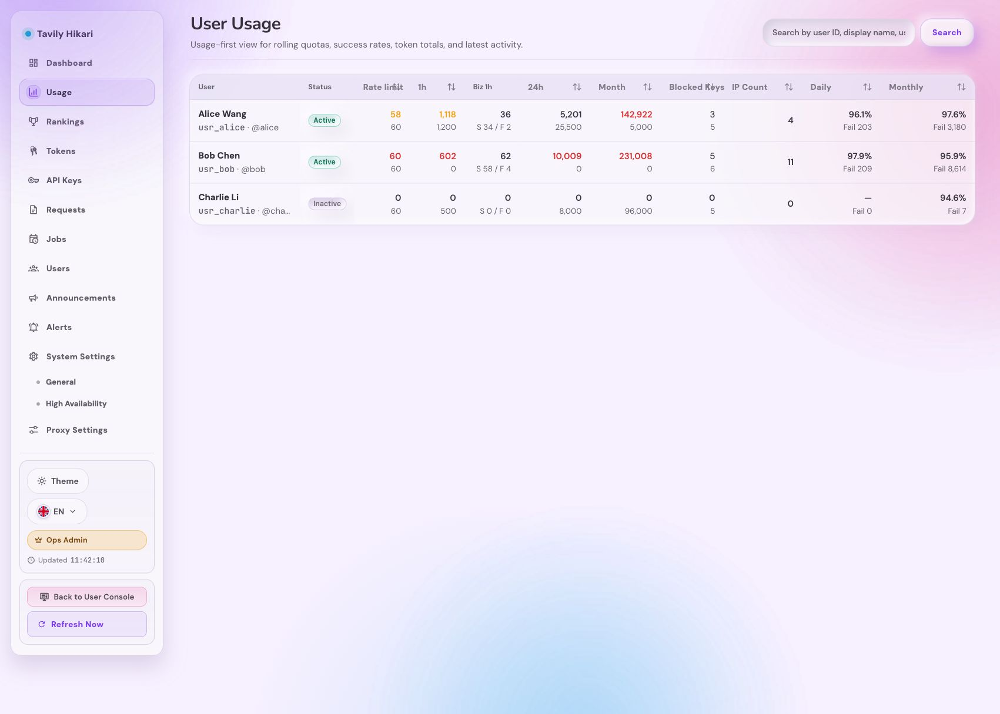
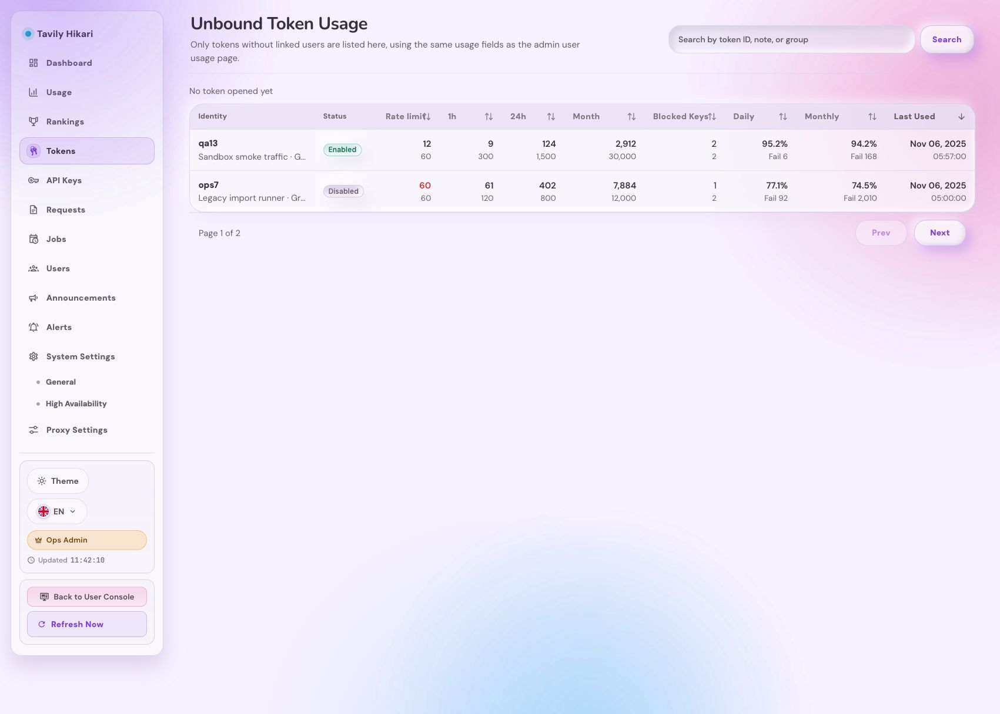
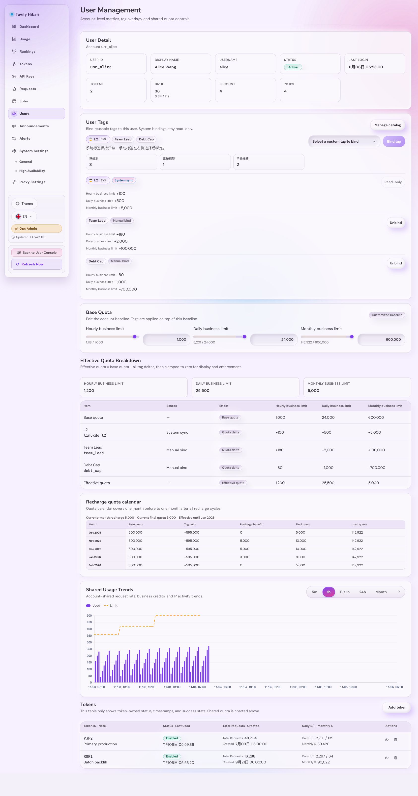

# Admin 路由 hook 顺序稳定化与 route screen 拆分（#4q9xk）

## 状态

- Status: 进行中（快车道）
- Created: 2026-06-22
- Last: 2026-06-22

## 背景 / 问题陈述

- `web/src/admin/AdminDashboardRuntime.tsx` 中存在多组 route-specific 早返回分支；当 `key`、`token`、`user-tags`、`user-tag-editor`、`user`、`user-usage`、`unbound-token-usage` 之间切换时，后面的共享 hooks 会被不同路由路径跳过，形成 hook 次序回归面。
- 线上 `/admin/users/usage` 已能稳定复现白屏并触发 React minified error `#300`，而 `/admin/dashboard` 与 `/admin/rankings` 仍可正常渲染，说明问题不是全局壳层崩溃，而是局部路由结构不稳定。
- 现有 Storybook / page proof 在 route JSX 上与生产实现存在重复编排，容易把同一类路由问题掩盖到两个不同的渲染树里。

## 目标 / 非目标

### Goals

- 把 `AdminDashboardRuntime` 收敛成稳定父壳：只保留稳定 hooks、共享状态、路由解析、导航回调、overlay wiring 与 route dispatch。
- 将高风险 route family 拆成独立 screen 组件，screen 只接收 plain props / callbacks，不再直接读取 `window.location`、`history` 或重新编排 fetch/hook 生命周期。
- 让 `user-usage`、`unbound-token-usage`、`user`、`token`、`key`、`user-tags`、`user-tag-editor` 这些路由在同一修复面内完成结构收敛。
- 为 route 切换建立本地 red-capable 回归回路，明确抓住 hook-order / 白屏 / 空 main / 标题缺失三类症状。
- 让 Storybook proof 复用同一套 screen contract 或同构 render helper，不再复制整棵 route JSX。

### Non-goals

- 不改任何 Rust handler、SQL 聚合、DTO、SSE 契约或 `/api/*` 返回结构。
- 不改 `/admin/*` URL 语义、排序口径、详情页业务功能口径或登录态契约。
- 不做新的视觉改版；仅允许等价渲染、结构拆分后的必要回归修正与可访问性收口。

## 范围（Scope）

### In scope

- `web/src/admin/AdminDashboardRuntime.tsx`
  - 将 route-specific JSX 从单体大函数拆成稳定 dispatch + screen 调用。
  - 保持共享 hooks 只在统一入口执行。
- `web/src/admin/screens/**`
  - 新增 route screen 组件与可复用 helper。
  - 统一 users usage / unbound token usage / detail/editor 族的 props contract。
- `web/src/admin/AdminDashboardRuntime.route-switch.test.tsx`
  - 新增 route-switch 回归。
- `web/test/happydom.ts`
  - 提供稳定本地回归所需的 base URL 解析。
- `web/src/admin/storySupport/AdminPagesStoryRuntime.tsx`
  - 复用同构 render helper / screen contract，降低 story 与 production 的 JSX 漂移。
- `web/src/admin/AdminPages.stories.test.ts`
  - 保持 Storybook proof 与新渲染契约一致。
- `docs/specs/README.md`
  - 增加本 spec 索引行与当前状态摘要。

### Out of scope

- 任何后端 API、数据库模式或权限逻辑变更。
- 新的视觉语言或重做页面信息架构。
- 新增对外 URL、重定向或 sitemap 变更。

## 路由家族

- `key`
- `token`
- `user-tags`
- `user-tag-editor`
- `user`
- `user-usage`
- `unbound-token-usage`

## 验收标准（Acceptance Criteria）

- Given 从模块页切换到 `user-usage` / `unbound-token-usage` / `user` / `token` / `key` / `user-tags` / `user-tag-editor`
  When 连续切换与返回
  Then 不会出现 React hook-order 报错，`main` 不会白屏，关键标题 / 表格壳层仍存在。

- Given 运行 `cd web && bun test src/admin/AdminDashboardRuntime.route-switch.test.tsx`
  When 作为回归守卫执行
  Then 该命令能稳定覆盖模块页 -> 专属路由页 -> 返回模块页的路径。

- Given `cd web && bun test`
  When 全量执行
  Then admin route proof 与相关 story proof 继续通过。

- Given `cd web && bun run build` 与 `cd web && bun run build-storybook`
  When 本地收口
  Then 生产构建与 Storybook 构建都通过。

- Given 线上 Chrome 会话
  When 打开 `/admin/dashboard -> /admin/users/usage`、`/admin/tokens` 或 `/admin/rankings -> /admin/tokens/leaderboard`，以及至少一个 detail 路由
  Then 不再复现白屏。

## 非功能性验收 / 质量门槛

- route-switch harness 必须是可单独运行的、本地 deterministic 的红绿回路。
- Storybook proof 必须复用同一 screen contract，不允许在 story 中再复制一整棵 production route JSX。
- UI-affecting 变更必须提供 Storybook / mock surface 视觉证据；真实线上截图只作为诊断补充。

## Visual Evidence

- source_type: `storybook_canvas`
  story_id_or_title: `admin-pages--users-usage`
  state: `UsersUsage` screen render
  target_program: `mock-only`
  capture_scope: `browser-viewport`
  requested_viewport: `1701x1216`
  viewport_strategy: `storybook-viewport`

  

- source_type: `storybook_canvas`
  story_id_or_title: `admin-pages--unbound-token-usage`
  state: `UnboundTokenUsage` screen render
  target_program: `mock-only`
  capture_scope: `browser-viewport`
  requested_viewport: `1701x1216`
  viewport_strategy: `storybook-viewport`

  

- source_type: `storybook_canvas`
  story_id_or_title: `admin-pages--user-detail-compact`
  state: `UserDetailCompact` detail-route representative render
  target_program: `mock-only`
  capture_scope: `browser-viewport`
  requested_viewport: `1686x3203`
  viewport_strategy: `storybook-viewport`

  

## 实现里程碑（Milestones）

- [x] M1: 确认 hook-order / 白屏根因与 route family 范围
- [x] M2: 建立 route-switch 回归回路
- [x] M3: 拆出 `web/src/admin/screens/**` 的 route screen contract
- [x] M4: 收敛 Storybook proof 到同一渲染契约
- [ ] M5: 完成 visual evidence、spec sync 与 merge-ready 收口

## 风险 / 开放问题 / 假设

- 风险：若仍在父组件中继续新增 route-specific hooks，下一轮 route family 扩展会重新引入 hook 次序漂移。
- 风险：Storybook proof 若继续与 production route JSX 复制，测试能绿但渲染树会再分叉。
- 假设：`AdminDashboardRuntime.route-switch.test.tsx` 的当前覆盖面足够代表本轮白屏回归风险。

## 变更记录（Change log）

- 2026-06-22: 创建聚焦 spec，冻结“hook 顺序稳定化 + route screen 拆分 + Storybook 同构复用”的范围。
- 2026-06-22: 先行落地 route-switch 回归与 users / unbound token usage screen 拆分，并准备继续补齐 visual evidence 与 spec sync。

## 参考（References）

- `web/src/admin/AdminDashboardRuntime.tsx`
- `web/src/admin/AdminDashboardRuntime.route-switch.test.tsx`
- `web/src/admin/screens/UsersUsageScreen.tsx`
- `web/src/admin/screens/UnboundTokenUsageScreen.tsx`
- `web/src/admin/screens/shared.tsx`
- `web/src/admin/storySupport/AdminPagesStoryRuntime.tsx`
- `docs/specs/m4n7x-admin-path-routing-modular-dashboard/SPEC.md`
- `docs/specs/frpeh-admin-desktop-sidebar-utility-relayout/SPEC.md`
- `docs/specs/3zky1-admin-user-shared-usage-charts/SPEC.md`
- `docs/specs/jh5hs-admin-unbound-token-usage/SPEC.md`
- `docs/specs/2pyzb-admin-overlay-host-route-persistence/SPEC.md`
