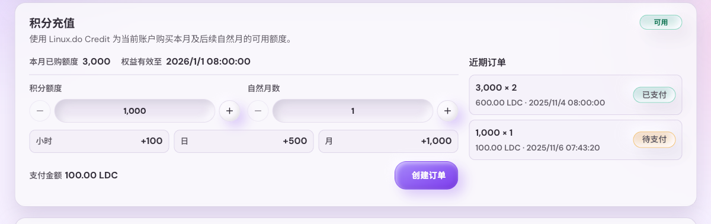
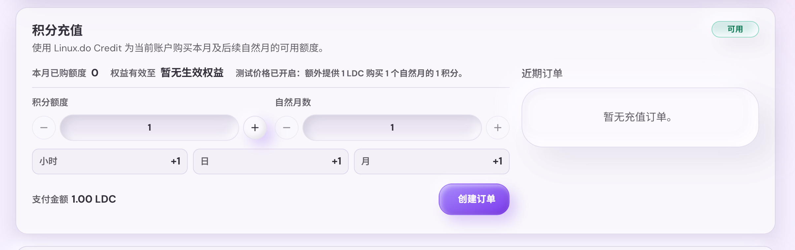
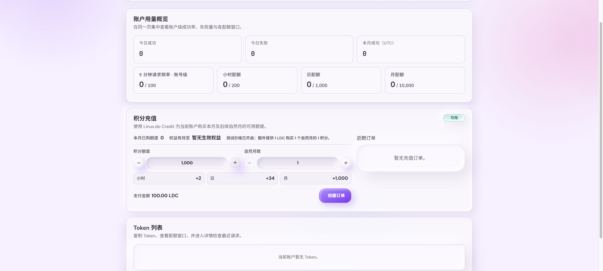
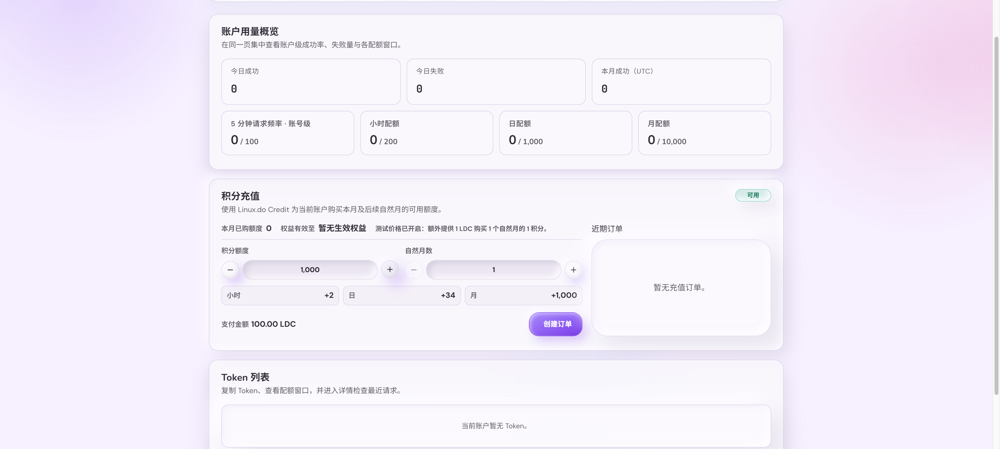

# Linux.do Credit 额度充值（#5vxmz）

> 当前有效规范以本文为准；实现覆盖与当前状态见 `./IMPLEMENTATION.md`，关键演进原因见 `./HISTORY.md`。

## 背景 / 问题陈述

- 新用户默认账户额度为 0，管理员可手动调基线额度，但用户无法自助购买可用额度。
- Linux.do Credit 已提供积分流转 API，可作为用户侧充值支付通道。
- 若不固定充值订单、权益展开、回调验签和自然月口径，月末购买与重复通知会产生长期歧义。

## 目标 / 非目标

### Goals

- 登录用户可在 `/console` 购买月度积分额度包。
- 使用 Linux.do Credit 官方 LDC 创建订单：`type=ldcpay`、Ed25519 签名、跳转至平台认证支付页。
- 支付成功后按服务器本地自然月展开权益，当前自然月从购买时所在月份到月底算第 1 个月。
- 已生效权益叠加到账户有效 `hourlyLimit`、`dailyLimit` 与 `monthlyLimit`，不改变 hourly-any 请求频率额度。
- 管理端用户详情只读展示充值订单与权益，便于审计。

### Non-goals

- 不接入易支付兼容 MD5 创建订单路径。
- 不实现退款后的自动扣回或争议处理。
- 不改变 Tavily business credits 的实际扣减口径。
- 不改变现有用户标签、基线额度、`block_all` 语义。

## 范围（Scope）

### In scope

- 后端充值配置、订单创建、通知验签、订单查询封装、DB schema 与幂等权益发放。
- 账户有效额度解析读取当前服务器本地自然月命中的充值权益。
- 用户控制台充值卡片、订单历史、状态刷新与 Storybook 状态覆盖。
- Admin 用户详情只读审计区域。

### Out of scope

- 自动退款、手动改订单状态、后台补单按钮。
- 多币种、多价格表、多支付渠道。
- 将充值额度拆分到 token 级别。

## 需求（Requirements）

### MUST

- 默认价格固定为 `100 LDC = 1000 积分额度 / 自然月`；测试价开关开启后，`1 LDC = 1 积分额度 / 自然月`。
- 用户选择的积分额度默认必须在 `1000..=20000` 内，且为 `1000` 的正整数倍；测试价开启后允许 `1..=20000` 且步进为 `1`。
- 用户选择的自然月数必须在 `1..=12` 内。
- 订单金额按 `credits / 1000 * months * 100` 计算，并以两位小数字符串提交给 Linux.do Credit。
- 订单创建必须持久化 `out_trade_no`、用户、购买额度、月数、金额、状态、创建/更新时间。
- 异步通知必须校验订单存在、金额一致、状态成功、签名有效，并对重复通知幂等返回 `success`。
- 权益必须按服务器本地自然月展开为 `(user_id, month_start, credits)`，同一订单同一月份只能发放一次。
- 当前月份的充值权益必须按 `1000 月积分 => +2 小时额度、+34 日额度、+1000 月额度` 派生并加入账户有效 quota，正数小额测试价至少显示并生效 `+1` 小时/日额度；`block_all` 生效时最终额度仍为 0。

### SHOULD

- 私钥配置应支持 32-byte seed（base64/base64url/hex）和 PKCS#8 DER/PEM，方便部署。
- 用户控制台应通过后端返回的价格与配置展示充值选项，避免前端重复实现支付规则。
- 订单查询接口用于用户返回控制台后的状态刷新，不作为发放权益的唯一依据。
- 管理端系统设置应提供充值总开关与“开放非管理员充值”调试开关；总开关关闭时用户控制台不展示充值入口，创建订单接口拒绝新订单；非管理员开关关闭时仅管理员请求可看到并创建充值订单。

### COULD

- 后续可支持平台公钥验签、退款回滚与管理员补偿单。

## 功能与行为规格（Functional/Behavior Spec）

### Core flows

- 用户打开 `/console`，在充值卡片中用只读步进器选择积分额度与自然月数，并看到本次购买会增加多少小时、日、月额度。
- 前端调用创建订单 API，后端生成唯一 `out_trade_no`，持久化 pending 订单，使用官方 LDC 签名调用 Linux.do Credit 创建订单。
- 后端返回支付 URL；浏览器跳转到 Linux.do Credit 完成认证支付。
- Linux.do Credit GET 通知本服务 notify endpoint；服务验签和校验金额后，将订单置为 paid，并按购买月份展开权益。
- 用户回到 `/console?payment=<out_trade_no>` 后，控制台刷新 dashboard 和订单列表，显示当前生效额度与订单状态。

### Edge cases / errors

- 充值未配置时，用户控制台显示不可用状态，创建订单返回 `503`。
- 非登录用户访问充值 API 返回 `401`。
- 金额、订单号或签名不匹配的通知返回 `400`，不发放权益。
- 重复成功通知不重复插入权益，仍返回 `success`。
- 过期月份权益不参与当前 quota 解析。

## 接口契约（Interfaces & Contracts）

### 接口清单（Inventory）

| 接口（Name）                                  | 类型（Kind） | 范围（Scope） | 变更（Change） | 契约文档（Contract Doc）   | 负责人（Owner） | 使用方（Consumers） | 备注（Notes）                      |
| --------------------------------------------- | ------------ | ------------- | -------------- | -------------------------- | --------------- | ------------------- | ---------------------------------- |
| `GET /api/user/recharge/config`               | HTTP         | external      | New            | `./contracts/http-apis.md` | backend         | user console        | 读取充值可用性、价格、当前权益摘要 |
| `GET /api/user/recharge/orders`               | HTTP         | external      | New            | `./contracts/http-apis.md` | backend         | user console        | 用户订单历史                       |
| `POST /api/user/recharge/orders`              | HTTP         | external      | New            | `./contracts/http-apis.md` | backend         | user console        | 创建 Linux.do Credit 支付订单      |
| `GET /api/user/recharge/orders/:out_trade_no` | HTTP         | external      | New            | `./contracts/http-apis.md` | backend         | user console        | 查询当前用户订单                   |
| `GET /api/linuxdo-credit/notify`              | HTTP         | external      | New            | `./contracts/http-apis.md` | backend         | Linux.do Credit     | 支付成功异步通知                   |
| `GET /api/users/:id`                          | HTTP         | external      | Modify         | `./contracts/http-apis.md` | backend         | admin UI            | 增加只读充值审计字段               |

### 契约文档（按 Kind 拆分）

- [`./contracts/http-apis.md`](./contracts/http-apis.md)
- [`./contracts/db.md`](./contracts/db.md)

## 验收标准（Acceptance Criteria）

- Given 充值配置完整且用户已登录
  When 用户购买 `2000` 积分额度、`3` 个自然月
  Then 订单金额为 `600.00` LDC，支付请求使用 `type=ldcpay` 和 Ed25519 签名。

- Given Linux.do Credit 发送同一成功通知两次
  When 服务处理通知
  Then 订单保持 paid，权益只发放一次，响应体均为 `success`。

- Given 用户本月有 `3000` 充值权益，且基线/标签有效小时/日/月额度为 `100/500/5000`
  When 读取 dashboard 或做 quota precheck
  Then 有效小时/日/月额度为 `106/602/8000`。

- Given 测试价开关已开启
  When 用户购买 `1` 积分额度、`1` 个自然月
  Then 订单金额为 `1.00` LDC，界面展示最小额度增量。

- Given 用户绑定 `block_all` 标签
  When 同一用户存在充值权益
  Then 有效额度仍为 `0`。

- Given 充值配置缺失
  When 用户打开控制台
  Then 充值卡片展示不可用状态，创建订单接口不应产生本地订单。

- Given 管理员关闭充值功能总开关
  When 普通用户打开控制台或调用创建订单接口
  Then 用户控制台不展示充值入口，创建订单接口返回不可用且不产生本地订单。

- Given 管理员关闭“开放非管理员充值”调试开关
  When 普通用户打开控制台
  Then 用户控制台不展示充值入口；管理员请求仍可看到并创建充值订单。

## 验收清单（Acceptance checklist）

- [x] 核心路径的长期行为已被明确描述。
- [x] 关键边界/错误场景已被覆盖。
- [x] 涉及的接口/契约已写清楚或明确为 `None`。
- [x] 相关验收条件已经可以用于实现与 review 对齐。

## 非功能性验收 / 质量门槛（Quality Gates）

### Testing

- Unit tests: LDC 签名字符串、私钥解析、通知验签、月份展开。
- Integration tests: 创建订单、重复通知幂等、权益叠加 quota、`block_all` 优先级。
- E2E tests (if applicable): 用户控制台充值交互可用。

### UI / Storybook (if applicable)

- Stories to add/update: `UserConsole` 充值默认、调档、处理中、成功、回调延迟、错误态。
- Docs pages / state galleries to add/update: 用户控制台充值状态 gallery。
- `play` / interaction coverage to add/update: stepper 调整与创建订单成功/失败路径。
- Visual regression baseline changes (if any): 充值卡片桌面与移动布局。

### Quality checks

- `cargo fmt`
- `cargo clippy -- -D warnings`
- `cargo test`
- `cd web && bun test`
- `cd web && bun run build`
- `cd web && bun run build-storybook`

## Visual Evidence

## Related PRs

- None

## 风险 / 开放问题 / 假设（Risks, Open Questions, Assumptions）

- 假设：创建订单使用官方 LDC Ed25519；异步通知因文档未提供平台公钥，按公共通知字段的排序签名和 `Client Secret` 校验。
- 风险：Linux.do Credit 平台若实际回调签名与文档公共段不一致，通知验签会拒绝，需要后续按平台实际字段调整。
- 假设：服务器本地时区为运行环境的 `chrono::Local`，当前部署为 `Asia/Shanghai`。

## 参考（References）

- [Linux.do Credit API 文档](https://credit.linux.do/docs/api)
- [`docs/specs/45squ-account-quota-user-console/SPEC.md`](../45squ-account-quota-user-console/SPEC.md)
- [`docs/specs/2mt2u-admin-user-tags-quota/SPEC.md`](../2mt2u-admin-user-tags-quota/SPEC.md)
