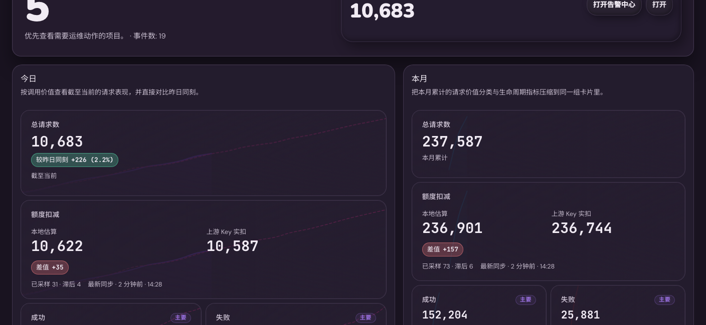

# Admin：仪表盘摘要区重构为“今日对比 + 本月 + 当前状态”（#6p4xz）

## 状态

- Status: 已完成（快车道）

## 背景

- 现有管理仪表盘摘要区把请求窗口指标和站点当前状态混在同一组等权卡片里，阅读优先级不清晰。
- 运营视角更关心“今天相对昨天发生了什么”，其次才是“本月累计如何”，实时站点状态则应作为独立快照展示。
- 当前后端只提供全站即时摘要，缺少可直接驱动“今日对比昨日 / 本月累计”的聚合接口。

## Goals

- 将 `/admin/dashboard` 顶部摘要区重构为三个信息块：`今日`、`本月`、`站点当前状态`。
- `今日` 块展示 `总请求数 / 成功 / 错误 / 上游 Key 耗尽`，并为每项显示“较昨日同一时刻”的增减信息。
- `本月` 块展示同一组月累计指标，其中 `上游 Key 耗尽` 按窗口内新耗尽的唯一上游 Key 数展示，不混入昨日比较文案。
- `站点当前状态` 块继续显示实时快照：`剩余可用`、`活跃密钥`、`隔离中`、`已耗尽`。
- 新增管理端期间摘要接口，保持现有 `/api/summary` 向后兼容。

## Non-goals

- 不为 `活跃密钥 / 隔离中 / 剩余可用` 增加历史快照能力。
- 不调整趋势图、风险看板、行动中心的数据口径。
- 不修改用户控制台或公开首页的统计展示。

## 接口契约

- 保持 `GET /api/summary` 不变，继续返回当前全站快照。
- 新增 `GET /api/summary/windows`，仅管理员可访问，固定返回：
  - `today`: `{ total_requests, success_count, error_count, quota_exhausted_count, upstream_exhausted_key_count }`
  - `yesterday`: `{ total_requests, success_count, error_count, quota_exhausted_count, upstream_exhausted_key_count }`，表示“昨日截至当前同一时刻”的对比窗口
  - `month`: `{ total_requests, success_count, error_count, quota_exhausted_count, upstream_exhausted_key_count }`
- `today_start` 使用服务端本地自然日 0 点；`today_end` 使用服务端当前时刻加一秒作为半开区间上界。
- `yesterday_start` 使用服务端本地昨日 0 点；`yesterday_end` 使用 `yesterday_start + (today_end - today_start)` 推导，必须满足 `yesterday_end - yesterday_start = today_end - today_start`。
- `yesterday` 窗口是半开区间 `[yesterday_start, yesterday_end)`；昨日同一日内进度之后的数据不得进入今日对比，即使这些数据落在截止时间所在的同一分钟内也必须排除。非 DST 切换日下，该边界等价于昨日同一时刻加一秒。
- `quota_exhausted_count` 继续保持请求级语义，供请求日志、详情页和旧消费者使用；dashboard 的耗尽卡改读 `upstream_exhausted_key_count`。
- 时间窗口边界统一使用服务端本地时区的日/月 bucket 口径，而不是浏览器时区。

## 交互与展示约束

- 摘要区使用三块式层级布局：桌面端突出 `今日` 主块，`本月` 与 `站点当前状态` 作为次级块；窄屏按 `今日 -> 本月 -> 站点当前状态` 顺序纵向堆叠。
- `今日` 指标卡必须同时显示当前值；其中 `总请求数` 与 `上游 Key 耗尽` 的“较昨日同刻”继续按数量差值展示，`成功` 与 `错误` 改为分别比较成功率/错误率的百分点差。
- `成功` 的“较昨日同刻”按 `success_count / total_requests` 计算；`错误` 按 `error_count / total_requests` 计算；两者都保留当前次数主值与 `今日占比` 副标题。
- `今日` 的 `上游 Key 耗尽` 卡固定使用总览专用标签，并显示 `今日新增` 副标题；其主值与比较值都基于窗口内由系统自动标记 exhausted 的唯一 `key_id` 数量，而不是请求次数。
- 摘要卡背景图必须展示对应完整周期的轴：`今日` 背景图覆盖服务端本地自然日完整 24 小时，`本月` 背景图覆盖服务端本地自然月完整日历周期；当前时刻之后的当前周期槽位必须保留为空（`null`），不得填 `0`、不得裁掉未来空间。
- 背景图的“完整周期显示轴”与主值 / delta 的“same-time 窗口”是两回事：主值和 delta 仍按现有截至当前时刻的统计窗口计算，背景图只负责把完整周期铺满。
- 当 `yesterday.total_requests = 0` 且 `today.total_requests > 0` 时，`成功` / `错误` 不伪造百分点差，改为“昨日无基线”兜底文案并使用中性态。
- 当 `today.total_requests = 0` 且 `yesterday.total_requests = 0` 时，`成功` / `错误` 的“较昨日同刻”显示 `0.0` 个百分点（或对应语言单位）并保持 `flat`。
- `本月` 指标卡只显示月累计值与本月占比，不显示昨日比较；其中 `上游 Key 耗尽` 卡固定显示 `本月新增`，不再显示请求占比副标题。
- `站点当前状态` 必须明确标注为当前快照，避免与期间窗口混淆。
- 桌面端 `今日` 明细指标固定为两列三行网格；当 `今日` 主块与 `本月` 主块同高时，明细网格必须吃掉剩余高度并平均分配给三行卡片，避免主块底部出现无意义空白。
- `今日` 明细小卡的占比 / 新增说明与“较昨日同刻”badge 必须作为同一组右下角信息展示；`主要` / `次要` marker 保持轻量半透明，避免遮挡背景趋势线。
- 任意断点下都不得引入横向滚动。

## 验收标准

- `/admin/dashboard` 顶部摘要区不再是 7 张等权卡片，而是 `今日`、`本月`、`站点当前状态` 三块结构。
- `今日` 的 `成功` 与 `错误` 指标能正确显示相对昨日同一时刻的成功率/错误率百分点差，而不是原始次数差。
- `今日` 的 `总请求数` 与 `上游 Key 耗尽` 继续显示较昨日同一时刻的数量差与方向，其中 `上游 Key 耗尽` 只统计系统自动标记 exhausted 的唯一上游 Key 数。
- `本月` 的四项指标能正确显示月累计值；其中 `上游 Key 耗尽` 使用 `本月新增` 副标题且不再显示请求占比。
- `站点当前状态` 保留 `剩余可用`、`活跃密钥`、`隔离中`、`已耗尽` 四项实时快照。
- `GET /api/summary/windows` 在空窗口时返回 `0`，`today` 与 `yesterday` 的窗口时长相同，昨日对比窗口不会混入昨日同刻之后的数据，包括截止分钟内的后续请求；本月窗口累计到当前时刻，并继续向下游保留请求级 `quota_exhausted_count` 兼容字段。
- `cargo test`、`cargo clippy -- -D warnings`、`cd web && bun run build`、`cd web && bun run build-storybook` 全部通过。

## 成果展示

- 当前实现将摘要区重构为“左侧今日主块 + 右侧本月/站点当前状态侧栏”，并在今日块内补入较昨日变化清单，避免桌面端出现大面积空白。
- 后续口径修正已将 `成功` / `错误` 的昨日对比改为成功率/错误率的百分点比较，以避免高流量日把单纯次数变化误读为质量波动。
- 最新同步将 dashboard 的耗尽卡切到唯一上游 Key 生命周期口径：`今日` 显示 `今日新增 + 较昨日同刻`，`本月` 显示 `本月新增`，而请求级 `quota_exhausted_count` 继续保留给日志与详情页。

## Visual Evidence

- source_type: `storybook_canvas`; story_id_or_title: `Admin/Components/DashboardOverview/ZhDarkEvidence`; state: `full-period background charts`; evidence_note: 验证今日/本月摘要卡背景 chart 覆盖完整自然日/自然月周期，当前时刻之后保持为空槽而不是 0，并且背景轴不影响主值与 delta 的 same-time 统计口径。
  

- source_type: `storybook_canvas`; story_id_or_title: `Admin/Components/DashboardOverview/ZhDarkEvidence`; state: `upstream exhausted lifecycle cards`; evidence_note: 验证今日/本月耗尽卡均展示 `上游 Key 耗尽`，并分别使用 `今日新增` / `本月新增` 副标题；耗尽卡不再复用请求级占比文案。
  

- source_type: `storybook_canvas`; story_id_or_title: `Admin/Components/DashboardOverview/ZhDarkEvidence`; state: `yesterday same-time window and polished today metric grid`; evidence_note: 验证今日/昨日同刻窗口对齐、今日明细两列三行卡片均分主块剩余高度、右下角信息组对齐、长 badge 单行紧凑展示，以及 `主要` / `次要` marker 不遮挡背景趋势线。
  
