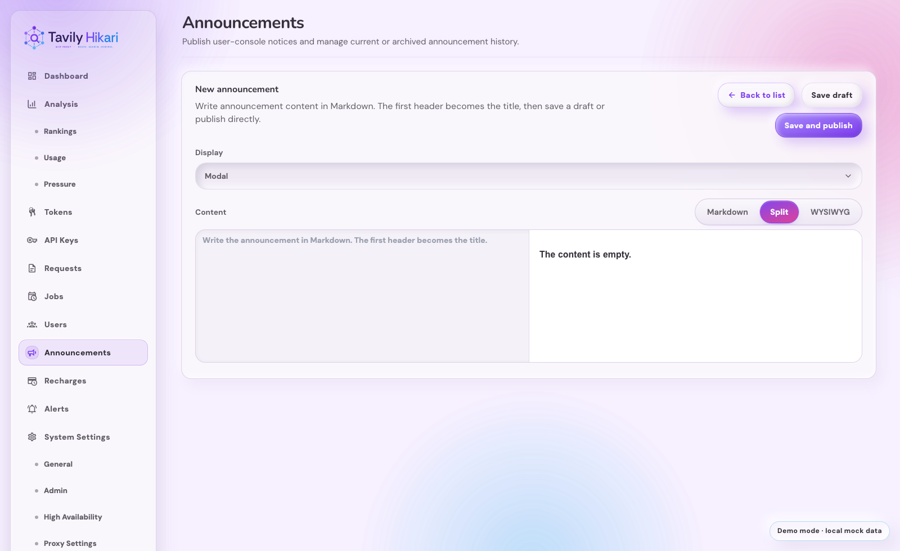
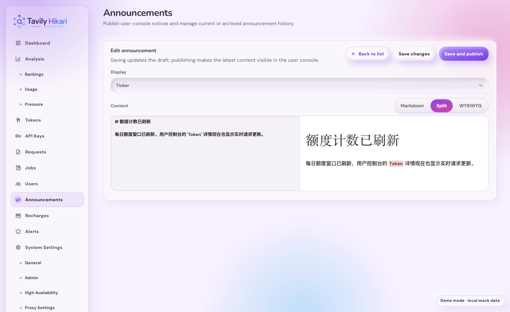
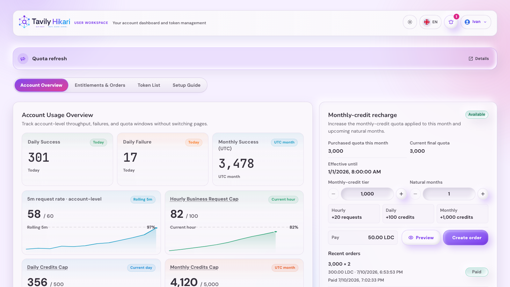
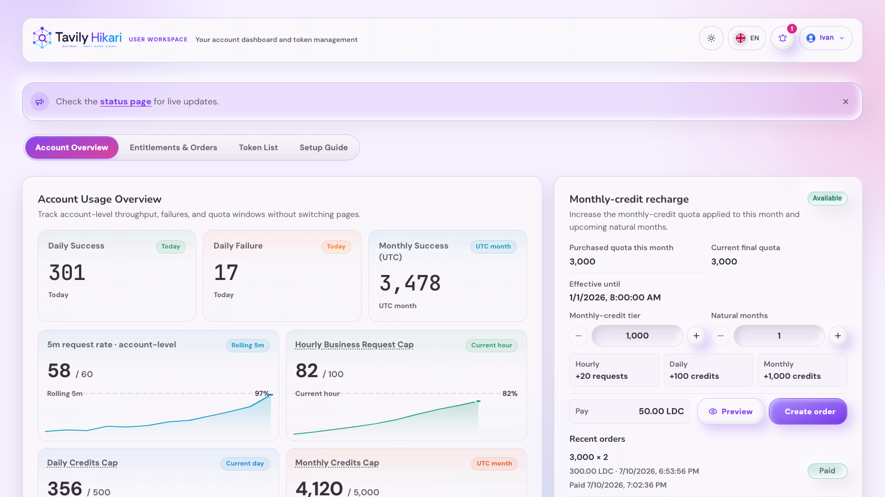
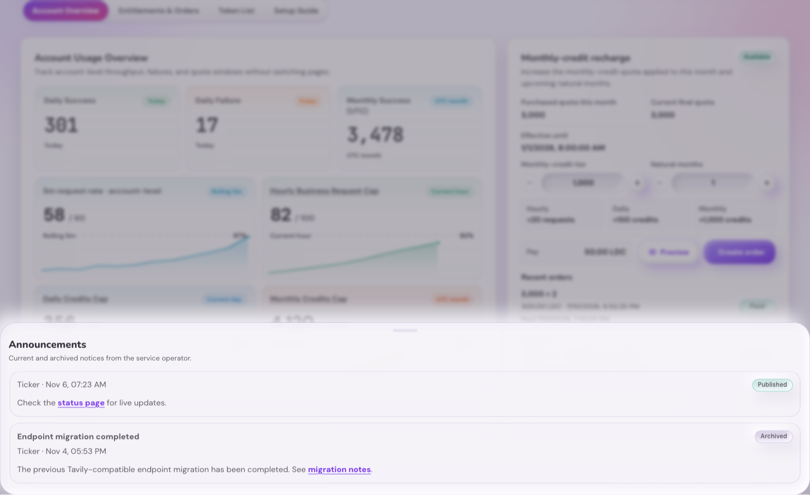

# 用户控制台公告（#aa7yu）

> 当前有效规范以本文为准；实现覆盖与当前状态见 `./IMPLEMENTATION.md`，关键演进原因见 `./HISTORY.md`。

## 背景 / 问题陈述

- 管理员需要向用户控制台访客发布运营公告，不应依赖外部渠道或手动改前端代码。
- 公告需要支持强提醒弹窗和低打扰横幅提示两种展示方式。
- 用户关闭公告后，同一个浏览器不应反复打扰；同时用户仍需要从控制台入口查看历史公告。

## 目标 / 非目标

### Goals

- 管理员控制台新增公告模块，可创建、编辑草稿、发布、归档公告。
- 公告支持 `modal`（弹窗）与 `ticker`（横幅）两种展示方式。
- 用户访问 `/console` 时自动展示当前已发布的最新弹窗公告和横幅公告。
- 用户关闭任意公告后，浏览器本地记录公告 ID 与关闭时间，同一公告不再自动展示。
- 用户控制台页头提供通知入口，可查看已发布与已归档公告历史。

### Non-goals

- 不做服务端“已读/已关闭”跨设备同步。
- 不向未登录公共首页展示公告。
- 不对接外部推送、邮件、Telegram 或 Tavily upstream。

## 范围（Scope）

### In scope

- SQLite 公告表、自愈建表迁移、公告 store 与 proxy 方法。
- 管理员 API：公告列表、创建、更新、发布、归档。
- 用户 API：公告自动展示和历史列表。
- 管理端公告模块、用户控制台弹窗/横幅/通知历史 UI、i18n、Storybook mock 与测试。

### Out of scope

- 用户公告关闭状态的服务端持久化。
- 富文本/Markdown 渲染、附件、定时发布、受众分组。
- 生产 Tavily endpoint 访问。

## 需求（Requirements）

### MUST

- 公告必须以 `content` 作为唯一正文真相源，展示方式、状态、创建/更新时间与发布/归档时间按状态记录；标题仅从 `content` 第一个非空 Markdown Header 块派生，弹窗公告必须满足“有开头标题且去掉标题块后仍有正文”，横幅公告允许标题-only、正文-only 或标题+正文。
- 管理员只能通过既有 admin 判定访问公告管理 API。
- 管理端公告模块必须按列表、创建/编辑功能拆分；新增公告不得常驻在列表页内。
- 管理端公告页的页面级标题必须由 admin shell 拥有；公告模块内部只渲染业务区标题与工具条，避免重复页头。
- 管理端公告页的新建公告入口必须位于页面标题行右端；公告模块内部不得再渲染刷新按钮或重复的新建入口。
- 管理端桌面表格的公告操作列必须按按钮内容收缩，按钮保持单行排列；移动卡片中可按可用宽度换行。
- 管理端创建/编辑公告必须提供 Markdown 内容编辑器，不能只提供纯文本输入框；独立标题输入框必须移除，原“正文”字段改名为“内容”。
- 公告 `content` 必须按 Markdown 原文保存，并在管理端列表预览和用户端公告展示中安全渲染；展示正文时不得重复渲染首个标题块。
- 用户端弹窗公告只能展示从 `content` 派生的标题、去重后的正文和固定确认操作，不展示非管理员填写的说明文案。
- 用户端横幅公告在有标题时只展示标题；若同时有正文，则右侧提供独立详情按钮打开“标题 + 正文”弹窗，并在用户确认或关闭详情后视为关闭该横幅公告；若只有标题，则横幅右侧保留直接关闭操作；若没有标题，则横幅内直接紧凑渲染完整 Markdown 内容并允许点击其中链接，且不再打开详情弹窗。
- 管理端创建/编辑视图只承载正文编辑模式，不提供自制用户侧预览；列表页预览必须复用真实用户端弹窗或横幅公告展示组件。
- 公告 Markdown 不得执行或渲染原始 HTML；图片禁用，危险链接必须降级为不可点击文本。
- 草稿可编辑；已发布公告更新时必须生成新公告 ID 并归档旧公告，确保用户浏览器把更新后的公告视为新提醒。
- 归档公告编辑时必须保留旧归档记录并生成新草稿，避免覆盖历史公告内容。
- 归档公告再次发布时必须保留旧归档记录并生成新公告 ID，避免被旧浏览器关闭记录吞掉。
- 发布状态公告才可进入用户自动展示和历史列表；归档公告只有曾发布过才进入历史列表。
- 用户自动展示接口每种展示方式最多返回一条最新已发布公告。
- 用户关闭状态只保存在浏览器本地，记录 `{ id, closedAt }`。
- 用户历史入口必须能打开公告列表，并展示关闭过的公告状态；无标题公告不得生成伪标题。

### SHOULD

- 管理端列表默认让正在发布的公告优先，草稿与归档公告可扫描。
- 用户端横幅公告不遮挡核心 Token/配额操作，移动端可自然换行。
- 弹窗公告使用既有 Dialog 视觉语言，避免强烈装饰和不必要动效。

## 接口契约（Interfaces & Contracts）

| 接口（Name）                      | 类型（Kind） | 范围（Scope） | 变更（Change） | 使用方（Consumers） | 备注（Notes）                  |
| --------------------------------- | ------------ | ------------- | -------------- | ------------------- | ------------------------------ |
| `/api/announcements`              | HTTP API     | admin         | New            | Admin Console       | GET/POST，管理员公告管理       |
| `/api/announcements/:id`          | HTTP API     | admin         | New            | Admin Console       | PATCH，草稿编辑或发布态换 ID   |
| `/api/announcements/:id/publish`  | HTTP API     | admin         | New            | Admin Console       | POST，发布草稿或归档公告       |
| `/api/announcements/:id/archive`  | HTTP API     | admin         | New            | Admin Console       | POST，归档公告                 |
| `/api/user/announcements`         | HTTP API     | user          | New            | User Console        | 自动展示列表，每种效果最新一条 |
| `/api/user/announcements/history` | HTTP API     | user          | New            | User Console        | 已发布与归档历史公告           |

## 验收标准（Acceptance Criteria）

- Given 管理员创建并发布弹窗公告
  When 用户访问 `/console`
  Then 弹窗公告默认展示，关闭后同一浏览器不再自动展示同一公告。

- Given 管理员创建并发布“标题 + 正文”的横幅公告
  When 用户访问 `/console`
  Then 横幅公告标题展示在控制台内容上方，右侧独立详情按钮可打开标题与正文详情，并且在详情弹窗点击“知道了”或关闭按钮后，同一浏览器不再自动展示同一公告。

- Given 管理员创建并发布只有标题的横幅公告
  When 用户访问 `/console`
  Then 横幅公告标题展示在控制台内容上方，用户可直接关闭公告，且不会打开空详情弹窗。

- Given 管理员创建并发布无标题横幅公告
  When 用户访问 `/console`
  Then 横幅直接展示紧凑可换行的 Markdown 内容，内容中的链接可点击，且不会生成额外详情弹窗。

- Given 已发布公告被管理员编辑
  When 保存更新
  Then 旧公告被归档，新公告使用新 ID 发布，用户浏览器会重新看到更新后的公告。

- Given 用户点击页头通知入口
  When 历史面板打开
  Then 已发布和已归档公告按时间倒序展示，并标明已关闭状态；无标题公告直接展示完整内容且不重复标题块。

## 非功能性验收 / 质量门槛（Quality Gates）

### Testing

- Backend targeted tests for admin create/update/publish/archive and user active/history APIs.
- Frontend tests for API client paths and UserConsole announcement close/history behavior.

### UI / Storybook

- Storybook 覆盖管理端公告模块的列表/编辑/发布态。
- Storybook 覆盖管理端公告列表页预览，确保预览复用用户端弹窗/横幅公告展示。
- Storybook 覆盖管理端公告模块的独立创建视图，确保新增公告不嵌在列表页。
- Storybook 覆盖用户控制台弹窗、横幅公告标题入口、横幅公告详情弹窗、无标题横幅、Markdown 正文和通知历史入口。
- Storybook 覆盖“标题 + 正文”横幅的独立详情入口，以及标题-only 横幅的直接关闭路径。
- 视觉证据写入本 spec 的 `## Visual Evidence`。

### Quality checks

- `cargo fmt`
- `cargo test` targeted or broader validation
- `cd web && bun test`
- `cd web && bun run build`

## Visual Evidence

- source_type: ui_demo
  demo_entry_or_url: `http://127.0.0.1:55175/admin/announcements/new?demo=1`
  state: admin create route with content-only editor
  evidence_note: 纯前端 demo 的 `/admin/announcements/new` 路由只剩 `Content` 字段；独立标题输入已移除，文案明确说明首个 Markdown header 会作为标题，展示方式与保存动作仍保留在编辑页头部。
  image:
  PR: include
  

- source_type: ui_demo
  demo_entry_or_url: `http://127.0.0.1:55175/admin/announcements/ann-demo-ticker/edit?demo=1`
  state: admin edit route with derived title and deduplicated body preview
  evidence_note: 纯前端 demo 的编辑路由同样只保留 `Content` 字段；现有横幅公告内容以 Markdown 原文编辑，右侧预览只渲染派生标题与去重后的正文，不再出现独立标题表单。
  image:
  PR: include
  

- source_type: storybook_canvas
  story_id_or_title: `User Console/UserConsole/Console Home Announcements`
  state: titled ticker announcement with a separate details action
  evidence_note: Storybook canvas 的控制台顶栏状态显示“有标题且有正文”的横幅只展示标题 `Quota refresh`，右侧是独立 `Details` 按钮，而不是把整条横幅做成点击入口。
  image:
  PR: include
  

- source_type: storybook_canvas
  story_id_or_title: `User Console/UserConsole/Console Home Untitled Ticker`
  state: untitled ticker announcement renders inline markdown content
  evidence_note: Storybook canvas 的无标题横幅直接渲染完整内容；横幅内保留可点击的 `status page` 链接，不再生成伪标题，也不提供详情按钮。
  image:
  PR: include
  

- source_type: storybook_canvas
  story_id_or_title: `User Console/UserConsole/Console Home Announcement History Untitled`
  state: untitled announcement history entry without a fake title
  evidence_note: Storybook canvas 的历史抽屉中，无标题公告只展示元信息与完整正文，不再补 `Untitled` 之类的伪标题；历史项里的 Markdown 链接继续可见。
  image:
  PR: include
  

## Related PRs

- None
