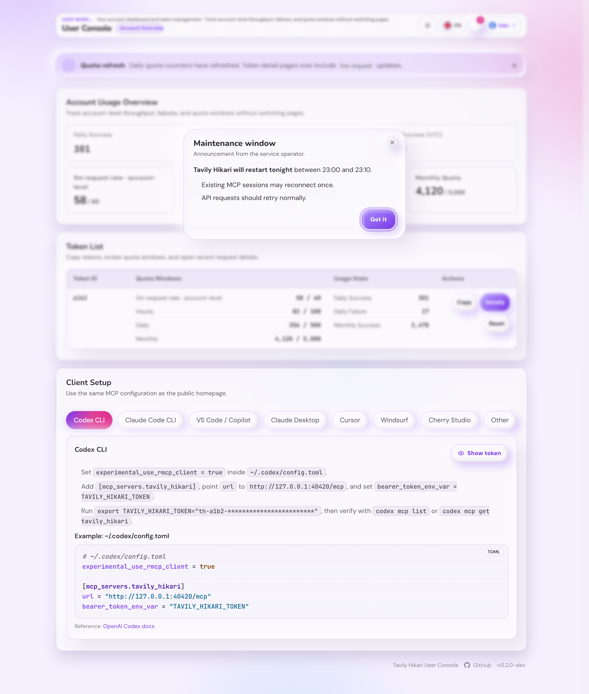
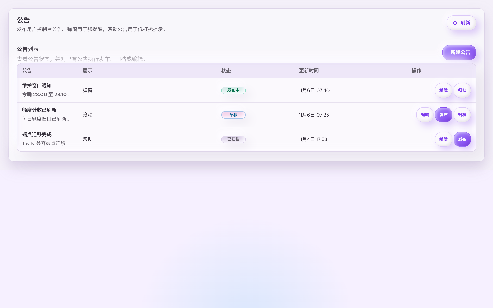
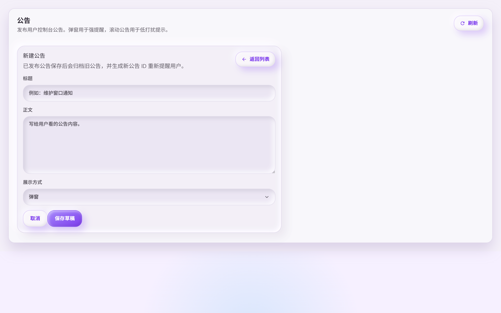

# 用户控制台公告（#aa7yu）

> 当前有效规范以本文为准；实现覆盖与当前状态见 `./IMPLEMENTATION.md`，关键演进原因见 `./HISTORY.md`。

## 背景 / 问题陈述

- 管理员需要向用户控制台访客发布运营公告，不应依赖外部渠道或手动改前端代码。
- 公告需要支持强提醒弹窗和低打扰滚动提示两种展示方式。
- 用户关闭公告后，同一个浏览器不应反复打扰；同时用户仍需要从控制台入口查看历史公告。

## 目标 / 非目标

### Goals

- 管理员控制台新增公告模块，可创建、编辑草稿、发布、归档公告。
- 公告支持 `modal`（弹窗）与 `ticker`（滚动）两种展示方式。
- 用户访问 `/console` 时自动展示当前已发布的最新弹窗公告和滚动公告。
- 用户关闭任意公告后，浏览器本地记录公告 ID 与关闭时间，同一公告不再自动展示。
- 用户控制台页头提供通知入口，可查看已发布与已归档公告历史。

### Non-goals

- 不做服务端“已读/已关闭”跨设备同步。
- 不向未登录公共首页展示公告。
- 不对接外部推送、邮件、Telegram 或 Tavily upstream。

## 范围（Scope）

### In scope

- SQLite 公告表、自愈建表迁移、公告 store 与 proxy 方法。
- 管理员 API：公告列表、创建、更新、发布、归档。
- 用户 API：公告自动展示和历史列表。
- 管理端公告模块、用户控制台弹窗/滚动/通知历史 UI、i18n、Storybook mock 与测试。

### Out of scope

- 用户公告关闭状态的服务端持久化。
- 富文本/Markdown 渲染、附件、定时发布、受众分组。
- 生产 Tavily endpoint 访问。

## 需求（Requirements）

### MUST

- 公告必须包含标题、Markdown 正文、展示方式、状态、创建/更新时间，发布和归档时间按状态记录。
- 管理员只能通过既有 admin 判定访问公告管理 API。
- 管理端公告模块必须按列表、创建/编辑功能拆分；新增公告不得常驻在列表页内。
- 公告正文必须按 Markdown 原文保存，并在管理端预览和用户端公告展示中安全渲染。
- 公告 Markdown 不得执行或渲染原始 HTML；图片禁用，危险链接必须降级为不可点击文本。
- 草稿可编辑；已发布公告更新时必须生成新公告 ID 并归档旧公告，确保用户浏览器把更新后的公告视为新提醒。
- 归档公告编辑时必须保留旧归档记录并生成新草稿，避免覆盖历史公告内容。
- 归档公告再次发布时必须保留旧归档记录并生成新公告 ID，避免被旧浏览器关闭记录吞掉。
- 发布状态公告才可进入用户自动展示和历史列表；归档公告只有曾发布过才进入历史列表。
- 用户自动展示接口每种展示方式最多返回一条最新已发布公告。
- 用户关闭状态只保存在浏览器本地，记录 `{ id, closedAt }`。
- 用户历史入口必须能打开公告列表，并展示关闭过的公告状态。

### SHOULD

- 管理端列表默认让正在发布的公告优先，草稿与归档公告可扫描。
- 用户端滚动公告不遮挡核心 Token/配额操作，移动端可自然换行。
- 弹窗公告使用既有 Dialog 视觉语言，避免强烈装饰和不必要动效。

## 接口契约（Interfaces & Contracts）

| 接口（Name）                      | 类型（Kind） | 范围（Scope） | 变更（Change） | 使用方（Consumers） | 备注（Notes）                  |
| --------------------------------- | ------------ | ------------- | -------------- | ------------------- | ------------------------------ |
| `/api/announcements`              | HTTP API     | admin         | New            | Admin Console       | GET/POST，管理员公告管理       |
| `/api/announcements/:id`          | HTTP API     | admin         | New            | Admin Console       | PATCH，草稿编辑或发布态换 ID   |
| `/api/announcements/:id/publish`  | HTTP API     | admin         | New            | Admin Console       | POST，发布草稿或归档公告       |
| `/api/announcements/:id/archive`  | HTTP API     | admin         | New            | Admin Console       | POST，归档公告                 |
| `/api/user/announcements`         | HTTP API     | user          | New            | User Console        | 自动展示列表，每种效果最新一条 |
| `/api/user/announcements/history` | HTTP API     | user          | New            | User Console        | 已发布与归档历史公告           |

## 验收标准（Acceptance Criteria）

- Given 管理员创建并发布弹窗公告
  When 用户访问 `/console`
  Then 弹窗公告默认展示，关闭后同一浏览器不再自动展示同一公告。

- Given 管理员创建并发布滚动公告
  When 用户访问 `/console`
  Then 滚动公告展示在控制台内容上方，关闭后同一浏览器不再自动展示同一公告。

- Given 已发布公告被管理员编辑
  When 保存更新
  Then 旧公告被归档，新公告使用新 ID 发布，用户浏览器会重新看到更新后的公告。

- Given 用户点击页头通知入口
  When 历史面板打开
  Then 已发布和已归档公告按时间倒序展示，并标明已关闭状态。

## 非功能性验收 / 质量门槛（Quality Gates）

### Testing

- Backend targeted tests for admin create/update/publish/archive and user active/history APIs.
- Frontend tests for API client paths and UserConsole announcement close/history behavior.

### UI / Storybook

- Storybook 覆盖管理端公告模块的列表/编辑/发布态。
- Storybook 覆盖管理端公告模块的独立创建视图，确保新增公告不嵌在列表页。
- Storybook 覆盖用户控制台弹窗、滚动公告、Markdown 正文和通知历史入口。
- 视觉证据写入本 spec 的 `## Visual Evidence`。

### Quality checks

- `cargo fmt`
- `cargo test` targeted or broader validation
- `cd web && bun test`
- `cd web && bun run build`

## Visual Evidence

- source_type: storybook_canvas
  story_id_or_title: `User Console/UserConsole/Console Home Announcements`
  state: active modal and ticker announcements
  evidence_note: 用户控制台会显示滚动公告，并打开当前弹窗公告；公告正文按 Markdown 渲染粗体、列表与行内代码。
  image:
  

- source_type: storybook_canvas
  story_id_or_title: `Admin/AnnouncementsModule/Default`
  state: admin announcement list only
  evidence_note: 管理端公告列表页只展示列表、状态和发布/归档/编辑操作，并用紧凑 Markdown 预览公告正文。
  image:
  

- source_type: storybook_canvas
  story_id_or_title: `Admin/AnnouncementsModule/Create Announcement`
  state: admin announcement create view
  evidence_note: 新增公告在独立创建视图中完成，页面不同时展示公告列表表格。
  image:
  

## Related PRs

- None
