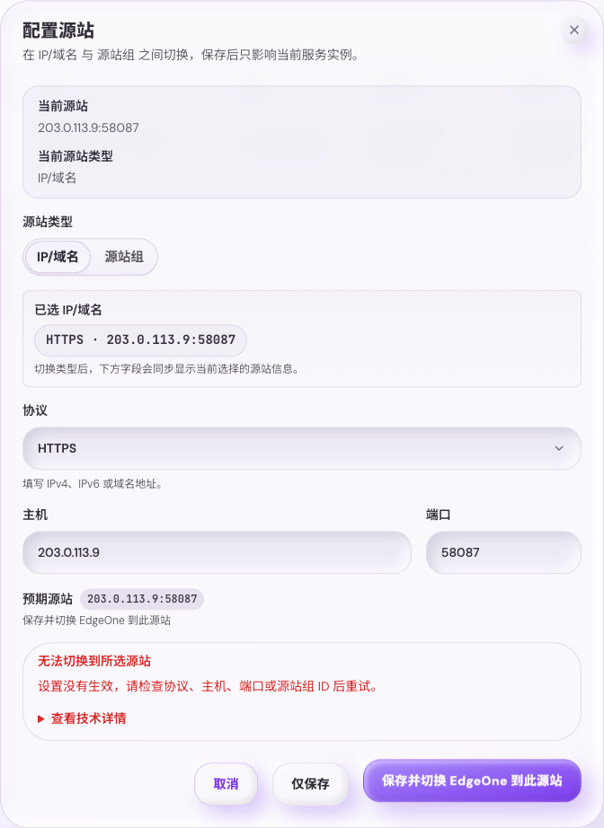

# Tavily Hikari 基于 EdgeOne 源站切换的单活主备高可用改造

## Summary

Tavily Hikari 的高可用方案采用单活主备热备，而不是一主多从负载均衡。任一时刻只有一个实例处理完整业务，EdgeOne 当前源站 `IP:port` 或源站组 ID 是 active master 的权威标识。standby 持续同步 active 的 SQLite 数据；active 故障时，standby 通过 EdgeOne API 切换源站到自己，先进入 `provisional_master`，恢复基础 API/MCP 服务，再由管理员确认后进入 `full_master`。同时，管理员现在必须能在当前 active 节点直接查看真实 peer 状态、执行 `planned cutover`，并查看 7 天 HA 控制面时间线。

## Goals

- 只暴露一个业务域名，并使用 EdgeOne 源站切换完成 active 节点切换。
- 容忍 active 或 standby 任一节点离线 24 小时。
- 自动 failover 只恢复基础 API/MCP、鉴权和 quota 扣减。
- 注册、充值、配置写入、上游 key 管理等高风险写入必须等管理员 finalize。
- 旧主恢复后只补传可幂等合并数据，不覆盖新主配置类状态。
- 当前 active 节点 HA 页面必须展示真实 peer 列表，而不是基于 EdgeOne 字段推断的占位节点。
- 提供计划内维护切流入口 `planned cutover`，由当前 `full_master` 发起并自动完成目标节点 finalize。
- 提供 7 天 HA 控制面时间线，覆盖切流、手工 failover、EdgeOne 调用、同步异常和 recovery/角色变化。

## Non-Goals

- 不实现一主多从负载均衡。
- 不实现跨从额度租约或 token 配额派发。
- 不合并多从 rebalance 映射状态。
- 不依赖 EdgeOne 免费版的原生负载均衡能力。
- 不在本轮实现 UI 内 cluster membership 编辑。
- 不在本轮让多个 standby 都具备自动接管能力；只有一个 `standby_candidate` 可作为计划内切流目标。

## EdgeOne Control Plane

- `DescribeAccelerationDomains` 用于查询加速域名当前源站，并判断当前 active 节点。
- `ModifyAccelerationDomain` 用于将源站切换到目标节点 `IP:port`。
- 直连源站切换到 EdgeOne 控制面时，`OriginInfo.OriginType` 必须发送 provider 兼容的字面值 `IP_DOMAIN`；小写 `ip_domain` 视为无效请求。
- 节点切换必须记录 operation、请求、响应、错误和操作者审计。
- 首个上线门槛是验证 EdgeOne 是否接受带端口的 origin；若不支持，主备节点必须监听相同端口。

## Node State Machine

- `full_master`：完整服务，允许业务 API、MCP、控制台写入、注册和充值。
- `provisional_master`：自动 failover 后状态，只允许基础业务 API/MCP、鉴权和 quota 扣减；控制台显示降级，只读为主。
- `standby`：只同步、健康检查、可被 promote；不处理外部业务写入。
- `recovery`：旧主恢复后的状态，只补传可合并数据，禁止重新抢主。

## Data Sync And Recovery

- HA 同步的目标是保活服务，不复制完整历史分析库。
- standby 每 5-15 秒从 active 拉取状态基线或 outbox 增量事件，目标 RPO `<=15s`。
- 禁止通过 HA 同步传输全量 SQLite 数据库文件。
- 状态基线与事件流使用 versioned zstd NDJSON，基线压缩后上限 `64MiB`，事件批次压缩后上限 `4MiB`。
- HA baseline/export/import 必须保持有界内存：active 侧不得整批 materialize 单个 channel
  的全量 NDJSON 再整体压缩；standby 侧不得先 `response.bytes()`、`decode_all()`、整块
  UTF-8，再统一收集成 `Vec` 后一次 apply。可接受实现是逐行生成、逐行压缩、逐行解压和
  单事务增量 apply。
- `billing_ledger` 等大表必须复用同一条流式 baseline 导出路径，避免 active 重复导出时出现
  持续抬升的 GiB 级内存峰值。
- HA wire contract 按三个正式 channel 拆分：`control`、`billing`、`runtime`。每个 channel 独立导出 baseline、独立拉取 events、独立记录 peer watermark，不支持 mixed-version HA。
- `control` 只同步控制面小状态，事件流写入 `ha_outbox`，保留窗口为 72 小时；超过窗口必须重新拉取该 channel 的状态基线。
- `billing` 只同步 `billing_ledger` 完整账本行历史，事件流写入 `ha_billing_outbox`，不再通过 `ha_outbox` 复制账本。
- `runtime` 只同步 failover 后若不恢复就会影响基础 API/MCP 正确性的最小运行态，事件流写入 `ha_runtime_outbox`。允许的最小运行态包括 quota 当前状态与 bucket、token/account 月额度、MCP 当前会话必要状态、forward proxy 亲和与节点 override、以及主/次 API key affinity。
- 如果 standby 在某个 channel 的 events apply 中命中 SQLite `FOREIGN KEY constraint failed`，
  该 channel 必须被视为“增量窗口不再自洽”，立即把 `baseline_applied` 与 `applied_seq`
  水位重置回 `0`，并要求下一轮重新拉取该 channel baseline；不得无限重试同一批坏 events。
- `control`/`billing`/`runtime` 三个 channel 的 baseline 和 events 都禁止包含 `request_logs`、`auth_token_logs`、请求体、响应体、path/query/IP/header 明细、dashboard recent logs、OAuth login 临时态、Web session、forward proxy runtime/attempts/hourly weight、维护审计、调度队列、请求限流快照和节点本地观测噪声。
- `HA_MODE=single` 下不得产生新的 HA 事件写入；仅保留 schema 兼容、显式 one-shot 维护工具与后续切回 `active_standby` 的启动能力。
- `standby` / `recovery` 启动时不得预热 forward-proxy runtime 或共享 `xray` 子进程；只有
  角色恢复到允许业务流量的状态后，才允许按需拉起业务 runtime。对应地，standby/recovery
  的 `/health` 不得因为 `xray` 未就绪而失败。
- `standby` / `recovery` 启动时不得拉起会持续写入主业务库的业务后台任务，例如 quota sync、
  usage rollup、request log GC、LinuxDo 同步、forward-proxy maintenance 与 DB compaction；
  这些任务只能在角色恢复到允许业务流量后再启动。standby 侧只保留 health、HA pull-sync、
  role/authority refresh 与 fencing 所需的最小后台能力。
- recovery 只允许导入幂等账本事件，不导入调用记录，不覆盖新主当前权威状态。
- recovery 完成后 quota 与 usage 聚合必须可继续滚动更新。

## API Contract

- `GET /api/admin/ha/status` 返回当前节点状态、EdgeOne 源站、同步水位、recovery 状态。
- `GET /api/admin/ha/status` 继续保留当前本机字段，并新增 `peerNodes[]` 与 `plannedCutoverEligible`。
- `GET /api/ha/status` 返回可公开给用户控制台的降级摘要，不包含 secret 或 expected origin。
- `GET /api/admin/ha/status` 还要返回当前/预期源站类型、本地默认源站、本地覆盖源站和当前 EdgeOne target。
- `PUT /api/admin/ha/source` 保存当前服务节点私有源站配置，可在 `IP/域名` 与 `源站组` 间切换，并可选择保存后立即应用到 EdgeOne。
- HA 源站设置的 `directOriginScheme` JSON wire 值固定为小写 `http|https|follow`。`PUT /api/admin/ha/source` 请求体、成功响应以及后续 `GET /api/admin/ha/status` 返回值都必须维持同一套小写语义；仅下游 EdgeOne 控制面 payload 可以继续映射成 `HTTP|HTTPS|FOLLOW`。
- `GET`/`PUT /api/admin/ha/snapshot` 是废弃接口，必须返回 `410 Gone`，不得读写 SQLite 数据库文件。
- `GET /api/admin/ha/baseline?channel=<control|billing|runtime>` 仅内部或管理员认证可调用，在 active/provisional 节点输出对应 channel 的 zstd NDJSON 状态基线，并在响应头返回该 channel 的 high watermark。
- `GET /api/admin/ha/events?channel=<control|billing|runtime>&after=<seq>&limit=<n>` 仅内部或管理员认证可调用，输出对应 channel 在 `after` 之后且仍位于 retention 窗口内的 zstd NDJSON outbox 事件；该读路径不得隐式删行，若 `after` 已落到 retention 窗口之外则返回 `410 Gone` 并要求先重拉该 channel baseline。
- `POST /api/admin/ha/events/ack` 仅内部或管理员认证可调用，请求体必须显式携带 `channel`，用于记录 standby 已应用的该 channel outbox seq。
- `POST /api/admin/ha/promote` 将当前 standby 切为 `provisional_master`，可带 `force` 用于强制接管。
- `POST /api/admin/ha/finalize` 管理员确认后进入 `full_master`。
- `POST /api/admin/ha/planned-cutover` 由当前 `full_master` 发起，请求体固定为 `{ targetNodeId }`，只允许对 `roleHint=standby_candidate`、最近 30 秒内探测成功、`syncLagSeconds <= 30`、当前角色为 `standby` 且无 `recoveryStatus` 的 peer 执行。
- `GET /api/admin/ha/timeline` 返回最近 7 天 HA 控制面事件，支持 `cursor`、`limit`、`nodeId`、`category` 过滤。
- `GET /api/internal/ha/status` 和 `POST /api/internal/ha/finalize` 仅供节点间内部控制使用。
- `POST /api/admin/ha/recovery/import` 导入旧主 recovery 账本批次，仅允许内部或管理员认证调用；调用记录字段必须被拒绝。

## Runtime Configuration

- `HA_MODE=single|active_standby`
- `NODE_ID`
- `HA_SOURCE_KIND=direct|origin_group`
- `HA_SOURCE_ORIGIN_GROUP_ID`
- `NODE_PUBLIC_SCHEME=http|https|follow`
- `NODE_PUBLIC_HOST`
- `NODE_PUBLIC_PORT`
- `EDGEONE_ZONE_ID`
- `EDGEONE_DOMAIN`
- `EDGEONE_EXPECTED_ORIGIN_SCHEME=http|https|follow`
- `EDGEONE_EXPECTED_ORIGIN_HOST`
- `EDGEONE_EXPECTED_ORIGIN_PORT`
- 节点私有源站保存值优先于 Env/CLI 默认值，但只作用于当前实例，不参与 HA 同步。`EDGEONE_EXPECTED_ORIGIN_*` 仍只表示直连预期源站。
- `EDGEONE_SECRET_ID`
- `EDGEONE_SECRET_KEY`
- `HA_SYNC_SOURCE_URL`（standby 拉取 active 的内部 URL）
- `HA_INTERNAL_TOKEN`
- `HA_SYNC_INTERVAL_SECS`
- `HA_PEER_NODES_JSON`：peer inventory 唯一真相源，元素固定为 `nodeId`、`adminBaseUrl`、`publicOrigin`、`roleHint`，且当前版本只允许一个 `standby_candidate`。

## UI Contract

- 用户控制台在 failover、provisional、recovery、同步滞后时显示降级警告。
- 管理员控制台的完整 HA 服务节点管理面板只出现在系统设置的高可用二级界面，包含节点清单、角色、源站、健康状态、同步水位、promote/finalize 操作和 EdgeOne 当前源站摘要。
- 管理员控制台的 HA 页面必须稳定分成三块：真实节点清单、`planned cutover` 操作区、7 天时间线。
- HA 管理页还要提供当前节点源站配置入口，允许在 `IP/域名` 与 `源站组` 之间切换，并在 active/provisional 时支持保存后切换 EdgeOne 到此源站。
- 节点清单必须直接展示 peer eligibility、最后探测时间、同步状态、恢复状态，以及哪个 peer 是当前允许切流的目标。
- `planned cutover` 必须通过明确确认流展示目标节点、当前路由和预检语义。
- 时间线默认展示运维摘要，原始 EdgeOne 请求/响应与内部错误细节放进 disclosure。
- HA 源站设置弹窗的本地校验必须贴近字段本身：`host`、`port`、`origin group` 错误继续绑定各自控件并保留 `aria-invalid`，不得与远端提交失败共用同一块文案区域。
- HA 源站设置弹窗的远端提交失败必须使用正式 destructive alert，包含任务相关标题、简短修复提示，以及默认折叠的“技术详情”展开区；原始后端文本只在展开后展示。
- 管理员业务页面在 `full_master` 正常态不得显示 HA 面板；在 failover、standby、recovery 或写入受限时，只显示紧凑异常提示并链接到系统设置的高可用界面，不直接执行 promote/finalize。
- `provisional_master` 阶段必须明确提示注册、充值和配置写入仍被禁用。

## Visual Evidence

PR: include

PR: include

PR: include

PR: include

PR: include

PR: include

PR: include

PR: include

PR: include

PR: include

PR: include

PR: include

PR: include

PR: include

PR: include

PR: include

## Acceptance

- `standby/recovery` 禁止外部业务写入。
- `planned cutover` 验收必须覆盖当前 active 节点发起到目标 standby 自动 `provisional_master -> full_master`，同时旧主进入 `recovery`，且过程无需人工再登录目标节点执行 finalize。
- `planned cutover` 预检失败必须覆盖 stale、unreachable、同步滞后超阈值、目标处于 recovery、目标不是 `standby_candidate` 这几类拒绝路径，并保证不会修改 EdgeOne。
- `provisional_master` 允许 API/MCP/quota，禁止注册、充值、配置写入。
- `finalize` 后恢复完整功能。
- EdgeOne 当前源站与本节点 origin 一致时，节点可识别自己为 active。
- EdgeOne API 失败、源站不匹配、并发 operation 不产生双 active。
- 旧主 recovery batch 重复导入幂等。
- 双节点 mock EdgeOne 验收必须覆盖 `pre -> failover -> recovery`：单入口业务流量、standby
  fencing、状态基线、outbox 增量 catch-up、standby promote、provisional gating、finalize 后 full
  write、旧主账本 recovery 和重复导入幂等。
- `GET /api/admin/ha/timeline` 分页、过滤、技术详情 disclosure 与 7 天保留清理必须有自动化覆盖。
- 大量调用记录和大请求/响应正文不得进入 HA baseline、events 或 recovery payload。
- 共享 `codex-testbox` 上的 256MiB cgroup v2 合同验证必须通过：standby 首次全量 baseline
  sync 成功、active 连续 billing baseline 导出成功，且主备进程组 `memory.current` 峰值都不
  得超过 `268435456` bytes。
