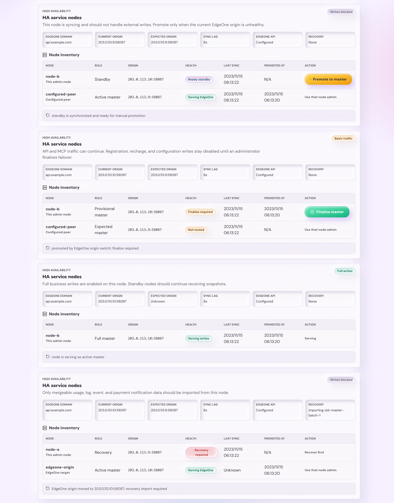

# Tavily Hikari 基于 EdgeOne 源站切换的单活主备高可用改造

## Summary

Tavily Hikari 的高可用方案采用单活主备热备，而不是一主多从负载均衡。任一时刻只有一个实例处理完整业务，EdgeOne 当前源站 `IP:port` 是 active master 的权威标识。standby 持续同步 active 的 SQLite 数据；active 故障时，standby 通过 EdgeOne API 切换源站到自己，先进入 `provisional_master`，恢复基础 API/MCP 服务，再由管理员确认后进入 `full_master`。

## Goals

- 只暴露一个业务域名，并使用 EdgeOne 源站切换完成 active 节点切换。
- 容忍 active 或 standby 任一节点离线 24 小时。
- 自动 failover 只恢复基础 API/MCP、鉴权和 quota 扣减。
- 注册、充值、配置写入、上游 key 管理等高风险写入必须等管理员 finalize。
- 旧主恢复后只补传可幂等合并数据，不覆盖新主配置类状态。

## Non-Goals

- 不实现一主多从负载均衡。
- 不实现跨从额度租约或 token 配额派发。
- 不合并多从 rebalance 映射状态。
- 不依赖 EdgeOne 免费版的原生负载均衡能力。

## EdgeOne Control Plane

- `DescribeAccelerationDomains` 用于查询加速域名当前源站，并判断当前 active 节点。
- `ModifyAccelerationDomain` 用于将源站切换到目标节点 `IP:port`。
- 节点切换必须记录 operation、请求、响应、错误和操作者审计。
- 首个上线门槛是验证 EdgeOne 是否接受带端口的 origin；若不支持，主备节点必须监听相同端口。

## Node State Machine

- `full_master`：完整服务，允许业务 API、MCP、控制台写入、注册和充值。
- `provisional_master`：自动 failover 后状态，只允许基础业务 API/MCP、鉴权和 quota 扣减；控制台显示降级，只读为主。
- `standby`：只同步、健康检查、可被 promote；不处理外部业务写入。
- `recovery`：旧主恢复后的状态，只补传可合并数据，禁止重新抢主。

## Data Sync And Recovery

- active 每 5-15 秒向 standby 同步 SQLite 一致性备份或变更包，目标 RPO `<=15s`。
- recovery 只允许导入 usage/log/event/payment notify 等可幂等合并数据。
- recovery 不覆盖系统设置、用户额度配置、token/key 当前状态、管理员配置写入、rebalance 权威状态。
- recovery 完成后 dashboard、quota、usage rollup 必须可重算。

## API Contract

- `GET /api/admin/ha/status` 返回当前节点状态、EdgeOne 源站、同步水位、recovery 状态。
- `GET /api/ha/status` 返回可公开给用户控制台的降级摘要，不包含 secret 或 expected origin。
- `GET /api/admin/ha/snapshot` 导出经过 WAL checkpoint 的 SQLite 快照，并返回 manifest。
- `PUT /api/admin/ha/snapshot` 仅 standby 可调用，通过 `ATTACH` 快照库在线恢复业务表，并记录同步水位。
- `POST /api/admin/ha/promote` 将当前 standby 切为 `provisional_master`，可带 `force` 用于强制接管。
- `POST /api/admin/ha/finalize` 管理员确认后进入 `full_master`。
- `POST /api/admin/ha/recovery/import` 导入旧主 recovery 批次，仅允许内部或管理员认证调用。

## Runtime Configuration

- `HA_MODE=single|active_standby`
- `NODE_ID`
- `NODE_PUBLIC_ORIGIN`
- `EDGEONE_ZONE_ID`
- `EDGEONE_DOMAIN`
- `EDGEONE_EXPECTED_ORIGIN`
- `EDGEONE_SECRET_ID`
- `EDGEONE_SECRET_KEY`
- `HA_SYNC_PEER_URL`
- `HA_INTERNAL_TOKEN`
- `HA_SYNC_INTERVAL_SECS`

## UI Contract

- 用户控制台在 failover、provisional、recovery、同步滞后时显示降级警告。
- 管理员控制台显示 HA 服务节点管理面板，包含节点清单、角色、源站、健康状态、同步水位、promote/finalize 操作和 EdgeOne 当前源站摘要。
- `provisional_master` 阶段必须明确提示注册、充值和配置写入仍被禁用。

## Visual Evidence

PR: include

## Acceptance

- `standby/recovery` 禁止外部业务写入。
- `provisional_master` 允许 API/MCP/quota，禁止注册、充值、配置写入。
- `finalize` 后恢复完整功能。
- EdgeOne 当前源站与本节点 origin 一致时，节点可识别自己为 active。
- EdgeOne API 失败、源站不匹配、并发 operation 不产生双 active。
- 旧主 recovery batch 重复导入幂等。
- 双节点 mock EdgeOne 验收必须覆盖 `pre -> failover -> recovery`：单入口业务流量、standby
  fencing、热备同步、standby promote、provisional gating、finalize 后 full write、旧主 recovery
  mergeable-only 导入和重复导入幂等。
