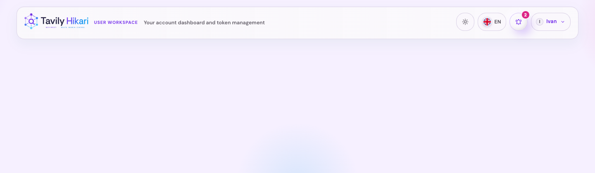

# 用户控制台页头重设计与退出登录

## 状态

- Status: 已实现（待审查）
- Created: 2026-04-09
- Last: 2026-06-27

## 背景 / 问题陈述

- 当前 `/console` 复用了偏后台语义的 `admin-panel-header`，用户控制台缺少专属的信息层级与视觉识别。
- 现有页头只展示标题、副标题与管理员入口，登录身份、当前视图上下文与关键操作没有形成稳定的 Hero 区。
- 后端已经提供 `POST /api/user/logout`，但前端用户控制台尚未暴露退出登录入口。
- LinuxDo 登录态在会话里已经带有头像模板，但用户控制台缺少头像入口与稳定的账户菜单结构。
- 本轮是 UI-affecting follow-up，必须同时补齐 Storybook 验收入口、视觉证据与退出链路验证。

## 目标 / 非目标

### Goals

- 为 `/console` landing 与 token detail 引入用户控制台专属 Hero 页头，不再直接复用后台页头视觉。
- 页头改为桌面与移动端都保持单层的用户控制台专属 header，顶部只保留品牌、桌面短副标题与操作区，彻底移除第二行标题/当前视图文案。
- 复用现有 `POST /api/user/logout` 增加退出登录入口，并在成功退出后返回首页 `/`。
- 将用户名、provider / admin 身份与退出登录收敛到同一个账户菜单，LinuxDo 会话优先展示头像。
- 保留并重新排布现有主题切换、语言切换与管理员入口；桌面端保留显性 theme/language，`small<=767` 与 `compact<=920` 下改为 utility menu 收纳，消除固定 60px 压缩模型。
- 更新 Storybook、前端测试与 spec 视觉证据，使本轮变更可以稳定验收。

### Non-goals

- 不修改 OAuth 登录流程、会话持久化 schema 或新增认证路由。
- 不重做 `/admin` 页面页头或通用 `AdminPanelHeader` 契约。
- 不调整用户控制台的 dashboard、token list、probe 与日志业务逻辑。

## 范围（Scope）

### In scope

- `src/server/handlers/admin_auth.rs`
- `src/server/tests.rs`
- `web/src/UserConsole.tsx`
- `web/src/api.ts`
- `web/src/index.css`
- `web/src/UserConsole.stories.tsx`
- `web/src/UserConsole.stories.test.ts`
- `web/src/UserConsole.test.ts`
- `web/src/api.test.ts`
- `web/src/components/UserConsoleHeader.tsx`
- `web/src/components/UserConsoleHeader.test.tsx`
- `docs/specs/g9bxz-user-console-header-logout/SPEC.md`
- `docs/specs/README.md`

### Out of scope

- `/admin` 或 PublicHome 的视觉改版。
- 用户 token 生命周期写操作。
- 新增认证路由、cookie 字段或额外头像抓取服务。

## 接口契约（Interfaces & Contracts）

- 继续复用现有 `GET /api/profile` 字段：`isAdmin`、`userLoggedIn`、`userProvider`、`userDisplayName`，并补充 `userAvatarUrl` 作为账户菜单头像来源。
- 继续复用现有 `POST /api/user/logout`：
  - `204` 视为退出成功；
  - `401` 视为会话已失效，也按已退出处理；
  - 其他非 2xx 继续作为错误上抛给页头/页面错误反馈。
- 不新增后端路由、schema、cookie 字段或前端 public contract。

## 验收标准（Acceptance Criteria）

- Given 已登录用户访问 `/console`
  When 页面加载 landing 或 token detail
  Then 顶部展示用户控制台专属单行页头，桌面端只保留品牌、eyebrow、短副标题、通知与账户入口，不再出现第二行标题区、固定高度裁切或省略号。

- Given `profile.userLoggedIn === true`
  When 用户点击退出登录
  Then 前端调用 `POST /api/user/logout`，按钮进入 loading/disabled，成功或 `401` 后跳回 `/`。

- Given 退出请求返回 `5xx` 或网络错误
  When 用户点击退出登录
  Then 当前页面保持不跳转，并展示可见错误反馈。

- Given 管理员用户访问 `/console`
  When 页头同时展示管理员入口、主题/语言切换与账户菜单
  Then desktop 与 mobile 紧凑态都不出现裁切、挤压失控或按钮不可点击；`compact<=920` 下 utility/account dropdown 不被容器裁切，且页面无横向滚动。

- Given `small<=767` 或 `compact<=920`
  When 验收者查看用户控制台页头
  Then 页头保持单层；`small<=767` 首行只保留品牌与通知 / utility / 账户三个入口，主题/语言不再以独立按钮挤在首层。

- Given `console unavailable` 或 admin-only/dev-open-admin 态
  When 页面渲染页头
  Then 不显示用户退出按钮。

- Given LinuxDo 登录用户访问 `/console`
  When 账户菜单渲染
  Then 账户按钮与展开菜单优先显示 LinuxDo 头像；头像失效时回退到首字母占位。

- Given UserConsole Storybook
  When 验收者打开普通用户 desktop 与管理员 mobile 入口
  Then 可以稳定复核新页头的布局与显隐差异，而无需依赖临时运行态。

## 非功能性验收 / 质量门槛（Quality Gates）

### Testing

- `cd web && bun test`
- `cd web && bun run build`
- `cd web && bun run build-storybook`

### UI / Storybook

- Storybook 保留稳定的 desktop 普通用户态与 mobile/admin 紧凑态入口。
- 视觉证据优先来自 Storybook；若需要退出链路证明，可补浏览器真实预览证据。

## Visual Evidence

- 证据类型：`source_type=storybook_canvas`，`target_program=mock-only`，`capture_scope=browser-viewport`
- `requested_viewport=1440x420`
- `viewport_strategy=devtools-emulate`
- 关联 story：`Console/UserConsoleHeader > storybook_canvas / desktop-landing`
- 证明点：desktop 页头已收紧为单行 skeleton。桌面首行只保留品牌、eyebrow、短副标题与操作区；第二行标题 / current view chip 已彻底删除，且页头文案不使用省略号。

- 证据类型：`source_type=storybook_canvas`，`target_program=mock-only`，`capture_scope=browser-viewport`
- `requested_viewport=0390-device-iphone-14`
- `viewport_strategy=devtools-emulate`
- 关联 story：`Console/UserConsoleHeader > storybook_canvas / mobile-collapsed-actions`
- 证明点：390px 级别下 header 保持单层手机工具壳体，移动端品牌收紧为 icon + 短字标 `Tavily Hikari`，并与 bell / utility / account 三个入口共存；移动端不再展示副标题或额外标签，且页面无横向滚动。

- 证据类型：`source_type=storybook_canvas`，`target_program=mock-only`，`capture_scope=browser-viewport`
- `requested_viewport=1440x420`
- `viewport_strategy=devtools-emulate`
- 关联 story：`Console/UserConsoleHeader > storybook_canvas / token-detail`
- 证明点：landing 与 token detail 复用同一单行 header skeleton；token detail 不再向页头追加标题、chip 或详情说明，视觉长度保持受控。

- 浏览器验证：在当前 Storybook 静态预览上，已验证 mobile utility/account dropdown 完整落在 viewport 内，且 `document.documentElement.scrollWidth === clientWidth`。本轮主证据源为 `storybook_canvas`，未再重复抓取真实 `/console` 页面截图。

## 风险 / 开放问题 / 假设

- 风险：账户菜单同时承载 admin 跳转、退出登录与头像回退逻辑，最窄 mobile/admin 组合仍需持续关注菜单宽度与点击热区。
- 风险：Storybook 环境若直接点击退出按钮会离开预览，因此本轮浏览器验证只检查 overlay 布局与无滚动，不在 Storybook 里触发真实退出动作。
- 假设：LinuxDo 会话能稳定提供 `avatar_template`；当头像模板缺失或加载失败时允许降级显示首字母占位。

## 变更记录（Change log）

- 2026-04-09: 创建 follow-up spec，冻结用户控制台专属 Hero 页头与退出登录的实现边界。
- 2026-04-10: 同步最终实现范围，补记账户菜单头像与 `userAvatarUrl` 契约。
- 2026-06-27: 将页头升级为桌面与移动端都保持单层的精简结构，删除第二行标题区，补齐 `UserConsoleHeader` 专属 Storybook proofs、组件测试与最新视觉证据。
