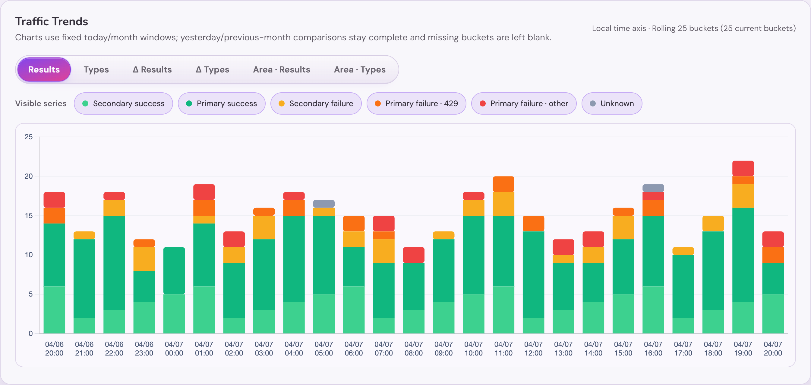
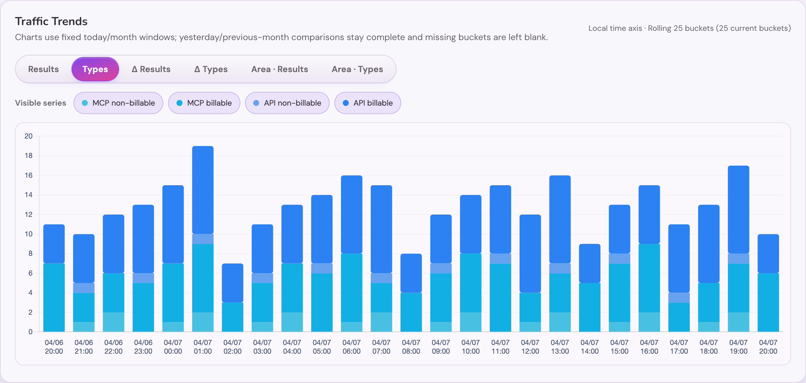
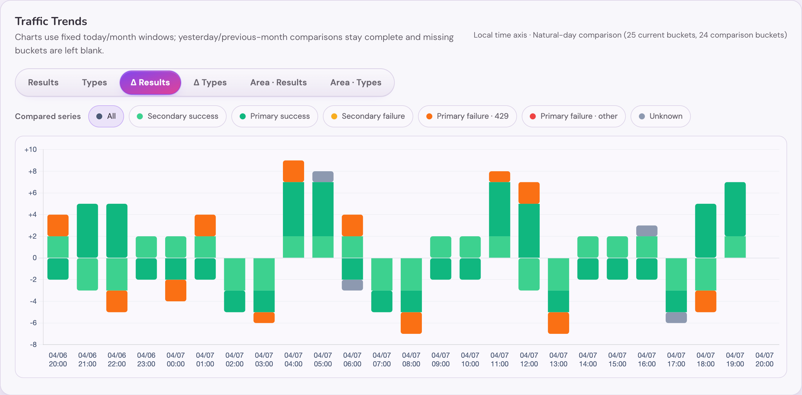
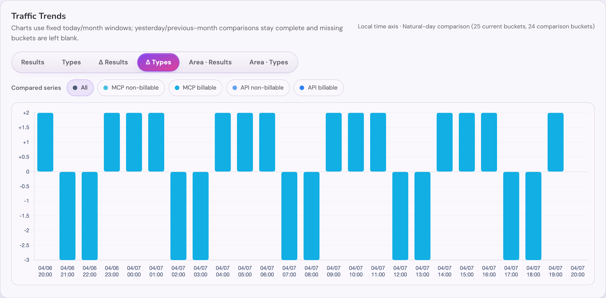
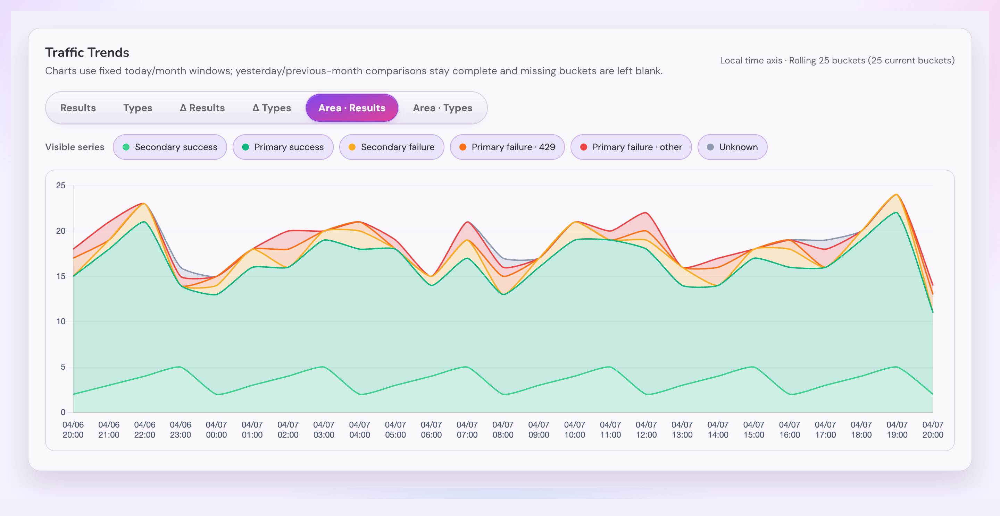
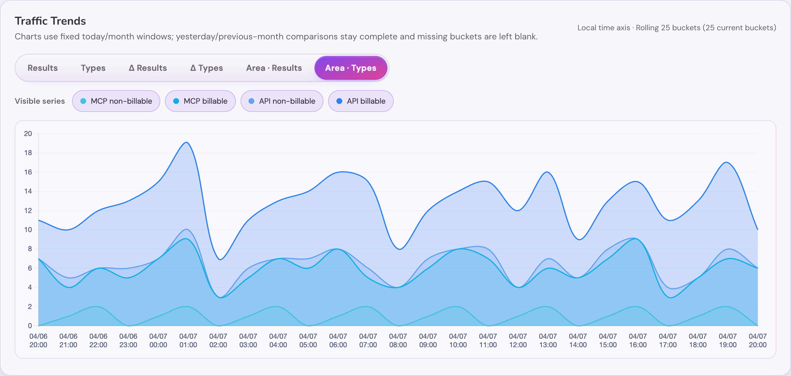
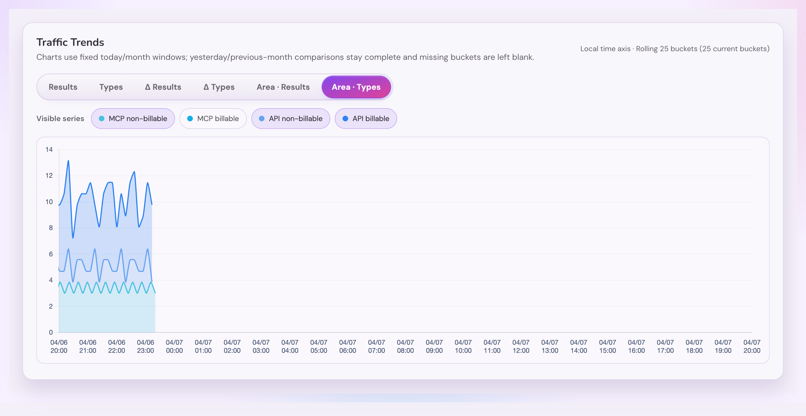
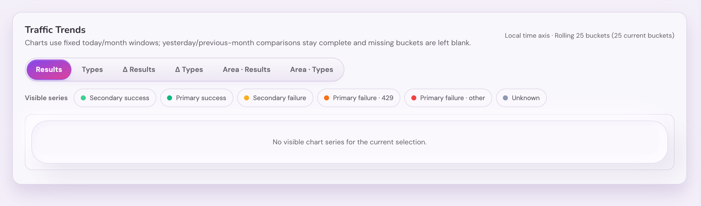
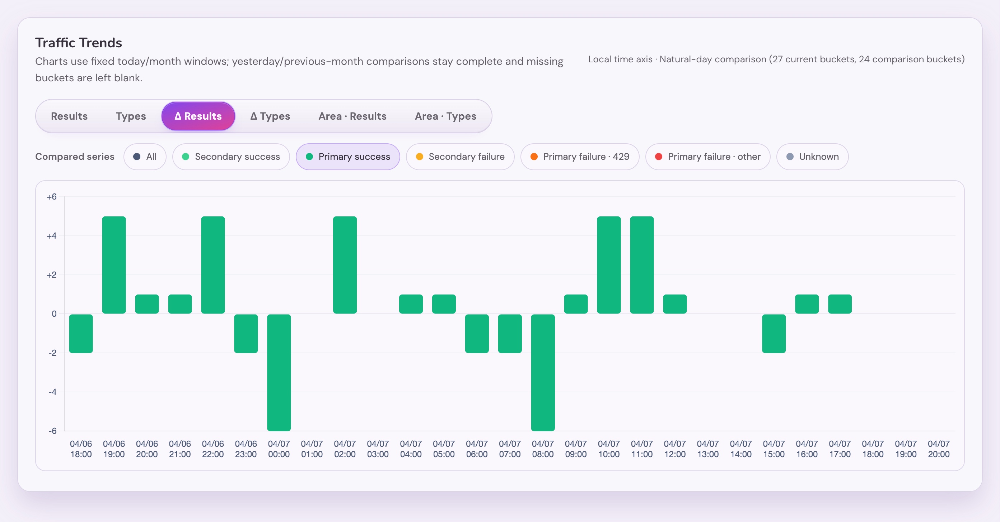

# Admin 仪表盘请求趋势图表（#h2698）

## 状态

- Status: 已完成
- Created: 2026-04-07
- Last: 2026-06-28

## 背景

- 当前 `/admin/dashboard` 的 `Traffic Trends` 仍是 2 张最近日志 sparkline，只能看到模糊的请求量 / 错误量变化，无法尽早识别 MCP `429`、MCP/API 结构变化与昨日同小时异常。
- 近期 `429` 问题证明：运营需要一块固定在管理员仪表盘首页、能按小时对齐、能立即对比昨日同小时的请求图表，而不是再跳到明细日志里临时筛选。
- 仪表盘已经有 `overview` fetch 与 admin `/api/events` SSE snapshot，同步契约适合继续承载这块小时级图表数据。

## Goals

- 在管理员仪表盘现有 `Traffic Trends` 区域内，用单一 stacked bar 图表面板替换旧 sparkline。
- 后端统一返回有限的**服务器本地时区对齐**5 分钟桶，并保证**最新一桶就是当前本地 5 分钟进行中**；前端将两张面积图固定展示最近 6 小时实时窗口，绝对柱状图与昨日对比图继续按本地自然范围聚合成小时槽位展示。
- 图表固定支持 6 种视图：
  - 调用结果
  - 调用类型
  - 与昨日对比 · 调用结果
  - 与昨日对比 · 调用类型
  - 面积图 · 调用结果
  - 面积图 · 调用类型
- 图表数据通过 `GET /api/dashboard/overview` 与 admin `/api/events` snapshot 共享同一契约，不新增单独 dashboard polling 接口。

## Non-goals

- 不调整 `request_logs` 的长期保留或 GC 策略。
- 不修改 public/user console 页面与 `/mcp` 外部协议。
- 不把调用类型拆到每个单独工具名；v1 只统计 `protocol × billing` 四类。

## 数据契约

### `DashboardHourlyRequestWindow`

- `bucketSeconds = 300`
- `visibleBuckets = 73`
- `retainedBuckets = 589`
- `buckets[]` 按时间升序排列，最新一桶允许是“当前服务器本地 5 分钟进行中”：
  - `bucketStart`
  - `secondarySuccess`
  - `primarySuccess`
  - `secondaryFailure`
  - `primaryFailure429`
  - `primaryFailureOther`
  - `unknown`
  - `mcpNonBillable`
  - `mcpBillable`
  - `apiNonBillable`
  - `apiBillable`

### `GET /api/dashboard/overview`

- 在现有 payload 中新增 `hourlyRequestWindow`。
- 旧 `trend` 字段可保留为兼容字段，但 dashboard 前端不再用它作为主图表来源。
- `hourlyRequestWindow` 服务 `Traffic Trends` 的实时面积图、绝对柱状图与今日/昨日对比图；`本月` 摘要卡及其 `previous-month comparison line` 必须继续走专用月度日粒度序列契约，禁止再从该窗口推断整月趋势。

### admin `/api/events` snapshot

- `snapshot.overview.hourlyRequestWindow` 与 `GET /api/dashboard/overview` 完全一致。
- SSE 变更检测必须覆盖小时窗口锚点变化与小时桶内容变化，避免整点翻小时后图表不刷新。

## 统计口径

- 5 分钟桶窗口：
  - 以**服务器本地时区当前 5 分钟边界**作为当前未封口桶起点，并将该边界换算成 UTC epoch `bucketStart`
  - 返回 `[currentFiveMinuteStart - 588*5m, currentFiveMinuteStart]` 的 589 个 5 分钟桶，其中最后一桶就是当前 5 分钟
  - 后端已返回的 bucket 可为 0 值；前端不得为缺失 bucket 自行补 0、插值或伪造 bucket，缺失时间槽位必须保持空缺不渲染。
- “主要 / 次要”直接复用现有 `request_value_bucket`：
  - `valuable -> primary`
  - `other -> secondary`
  - `unknown -> unknown`
- 调用结果分类：
  - `secondarySuccess` = `other + success`
  - `primarySuccess` = `valuable + success`
  - `secondaryFailure` = `other + (error | quota_exhausted)`
  - `primaryFailure429` = `valuable + failure_kind=upstream_rate_limited_429`
  - `primaryFailureOther` = `valuable + (error | quota_exhausted) - primaryFailure429`
  - `unknown` = `unknown + any result_status`
- 调用类型分类固定为：
  - `mcpNonBillable`
  - `mcpBillable`
  - `apiNonBillable`
  - `apiBillable`
- 与昨日对比：
  - 今日图使用 `summaryWindows.today_start/today_end`；对比图使用完整 `summaryWindows.yesterday_start/yesterday_end`。
  - 本月图使用 `summaryWindows.month_start/month_end`；上月对比使用服务端提供的
    `summaryWindows.previous_month_start/previous_month_end`，只筛选已有 buckets，不伪造历史数据。
  - 若旧 payload 缺少上月边界，前端展示空上月对比范围，不根据当前月边界自行推导。
  - 前端将 5 分钟桶按自然日范围聚合为小时槽位；当前小时只聚合当前已返回的 5 分钟桶，不额外补齐未来分钟。
  - delta 图 Y 轴允许正负值
- 绝对图与面积图窗口：
  - 两张面积图直接使用 `hourlyRequestWindow.visibleBuckets=73` 对应的最新滚动窗口，不再用 `summaryWindows.today_*` 二次裁剪。
  - 面积图窗口固定表示“72 个完整 5 分钟桶 + 1 个当前 5 分钟槽位”，即最近 6 小时实时运行情况。
  - 主绝对图继续展示今日自然日固定范围，数据由 `hourlyRequestWindow` 的 5 分钟桶按小时聚合而成。

## 展示约束

- `Traffic Trends` 外层 panel、标题区与整体 dashboard 排布保持不变，只替换内部内容。
- 图表默认显示：
  - 结果图：`次要成功 → 主要成功 → 次要失败 → 主要失败·429 → 主要失败·其他 → unknown`
  - 类型图：`MCP 非计费 → MCP 计费 → API 非计费 → API 计费`
- 面积图沿用结果/类型两组 series 与颜色体系，使用真正的 stacked area 读结构占比和波峰变化：
  - 首个可见 series 填充到 `origin`，后续可见 series 填充到前一个可见 dataset，禁止所有 series 同时回填到零基线造成重叠面积。
  - 用户隐藏中间 series 后，面积图必须按剩余可见 series 重新连续堆叠，不为隐藏层保留视觉空腔。
  - Chart.js filler propagation 必须关闭，避免相邻目标在隐藏/缺失时被插件自动传播到非预期层。
  - 面积图轮廓线只允许轻微平滑，避免小时桶数据被过度抹圆。
- 绝对图与面积图默认全选全部 series。
- 绝对图与面积图都使用多选显示/隐藏；后两个 delta 图使用单选，并额外提供 `全部`。
- 结果维度的 series 可见性在结果柱状图和结果面积图之间共享；类型维度同理。
- 前端需要记忆上次选中的图表模式与 series 组合，并在下次重新打开管理台时恢复。
- 桶统计口径按**服务器本地时区**对齐，但 UI 文案必须明确区分：
  - 两张面积图：最近 6 小时、5 分钟粒度
  - 绝对图：固定今日自然范围
  - delta 图：自然日 today/yesterday 对比
  - 横轴日期/时间标签按浏览器本地时间显示。
- 图表渲染必须把“时间槽位”和“已有 bucket 数据”分开：时间槽位可用于展示完整范围，bucket 缺失时数据值为 `null` 或等价空值，不渲染柱/点/线段。
- API / MCP 配色必须复用请求记录界面的语义色族；结果图复用 success / warning / destructive / neutral 语义，不新造一套与现有 UI 脱节的颜色体系。

## 验收标准

- 管理员仪表盘首页能直接看到请求趋势图表，不再显示旧 sparkline 卡片。
- `/api/dashboard/overview` 与 `/api/events` snapshot 都包含 `hourlyRequestWindow`，且 dashboard 切到该路由后可实时刷新。
- `hourlyRequestWindow.bucketSeconds = 300`、`retainedBuckets = 589`、`visibleBuckets = 73`，且最新一桶必须等于 `currentFiveMinuteStart`。
- 5 分钟桶最后一组必须是当前服务器本地 5 分钟进行中；横轴标签则按浏览器本地时间展示同一批 bucket。
- 当固定范围内缺少 bucket 时，对应柱/点/线段保持空缺，不得补 0、不插值、不自行生成 bucket。
- 主绝对图展示今日固定自然范围，5 分钟桶按小时聚合，不退化为面积图的 6 小时窗口。
- 两张面积图共享同一滚动 73 组横轴，并支持与同维度柱状图共享 series 显隐状态。
- 结果图与类型图的默认堆叠顺序、默认可见系列、面积图行为和 delta 行为与本 spec 一致。
- 管理台重新打开后，会恢复上一次选中的图表模式与 series 显示状态。
- 当所有可见系列被隐藏时，图表区域显示明确 empty state，而不是坏图或空白画布。
- Storybook 覆盖 6 个图表模式、toggle 行为与空数据场景，并提供最终视觉证据。

## 里程碑

- [x] M1: spec 冻结与索引登记
- [x] M2: 后端 hourly bucket 聚合与 overview/snapshot 扩展
- [x] M3: DashboardOverview 图表模式、图例切换与 i18n
- [x] M4: Storybook / 前端测试 / 后端测试补齐
- [x] M5: 趋势窗口纠偏、面积图补充、缺口留空视觉证据、review-loop 与快车道收敛

## 风险与假设

- 趋势图读路径依赖 `dashboard_request_rollup_buckets(bucket_secs=60)`，5 分钟窗口由分钟 rollup 汇总而来，不扫 `request_logs` 原始宽表；若后续扩展更多 breakdown，需继续保持 rollup 写入与 bounded rebuild 的幂等性。
- 风险：如果 admin SSE 的变更签名没有覆盖 5 分钟锚点，边界切换时图表可能在“无新日志”场景下停留旧窗口。
- 风险：`mcp:batch` 的计费/非计费判定依赖 request body 解析；rollup 写入与 rebuild 必须复用现有 canonicalization 规则，否则会和请求日志页面口径漂移。

## Visual Evidence

- source_type: storybook_canvas
  story_id_or_title: `admin-components-dashboardoverview--default`
  state: `results`
  evidence_note: 验证绝对“调用结果”图默认全选全部结果 series，按今日固定自然范围展示由 5 分钟桶聚合出的小时槽位，横轴标签按本地时间显示。
  image:
  

- source_type: storybook_canvas
  story_id_or_title: `admin-components-dashboardoverview--types-mode`
  state: `types`
  evidence_note: 验证“调用类型”图按 MCP/API 与计费/非计费四类堆叠，复用请求记录界面的协议色族。
  image:
  

- source_type: storybook_canvas
  story_id_or_title: `admin-components-dashboardoverview--results-delta-mode`
  state: `results-delta`
  evidence_note: 验证“与昨日对比·调用结果”图使用 signed Y 轴，并支持 `全部` 差值堆叠展示。
  image:
  

- source_type: storybook_canvas
  story_id_or_title: `admin-components-dashboardoverview--types-delta-mode`
  state: `types-delta`
  evidence_note: 验证“与昨日对比·调用类型”图支持单选/全部切换，并在 `全部` 下显示类型差值柱状图。
  image:
  

- source_type: storybook_canvas
  story_id_or_title: `admin-components-dashboardoverview--results-area-mode`
  state: `results-area`
  evidence_note: 验证“面积图 · 调用结果”使用最近 6 小时、5 分钟粒度滚动窗口，并按结果分层堆叠展示。
  image:
  

- source_type: storybook_canvas
  story_id_or_title: `admin-components-dashboardoverview--types-area-mode`
  state: `types-area`
  evidence_note: 验证“面积图 · 调用类型”使用最近 6 小时、5 分钟粒度滚动窗口，并按类型分层堆叠展示。
  image:
  

- source_type: storybook_canvas
  story_id_or_title: `admin-components-dashboardoverview--types-area-hidden-middle-series`
  state: `types-area-hidden-middle`
  evidence_note: 验证隐藏中间 type series 后，剩余可见 series 会重新连续堆叠，不为隐藏层保留视觉空腔。
  image:
  

- source_type: storybook_canvas
  story_id_or_title: `admin-components-dashboardoverview--hidden-series-empty`
  state: `empty-selection`
  evidence_note: 验证绝对图在所有系列都被隐藏后呈现明确 empty state，而不是坏图或空白画布。
  image:
  

- source_type: storybook_canvas
  story_id_or_title: `admin-components-dashboardoverview--fixed-range-with-gaps`
  state: `fixed-range-gaps`
  evidence_note: 验证图表元信息展示固定当前/对比范围，且固定范围缺失小时由 Storybook fixture 保持为空缺，不由前端补 0 或伪造 bucket。
  image:
  
