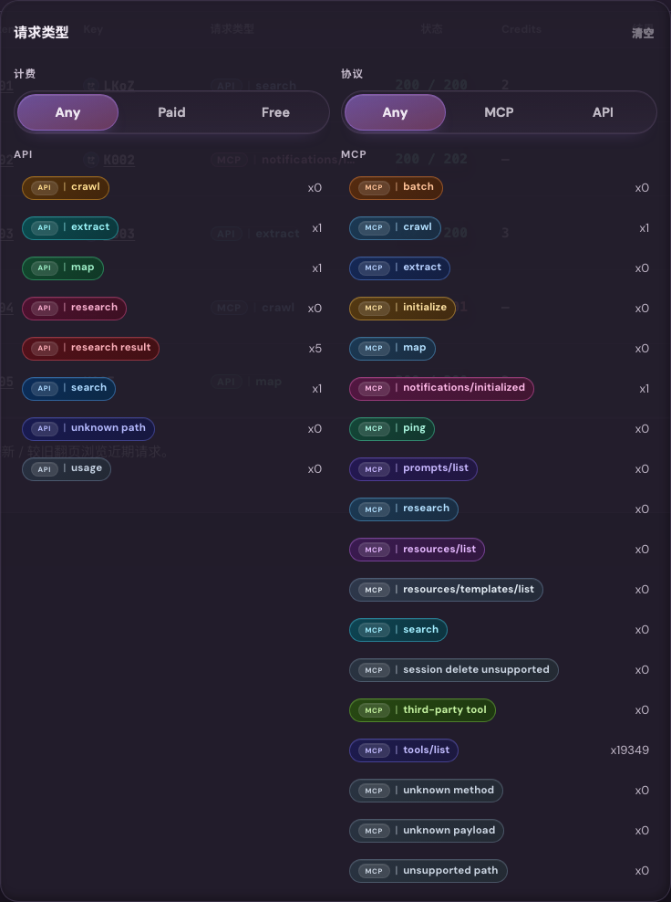
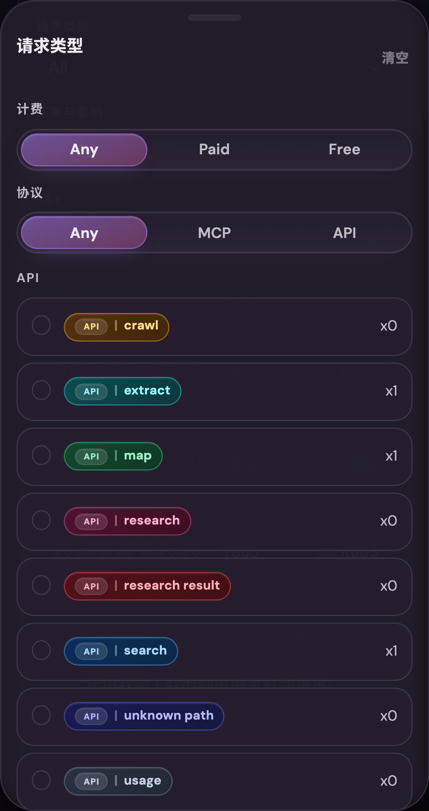

# 共享 Request Type 筛选面板田字形重排（#kq2rt）

## 状态

- Status: 进行中（快车道）
- Created: 2026-06-21
- Last: 2026-06-21

## 背景 / 问题陈述

- `wnzdr` 已把 `/admin/requests`、`/admin/keys/:id`、`/admin/tokens/:id` 的近期请求统一到 `AdminRecentRequestsPanel`，`uj9hb` 也已经把 request type 的 quick filters、manual override 与 canonical helper 统一下来。
- 但当前 request type 面板仍然是“顶部 quick filters + 单列混排 request kinds + 独占一行的 All request types”，在高密度 catalog 下高度过高，桌面端筛选面板会明显压缩列表可视区。
- 这次需要在不改筛选语义、不分叉调用方、不新增后端 contract 的前提下，把同一个共享 request type 面板重排成更矮的桌面 2x2 布局，并给小屏补上更稳定的 Drawer 收口。

## 关联规格

- `docs/specs/uj9hb-admin-token-request-kind-quick-filters/SPEC.md`
- `docs/specs/wnzdr-admin-recent-requests-unification/SPEC.md`

## 目标 / 非目标

### Goals

- 把 `AdminRecentRequestsPanel` 的 request type 浮层重排成共享组件级 2x2 桌面布局：
  - 第一行：`Billing`、`Protocol`
  - 第二行：`API` request kinds、`MCP` request kinds
- 去掉整行 `All request types` 入口，改为标题行右侧低强调 `Clear`，并继续复用现有 `onClearRequestKinds()` 语义。
- 小屏下沿用同一触发入口，但内容容器从 dropdown 改为 `Drawer`，固定顺序为标题/清空、计费、协议、API、MCP。
- 小屏 drawer 内的 `Billing` / `Protocol` quick filters 继续使用按钮单选，不降级为 select，前提是不引入横向溢出或触控面积回退。
- 保留 `uj9hb` 已建立的 helper 语义：quick filters、manual override、summary、retained selection fallback、count 展示与 empty-match 行为都不变。
- 为共享组件补稳定的 desktop expanded story 与 mobile drawer story，供 shared callers 统一验收。

### Non-goals

- 不改 `request_kind_options`、`protocol_group`、`billing_group`、筛选参数、URL 同步或任何后端 DTO。
- 不把这次改造扩展到 mini recent requests 卡片、全屏筛选路由、搜索/反选/按 count 重排。
- 不重做 `SegmentedTabs` 组件，也不引入新的 request type trigger props。

## 范围（Scope）

### In scope

- `docs/specs/README.md`
  - 新增 `kq2rt-admin-request-type-filter-quadrant-layout` 索引行。
- `web/src/components/AdminRecentRequestsPanel.tsx`
  - 共享 request type trigger 根据 viewport 在 dropdown / drawer 间切换。
  - request kind content body 重排为桌面 2x2 / 小屏单列。
  - retained selection 缺失 `protocol_group` 时按 key 前缀稳定回落到 `API` 或 `MCP` 列。
- `web/src/styles/public.css`
- `web/src/styles/user-console.css`
  - 新增 request type panel header、clear action、2x2 grid、drawer item 与 shared spacing styles。
- `web/src/components/AdminRecentRequestsPanel.stories.tsx`
- `web/src/components/AdminRecentRequestsPanel.stories.test.ts`
  - 新增 desktop expanded proof 与 mobile drawer proof，并保留 shared panel 既有 proofs。

### Out of scope

- `tokenLogRequestKinds.ts` helper 语义改动。
- `/admin/requests`、key detail、token detail 的页面级局部覆盖逻辑。
- 任何 API / Rust 侧 contract 变更。

## 接口契约（Interfaces & Contracts）

### Shared component contract

- `AdminRecentRequestsPanel` 继续保持现有 public props 不变。
- 同一组 `onRequestKindQuickFiltersChange`、`onToggleRequestKind`、`onClearRequestKinds` handlers 同时驱动桌面 dropdown 与小屏 drawer。
- `Clear` 的语义继续等价于“清空 selected request kinds + quick filters 回到 `Any / Any` + 调用方分页/empty-match 生命周期照旧”。

### Layout contract

- 桌面端 request type 浮层固定为单一外层滚动容器，不允许 API/MCP 各自独立滚动。
- 桌面端内容顺序固定为：
  1. 标题 + `Clear`
  2. `Billing`、`Protocol`
  3. `API`、`MCP`
- 小屏端 drawer 内容顺序固定为：
  1. 标题 + `Clear`
  2. `Billing`
  3. `Protocol`
  4. `API`
  5. `MCP`

## 验收标准（Acceptance Criteria）

- Given 管理员在桌面宽度打开 request type trigger
  When 浮层展开
  Then 标题右侧可见低强调 `Clear`，其下固定为两行两列，不再出现整行 `All request types`。

- Given 当前 quick filters 选择为 `Paid + MCP`、`Free + API` 或任意 `Billing/Protocol` 组合
  When 管理员展开浮层
  Then API/MCP 列中的勾选集合与现有 `tokenLogRequestKinds.ts` helper 结果保持完全一致。

- Given 当前处于某个 quick filter 组合生成的勾选集合
  When 管理员手动勾选或取消某个 request kind
  Then quick filter 的显示态继续按 `uj9hb` 既有规则回退或保持，不因为布局变化产生新优先级。

- Given 管理员点击 `Clear`
  When 面板重置 request type
  Then 共享组件继续调用既有 `onClearRequestKinds()` 语义，而不是只清 quick filters 的显示态。

- Given 视口宽度进入 small viewport
  When 管理员点击同一个 request type trigger
  Then 触发入口打开 drawer，drawer 无横向溢出，内容顺序固定为标题/清空、计费、协议、API、MCP，且 `Billing` / `Protocol` 保持按钮单选。

## 测试与证据

- `cd web && bun test src/tokenLogRequestKinds.test.ts src/components/AdminRecentRequestsPanel.stories.test.ts src/admin/AdminPages.stories.test.ts`
- `cd web && bun run build`
- `cd web && bun run build-storybook`

## Visual Evidence

- source_type: `storybook_canvas`
  story_id_or_title: `Admin/Components/AdminRecentRequestsPanel / RequestKindDesktopExpanded`
  target_program: `mock-only`
  capture_scope: `element`
  sensitive_exclusion: `N/A`
  requested_viewport: `1440-device-desktop`
  viewport_strategy: `storybook-viewport`
  submission_gate: `approved`
  state: `desktop request type panel expanded`
  evidence_note: 验证桌面端 request type 浮层已经压缩为标题/清空 + Billing/Protocol + API/MCP 田字形结构。
  image:
  

- source_type: `storybook_canvas`
  story_id_or_title: `Admin/Components/AdminRecentRequestsPanel / RequestKindMobileDrawer`
  target_program: `mock-only`
  capture_scope: `element`
  sensitive_exclusion: `N/A`
  requested_viewport: `390x844`
  viewport_strategy: `storybook-viewport`
  submission_gate: `approved`
  state: `mobile request type drawer open`
  evidence_note: 验证 small viewport 下同一触发入口改为 Drawer，内容顺序与点击面积保持稳定。
  image:
  

## 变更记录（Change log）

- 2026-06-21: 初始化 follow-up spec，冻结共享 request type 面板的桌面田字形布局、小屏 drawer 收口与 stable Storybook evidence 合同。
