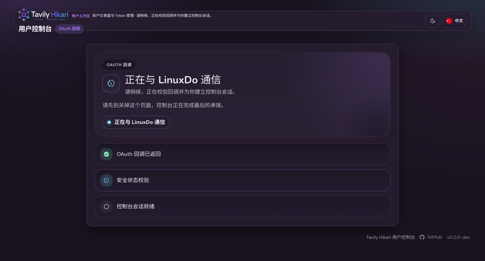
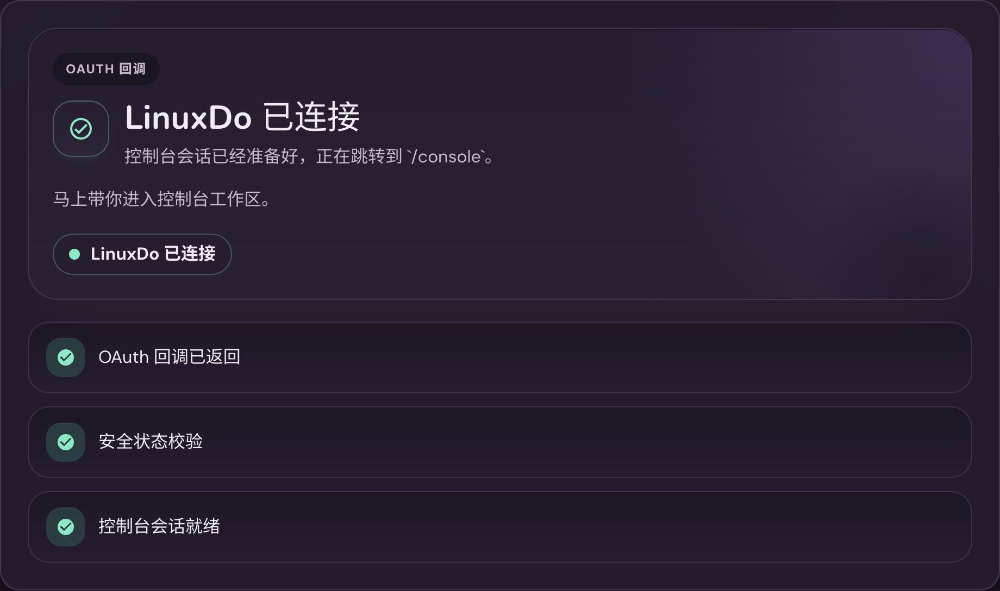
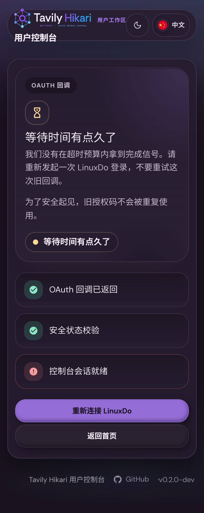

# LinuxDo OAuth 前端 Callback 承接与友好状态优化（#n8x4p）

## 状态

- Status: 已实现（待审查）
- Created: 2026-06-26
- Last: 2026-06-26

## 背景 / 问题陈述

- `rg5ju` 把 LinuxDo OAuth 登录打通后，正式回调仍由后端 `GET /auth/linuxdo/callback` 直接消费 `code/state` 并完成登录。
- 这种收口方式在 provider 拒绝、state 失效、上游 token/userinfo 失败、网络超时等场景下只能落到裸 HTTP 错误或跳转，用户无法在 `/console` 壳内得到稳定、可理解的状态提示。
- `8yzmy` 已经建立 `/console/*` 深链直开与 path route 能力，当前缺的不是新的路由框架，而是把 OAuth callback 作为一个正式的 console route 来承接。
- `r835w` 的暂停注册分流与 `vr67d` 的候选 token 重绑逻辑仍然需要保留，但它们应当被前端 callback 页通过统一 finalize contract 驱动，而不是继续绑死在旧的 GET callback 上。

## 关联规格

- `docs/specs/rg5ju-linuxdo-login-token-autofill/SPEC.md`
- `docs/specs/8yzmy-user-console-path-routing/SPEC.md`
- `docs/specs/r835w-user-registration-pause-switch/contracts/http-apis.md`
- `docs/specs/vr67d-linuxdo-token-rebind-relogin/contracts/http-apis.md`

## 目标 / 非目标

### Goals

- 把 LinuxDo OAuth 登录收口迁移到真正的前端 callback 页：`/console/oauth/linuxdo/callback`。
- 在 `/console` 壳内提供 provider-specific connecting、success、failure、timeout、cancel/deny 状态与双语友好文案。
- 新增 `POST /auth/linuxdo/finalize`，由前端提交 `code/state` 完成换 token、userinfo、用户 upsert、token 绑定与用户会话建立。
- 保留 `/registration-paused` 专页分流，并将旧 `GET /auth/linuxdo/callback` 改为配置诊断入口。
- 补齐 Storybook callback state gallery、前后端测试、README 配置说明与 visual evidence。

### Non-goals

- 不在本轮接入 LinuxDo 之外的真实 OAuth provider。
- 不新增任意 console 深链回跳；登录成功后的默认落点固定为 `/console`。
- 不保留旧 `GET /auth/linuxdo/callback` 作为正式可用的第二条登录完成路径。
- 不做自动重试，也不复用已消费或超时的 `code/state`。

## 范围（Scope）

### In scope

- `src/server/handlers/user.rs`
- `src/server/serve.rs`
- `src/server/tests/linuxdo_oauth_and_admin_keys.rs`
- `src/server/tests/api_keys_and_registration.rs`
- `src/server/tests/upstream_support_and_manual_jobs.rs`
- `web/src/lib/userConsoleRoutes.ts`
- `web/src/user-console/runtime.tsx`
- `web/src/user-console/useOAuthCallbackFlow.ts`
- `web/src/user-console/oauthCallback.ts`
- `web/src/user-console/OAuthCallbackPanel.tsx`
- `web/src/user-console/OAuthCallbackPanel.stories.tsx`
- `web/src/user-console/OAuthCallbackPanel.stories.test.ts`
- `web/src/styles/user-console-overview.css`
- `README.md`
- `README.zh-CN.md`
- `docs/specs/README.md`

### Out of scope

- Public home、admin login、access token 额度策略的重新设计。
- 新的 provider registry / session federation 架构。
- 旧 callback 的长期双栈兼容或自动迁移逻辑。

## 接口契约（Interfaces & Contracts）

### Route contract

- `/console/oauth/:provider/callback` 是 `/console` 壳内的正式 callback path。
- 本轮前端 route contract 参数化保留 `provider`，但运行时只接受 `linuxdo` 作为真实后端接线 provider。
- callback 页负责解析 query `code`、`state`、`error`、`error_description`，再驱动 finalize 状态机。

### HTTP contract

- `POST /auth/linuxdo/finalize`
  - body: `{ "code": string, "state": string }`
  - success outcome: 设置 `hikari_user_session` cookie，返回 `{"ok":true,"outcome":"success","redirectTo":"/console"}`
  - failure outcomes: `invalid_state`、`inactive_user`、`upstream_failure`、`server_error`
  - redirect outcome: `registration_paused` 返回 `{"ok":false,"outcome":"registration_paused","redirectTo":"/registration-paused"}`
- `GET /auth/linuxdo/callback`
  - 不再承担正式登录完成路径
  - 固定返回诊断性 HTML，提示当前 redirect URI 应指向 `/console/oauth/linuxdo/callback`

### UX contract

- callback 页首屏必须先显示“正在与 LinuxDo 通信”的连接态，然后在 finalize 结果到达后切换成功或失败视图。
- 失败、超时、取消、无效请求等非成功场景必须固定提供：
  - `重新连接 LinuxDo`
  - `返回首页`
- reduced-motion 环境下必须保留状态层级，但停用依赖持续动画才能理解的信息。

## 验收标准（Acceptance Criteria）

- Given 用户从 LinuxDo 返回有效 `code/state`
  When 打开 `/console/oauth/linuxdo/callback`
  Then 页面先显示 provider-specific connecting 态，再在 finalize 成功后自动进入 `/console`，且用户会话 cookie 已生效。

- Given provider 返回 `error=access_denied`、缺少 `code`、或 state 无效/过期
  When callback 页解析 query 或 finalize 响应
  Then 页面不出现裸 HTTP 错页，而是在 callback 视图中展示友好失败文案与 `重新连接 LinuxDo / 返回首页` CTA。

- Given finalize 请求超过前端超时预算
  When callback 页等待超时
  Then 页面进入 timeout 态，并只允许 fresh restart，不复用旧授权码重试。

- Given 新用户命中暂停注册分流
  When finalize 返回 `registration_paused`
  Then 浏览器跳转 `/registration-paused`，而不是停留在通用错误卡片。

- Given 实现完成
  When 运行验证
  Then `cargo test`、`cd web && bun test`、`cd web && bun run build`、`cd web && bun run build-storybook` 通过。

## 测试与证据

- `cargo test`
- `cd web && bun test`
- `cd web && bun run build`
- `cd web && bun run build-storybook`

## Visual Evidence

- source_type: `storybook_canvas`
  story_id_or_title: `User Console/Fragments/OAuth Callback/Desktop Connecting`
  target_program: `mock-only`
  capture_scope: `element`
  sensitive_exclusion: `N/A`
  requested_viewport: `1440-device-desktop`
  viewport_strategy: `storybook-viewport`
  submission_gate: `approved`
  state: `desktop connecting in dark user-console shell`
  evidence_note: 验证桌面端 callback 首屏已回到真实 dark clay user-console shell 语境，承接卡片维持居中 bounded column，不再在宽屏下整块摊满，同时保留共享 header、主题切换器、语言切换器、footer，以及“正在与 LinuxDo 通信”的承接态。
  PR: include
  image:
  

- source_type: `storybook_canvas`
  story_id_or_title: `User Console/Fragments/OAuth Callback/Desktop Success`
  target_program: `mock-only`
  capture_scope: `browser-viewport`
  sensitive_exclusion: `N/A`
  requested_viewport: `1440-device-desktop`
  viewport_strategy: `storybook-viewport`
  submission_gate: `approved`
  state: `desktop success handoff in dark user-console shell`
  evidence_note: 验证桌面端 finalize 成功后会在真实 dark clay user-console shell 中显示成功承接态、三步完成状态与即将进入 `/console` 的语义。
  image:
  

- source_type: `storybook_canvas`
  story_id_or_title: `User Console/Fragments/OAuth Callback/Mobile Timeout`
  target_program: `mock-only`
  capture_scope: `element`
  sensitive_exclusion: `N/A`
  requested_viewport: `390x844`
  viewport_strategy: `storybook-viewport`
  submission_gate: `approved`
  state: `mobile timeout recovery in dark user-console shell`
  evidence_note: 验证移动端 callback 超时后在真实 dark clay user-console shell 中仍保持完整信息层级、稳定左右 gutter 与按钮区纵向堆叠，并固定提供“重新连接 LinuxDo / 返回首页”双 CTA。
  PR: include
  image:
  

## 变更记录（Change log）

- 2026-06-26: 创建 follow-up spec，冻结前端 callback route、`POST /auth/linuxdo/finalize`、legacy callback 诊断语义，以及 callback outcome taxonomy。
- 2026-06-26: 完成前后端 callback/finalize 收口、Storybook callback gallery、README/spec 合同同步，以及本地测试/构建/视觉证据验证。
