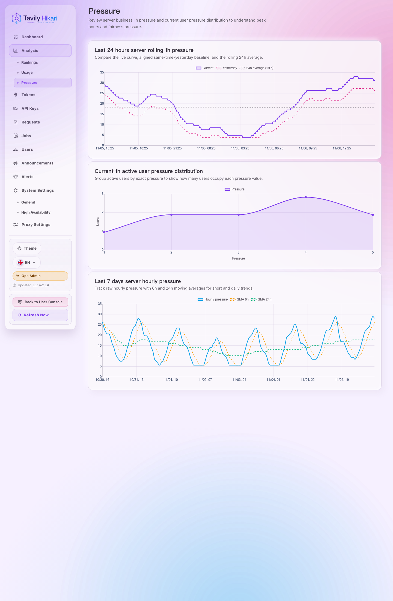
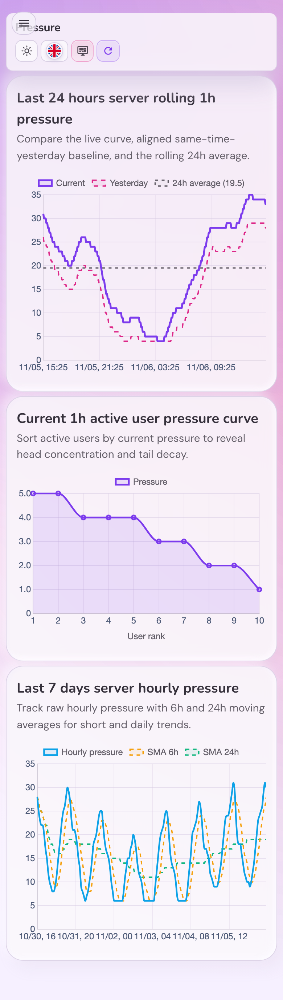

# Admin Pressure 曲线化与均线增强（#qwwgt）

## 状态

- Status: 进行中（快车道）
- Created: 2026-06-26
- Last: 2026-06-26

## 背景

- `/admin/analysis/pressure` 当前已有三块稳定 panel，但表达仍停留在“当前/昨日折线 + 粗分桶用户分布 + 7d 单曲线”，无法直接回答最近 24 小时基线、7 天短中期趋势与活跃用户头部集中度。
- 用户侧真相源已经由 `3zky1` 固定为 `businessCalls1h`；当前页面的问题不是缺数据，而是当前图表语义过粗，难以支持分析判断。
- `4q9xk` 已冻结为 route/screen contract 与 story/runtime 承载主题；新的压力分析语义不应继续挤入它的范围。

## Goals

- 保持 `/admin/analysis/pressure` 三面板结构不变，但把三个 panel 统一提升为平滑曲线表达。
- 在最近 24 小时服务器 rolling 1h pressure 图中，保留“当前 / 昨日同期”对比，并新增“最近 24 小时平均压力”水平虚线。
- 在最近 7 天服务器小时压力图中，保留原始小时压力曲线，并叠加 `SMA 6h` 与 `SMA 24h` 两条移动均线虚线。
- 把“当前 1 小时用户压力分布”改成“活跃用户 pressure rank 曲线”，按 pressure 降序呈现用户头部与长尾。
- 让 API、TS 类型、Storybook mock、视觉证据与 i18n 文案围绕同一新语义同步。

## Non-goals

- 不引入“今日 / 自然日” pressure 口径。
- 不新增新的后端用户 pressure 统计真相源，继续复用 `businessCalls1h` active rows。
- 不把 zero-pressure 用户画进 rank 曲线，也不保留旧的粗分桶区间图。
- 不修改 admin 其他 analysis 页面、导航结构、权限逻辑或 summary card band。

## 数据与 UI 合同

- `/api/analysis/pressure`
  - `server24h.current` / `server24h.previous` 继续保持 288 个 rolling 1h pressure 点。
  - `server7d.points` 继续保持最近 7 天的 168 个小时 pressure 点。
  - 新增 `server7d.movingAverages`：
    - `Array<{ key: 'sma6h' | 'sma24h', windowHours: number, points: Array<{ bucketStart: number, displayBucketStart: number, value: number }> }>`
    - `points.length = 168`
    - 计算使用额外 23 小时 hidden warmup 数据，但最终只暴露最近 168 个可见点。
- 最近 24 小时平均压力
  - 定义为 `server24h.current[*].pressure` 288 个点的算术平均值。
  - 不新增后端字段；前端直接计算并渲染水平虚线。
- 活跃用户 pressure rank 曲线
  - 数据源固定为 `currentUserDistribution.rows`
  - 前端按 `pressure DESC, userId ASC` 排序
  - 仅展示 `pressure > 0` 用户
  - x 轴为 rank，tooltip 展示 displayName/username、pressure、success、failure

## 验收标准

- `/api/analysis/pressure` 返回 288 个 `server24h.current` 点、288 个 `server24h.previous` 点、168 个 `server7d.points` 点，以及 2 条各 168 点的 `movingAverages`。
- `movingAverages[0].key = sma6h`，`movingAverages[1].key = sma24h`；两条线的首个可见点均已基于完整 trailing window 计算，不用半窗均值。
- `/admin/analysis/pressure` 的三张图都只使用平滑曲线表达，不出现 step/直方/折角折线。
- 最近 24 小时图可同时看见 `当前`、`昨日同期`、`最近 24 小时平均` 三条线；平均线为水平虚线，图例带可读数值。
- 最近 7 天图可同时看见 `小时压力`、`SMA 6h`、`SMA 24h` 三条曲线；两条移动均线为虚线且可在 legend / tooltip 中区分。
- 活跃用户曲线只包含 active users；任意 zero-pressure 用户不出现在点位、tooltip 或尾部占位中。
- `cargo test`、`cd web && bun test`、`cd web && bun run build`、`cd web && bun run build-storybook` 全部通过。

## Visual Evidence

- source_type: `storybook_canvas`
  story_id_or_title: `admin-pages--pressure`
  state: `Analysis / Pressure desktop render with 24h average, SMA 6h/24h, and active-user rank curve`
  target_program: `mock-only`
  capture_scope: `element`
  requested_viewport: `1440x2200`
  viewport_strategy: `storybook-viewport`

  PR: include
  

- source_type: `storybook_canvas`
  story_id_or_title: `admin-pages--pressure-mobile`
  state: `Analysis / Pressure mobile stacked render with the same three curve panels`
  target_program: `mock-only`
  capture_scope: `element`
  requested_viewport: `390x2600`
  viewport_strategy: `storybook-viewport`

  PR: include
  

## References

- `docs/specs/3zky1-admin-user-shared-usage-charts/SPEC.md`
- `docs/specs/4q9xk-admin-route-hook-order-screen-split/SPEC.md`
- `src/tavily_proxy/proxy_request_limits.rs`
- `web/src/admin/PressureAnalysisScreen.tsx`
