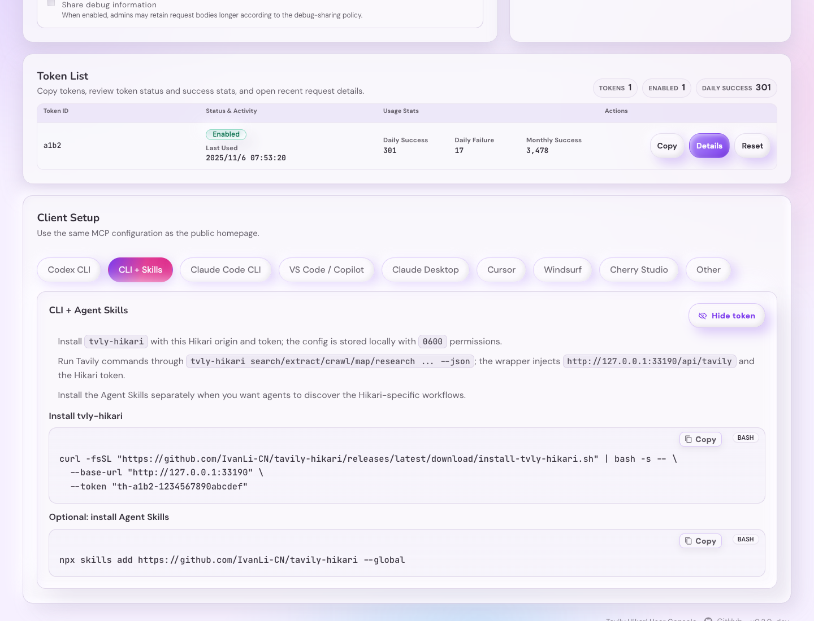
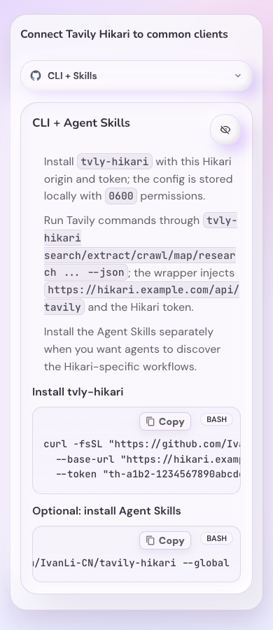

# Tavily Hikari CLI + Agent Skills Release

Spec ID: `tv4hc`

## Status

进行中（快车道）

## Problem

Tavily Hikari 已提供 `/mcp` 与 `/api/tavily/*` 两个稳定接入面，但 CLI 和 Agent Skills
用户仍需要手工理解官方 `tvly`、Hikari façade base URL、Hikari token 与官方 Tavily API key
的差异。正式发布需要一个可从 GitHub Release 直接分发的薄 wrapper，并在用户控制台中生成
带当前 origin 与当前 token 的安装命令。

## Goals

- 发布 `tvly-hikari` CLI wrapper，通过官方 `tvly` 执行 `search`、`extract`、`crawl`、
  `map`、`research` 等命令。
- 发布 `install-tvly-hikari.sh` GitHub Release asset，支持 `--base-url`、`--token`、
  `--install-dir`、`--config-dir`、`--with-skills`。
- 将 wrapper 配置写入 `~/.config/tavily-hikari-cli/config.json`，权限为 `0600`。
- 在 Release workflow 上传 `install-tvly-hikari.sh` 与 `tvly-hikari`，并在上传前做语法与
  环境注入 smoke。
- 在仓库根 `skills/` 发布 Tavily Hikari Agent Skills package。
- 在用户控制台“客户端接入”中新增 `CLI + Skills` tab，命令带当前 `baseUrl` 与当前 guide
  token，并沿用 token reveal 行为。
- 同步 README、docs-site 与 FAQ/quick-start 中的接入说明。

## Non-Goals

- 不发布 PyPI、npm、Homebrew 或系统包管理器版本。
- 不 fork 官方 `tavily-cli`，不重写 Tavily command 逻辑。
- 不改变 `/api/tavily/*`、`/mcp`、计费、上游转发、HA 或 key 调度语义。
- 不内置生产域名；所有安装命令通过 `--base-url` 显式配置。
- 不默认安装 Agent Skills；只有 `--with-skills` 才执行全局 `npx skills add`。
- 不在测试中访问 Tavily 生产上游。

## Contract

### CLI Wrapper

`tvly-hikari configure --base-url <origin> --token <th-token>` 写入：

```json
{
  "baseUrl": "https://<your-hikari-host>",
  "token": "th-<id>-<secret>"
}
```

普通命令透传给官方 `tvly`，并注入：

```bash
TAVILY_API_BASE_URL=https://<your-hikari-host>/api/tavily
TAVILY_API_KEY=th-<id>-<secret>
```

`TAVILY_API_KEY` 是 Hikari access token，不是官方 Tavily API key。Hikari 负责 quota、audit
与 upstream key-pool routing。

### Installer

Release asset URL:

```bash
https://github.com/IvanLi-CN/tavily-hikari/releases/latest/download/install-tvly-hikari.sh
```

默认行为：

- 安装 `tvly-hikari` 到 `~/.local/bin`。
- 若官方 `tvly` 不存在，优先尝试 `uv tool install tavily-cli`。
- 若 `uv` 不可用或安装失败，输出明确的手动安装指引并失败。
- 只有传入 `--with-skills` 才执行
  `npx skills add https://github.com/IvanLi-CN/tavily-hikari --global`。

### Agent Skills

仓库根 `skills/` 目录包含：

- `tavily-hikari-cli`
- `tavily-hikari-search`
- `tavily-hikari-extract`
- `tavily-hikari-crawl`
- `tavily-hikari-map`
- `tavily-hikari-research`
- `tavily-hikari-best-practices`

所有示例命令使用 `tvly-hikari ... --json`，并说明默认流量走 Hikari `/api/tavily` façade。

每个 `SKILL.md` 必须以标准 YAML frontmatter 开始，包含与目录一致的非空 `name` 与非空
`description`。面向用户的唯一安装命令是：

```bash
npx skills add https://github.com/IvanLi-CN/tavily-hikari --global
```

不建议项目级安装，也不在公开命令中指定 agent。当前 `npx skills` 将 Codex 与 OpenCode
作为 universal clients 安装到用户级 `~/.agents/skills`，并将 Claude Code 安装到用户级
`~/.claude/skills`；选择与映射由 `npx skills` 负责。

### UI Guide

用户控制台 guide 新增 `CLI + Skills` tab：

```bash
curl -fsSL "https://github.com/IvanLi-CN/tavily-hikari/releases/latest/download/install-tvly-hikari.sh" | bash -s -- \
  --base-url "<current origin>" \
  --token "<current guide token>"
```

未 reveal 时显示 masked token；reveal 后代码块使用真实 token。代码块提供复制按钮。

## Validation

- `bash -n scripts/install-tvly-hikari.sh scripts/tvly-hikari`
- `python3 tests/test_tvly_hikari_cli.py`
- `RUN_NPX_SKILLS_INTEGRATION=1 python3 tests/test_tavily_hikari_agent_skills.py`
- `cd web && bun test`
- `cd web && bun run build`
- `cd web && bun run build-storybook`
- `cargo fmt --all -- --check`
- `cargo clippy --all-targets --all-features -- -D warnings`
- `cargo test --locked --all-features`
- Storybook visual evidence for desktop and mobile `CLI + Skills` guide states.

## Visual Evidence

source_type=storybook_canvas
story_id_or_title: `User Console/UserConsole / Setup Guide CLI + Skills`
state: desktop CLI + Skills guide with revealed token
target_program: mock-only
capture_scope: browser-viewport
requested_viewport=1440x1100
viewport_strategy=browser-resize-fallback
sensitive_exclusion: mock Storybook token only
submission_gate: approved
evidence_source_commit: a836951a
evidence_note: Shows the desktop `CLI + Skills` guide with the release installer command and the
global Agent Skills command.

PR: include



source_type=storybook_canvas
story_id_or_title: `User Console/UserConsole / Setup Guide CLI + Skills Mobile`
state: mobile CLI + Skills guide with the global command scrolled to its tail
target_program: mock-only
capture_scope: browser-viewport
requested_viewport=390x900
viewport_strategy=browser-resize-fallback
sensitive_exclusion: mock Storybook token only
submission_gate: approved
evidence_source_commit: a836951a
evidence_note: Shows the 390 px mobile guide with its compact selector, icon-only token control,
and the horizontally scrollable Skills command ending in `--global`.

PR: include



## Security

- Never write official Tavily API keys to downstream client configs.
- Hikari tokens are stored locally with file mode `0600`.
- UI only injects the real token after the existing reveal flow succeeds.
- Tests use fake `tvly` or local façade behavior and must not call Tavily production upstream.
