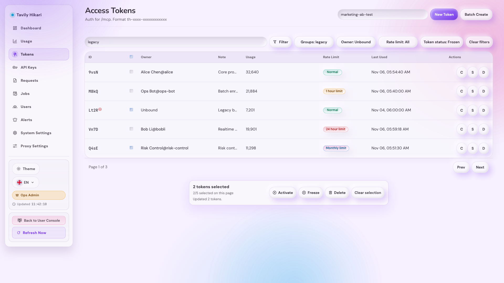
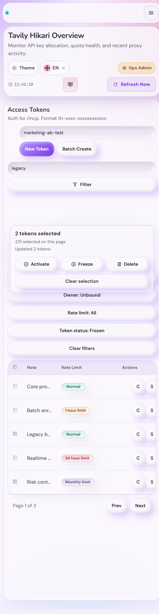

# 访问令牌批量操作与筛选改造（#urk9j）

## 状态

- Status: 已实现（待审查）
- Created: 2026-05-26

## 背景 / 问题陈述

- 管理台 `/admin/tokens` 原本只能逐条操作访问令牌，冻结、激活、删除在批量维护时成本高且容易遗漏。
- 原分组 chip 只能表达单一维度，缺少关键词、绑定关系、额度状态和冻结状态筛选，管理员难以定位目标令牌。
- “冻结”来自 `auth_tokens.enabled = false`，“限额状态”来自 runtime quota state；二者语义不同，不能混入同一筛选或展示字段。

## 目标 / 非目标

### Goals

- 为访问令牌列表增加当前页全选、跨页保留勾选、清空选择，以及有勾选时可见的悬浮批量操作面板。
- 批量面板提供激活、冻结、删除；删除必须二次确认。
- 将分组 chip 改为下拉筛选，并新增关键词、是否关联用户、限额状态、令牌状态筛选。
- 扩展 `/api/tokens` 服务端筛选，筛选必须发生在分页前，并保持现有 `items/total/page/perPage` 响应兼容。
- 新增批量状态更新与批量删除接口，返回成功数量与缺失 ID 以便前端反馈。
- 补齐 Storybook 稳定入口、视觉证据和后端回归测试。

### Non-goals

- 不修改令牌创建、复制、分享、详情页和用户控制台令牌列表的业务语义。
- 不把冻结状态写入或映射到 `quota_state`。
- 不实现“选择全部筛选结果”；全选只作用于当前页。
- 不触发生产 Tavily upstream 测试。

## 范围（Scope）

### In scope

- `src/server/handlers/admin_resources/user_tag_and_token_handlers.rs`
  - `/api/tokens` 查询参数解析与批量 mutation handlers。
- `src/store/key_store_keys.rs`
  - 访问令牌服务端筛选、批量启停、批量软删除。
- `src/tavily_proxy/proxy_auth_and_oauth.rs`
  - 筛选分页与 quota-state 后过滤接线。
- `web/src/admin/AdminDashboardRuntime.tsx`
  - 筛选栏、URL 状态、跨页选择、悬浮批量面板和确认弹窗。
- `web/src/api/runtime.ts`
  - token list query 类型与批量 API helper。
- `web/src/admin/routes.ts`
  - token list 筛选 URL 构造。
- `web/src/admin/storySupport/AdminPagesStoryRuntime.tsx`
  - 访问令牌列表筛选与批量面板 Storybook 画面。
- `web/src/i18n/**`、`web/src/styles/**`
  - 文案与响应式样式。
- `src/server/tests/**`
  - 筛选和批量 mutation 回归测试。

### Out of scope

- 新增后台 job 或批量操作进度流。
- 访问令牌数据库字段重命名。
- API Key 批量操作复用或重构。

## 需求（Requirements）

### MUST

- `/api/tokens` 支持：
  - `group=<name>`
  - `no_group=true`
  - `q=<keyword>`
  - `owner=all|bound|unbound`
  - `quota_state=normal|hour|day|month`
  - `enabled=all|active|frozen`
- 关键词匹配 token ID、备注、绑定用户 ID、用户名和显示名。
- `owner=bound|unbound` 以 `user_token_bindings` 是否存在绑定为准。
- `enabled=active|frozen` 以 `auth_tokens.enabled` 为准。
- `quota_state` 仅表达额度状态，不表达冻结状态。
- 当前页全选只切换当前页可见 token ID；翻页后已选择 ID 保留。
- 任意筛选条件变化必须清空批量选择。
- 批量激活或冻结完成后必须保留当前选择集合，方便管理员继续执行后续批量操作。
- 批量删除必须二次确认，并从选择集合移除已删除 ID。
- 桌面表格的选择列必须是第一列，使用固定窄列展示 checkbox，且不得显示省略号。
- 批量接口必须对缺失或已删除 ID 返回 `missing`。

### SHOULD

- 批量面板固定在列表底部可见区域附近，并避免遮挡分页。
- 桌面表格与移动卡片都支持单项选择。
- 批量操作完成后刷新列表，并展示成功数量与缺失数量摘要。
- Storybook 静态画面覆盖筛选栏、已选状态、冻结状态和批量面板。

## 接口契约（Interfaces & Contracts）

- [contracts/http-apis.md](./contracts/http-apis.md)

## 验收标准（Acceptance Criteria）

- Given 组合筛选参数
  When 请求 `/api/tokens`
  Then 返回的 `total` 与当前页数据基于筛选后全集计算。

- Given 当前页存在多条 token
  When 点击表头 checkbox
  Then 只勾选当前页 token；翻页后旧页勾选仍保留在选择集合。

- Given 已跨页勾选 token
  When 修改任意筛选条件
  Then 选择集合被清空，避免对不可见结果误操作。

- Given 已选择 token
  When 点击批量冻结或激活
  Then 调用批量状态接口，刷新列表，保留选择状态，并显示结果摘要。

- Given 已选择 token
  When 点击批量删除并确认
  Then 调用批量删除接口，刷新列表，并从选择集合移除已删除 token。

- Given 冻结 token 存在
  When 使用“令牌状态=冻结”筛选
  Then 列表能查出冻结 token，且限额状态筛选仍只表示 `normal/hour/day/month`。

## 质量门槛（Quality Gates）

- `cargo test admin_token`
- `cargo test`
- `cargo clippy -- -D warnings`
- `cd web && bun test`
- `cd web && bun run build`
- `cd web && bun run build-storybook`
- Storybook/浏览器视觉证据覆盖桌面与窄屏至少一组。

## Visual Evidence

- Storybook 访问令牌筛选与批量操作桌面图：
  
- Storybook 访问令牌筛选与批量操作窄屏图：
  
