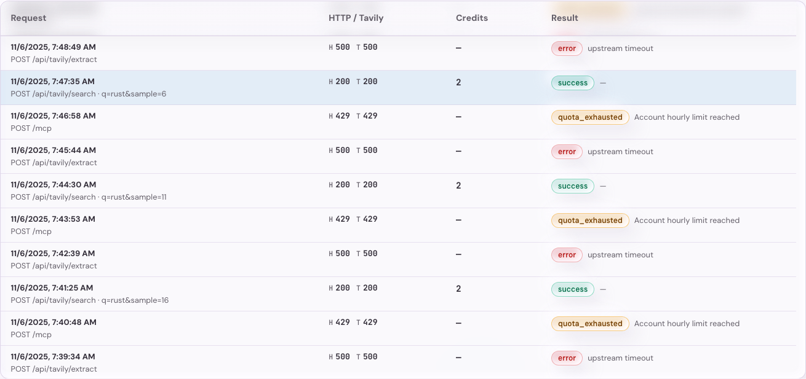
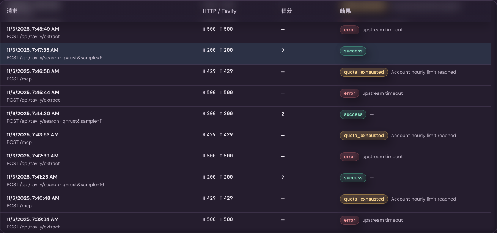

# 用户控制台 Token 近期请求计费筛选（#yphq4）

## Summary

用户控制台 Token 详情页的近期请求列表需要从固定最近 20 条扩展为最近 50 条，并提供“全部 / 额度消耗”二选一过滤。额度消耗的语义沿用项目内 request kind 计费分类：`counts_business_quota = true`，不按实际扣费金额或 `quota_exhausted` 结果状态推断。

## Goals

- 用户态 `GET /api/user/tokens/:id/logs` 支持 `billing=all|billable`，默认 `all`，并将用户态 `limit` 上限提升到 50。
- 用户态日志响应暴露 `countsBusinessQuota`，用于前端区分计费类型，同时继续只返回已脱敏的请求路径、查询、状态、错误与积分字段。
- `/console/tokens/:id` 的近期请求区显示最近 50 条，并在标题区提供“全部 / 额度消耗”筛选控件；桌面详情页最多露出 10 行，超出后列表内滚动。
- 移动端 Token 详情页只显示近期请求入口，完整 50 条记录与筛选控件在 `/console/tokens/:id/logs` 独立页面查看。
- Storybook 覆盖桌面与移动 Token Detail 场景，验证筛选控件、计费类型过滤和现有紧凑日志布局。
- 桌面内滚动表格使用全站通用 sticky 表头表面；表头以高遮挡背景和轻量背景模糊隔离滚动内容，明暗主题及不支持背景模糊的环境均不得明显透出正文文字。

## Non-goals

- 不新增分页、无限滚动、自由搜索或多维 request kind 筛选。
- 不改变管理端 Token 详情、public token logs 或 MCP helper 的现有查询语义。
- 不把“额度消耗”改成 `business_credits > 0` 或 `result_status = quota_exhausted`。
- 不触碰生产 Tavily upstream，验证仅使用本地或 Storybook mock 数据。

## Interface Contract

- `GET /api/user/tokens/:id/logs?limit=50&billing=all` 返回该用户拥有的 Token 最近最多 50 条日志，按 `created_at DESC, id DESC` 排序。
- `GET /api/user/tokens/:id/logs?limit=50&billing=billable` 返回最近最多 50 条 `counts_business_quota = true` 的日志。
- 缺省 `billing`、空值或未知值按 `all` 处理，保持兼容。
- 用户态日志 JSON 使用 camelCase，新增 `countsBusinessQuota: boolean`。

## Acceptance

- Token 详情页默认显示“近期请求（50 条）”并加载 `billing=all`。
- 点击“额度消耗”后重新请求 `billing=billable`，列表只显示计费类型请求；空结果显示现有空状态。
- 桌面表格和移动卡片不新增横向滚动，不遮挡请求状态、积分或错误文本；桌面详情列表最多显示 10 行。
- 桌面近期请求滚动时表头保持固定，正文文字在表头下方不可辨认；普通非 sticky 表头的现有视觉保持不变。
- 移动端详情页的近期请求区不直接堆叠 50 条卡片，独立日志页标题不换行，筛选控件位于标题行右侧。
- 后端针对用户 Token logs 的权限校验、脱敏与 OAuth 可用性检查保持不变。

## Visual Evidence

桌面近期请求滚动后的 sticky 表头使用同步模糊背景和半透明主题色覆盖，正文在表头内只保留不可辨认的模糊轮廓。

PR: include

PR: include

桌面 Token 详情页保留 50 条数据，但近期请求表格只显示 10 行并在表格内部滚动：

移动端 Token 详情页只保留近期请求入口，避免 50 条记录挤占详情内容：

移动端深色模式下近期请求入口保持可读对比度与无横向溢出：

移动端独立近期请求页承载完整列表与“全部 / 额度消耗”筛选，标题保持单行：

