# Web Claymorphism Redesign

## Status

active

## Summary

Tavily Hikari's web surfaces adopt a light high-fidelity claymorphism visual system across the public homepage, user console, admin console, authentication screens, and shared UI components. The redesign keeps the existing React/Vite/Tailwind/shadcn architecture and does not change backend APIs or data contracts.

## Scope

- Centralize clay palette, typography, radii, elevation, motion, and reduced-motion behavior.
- Upgrade shared UI wrappers and legacy compatibility classes so existing pages inherit the new material language.
- Keep admin data tables, request logs, quota controls, and settings panels dense and readable.
- Keep Storybook as the primary review surface for page and component states.

## Non-goals

- No backend API, database, authentication, proxy, or quota behavior changes.
- No new design framework or daisyUI runtime dependency.
- No marketing-only landing page rewrite that hides the actual proxy workflows.

## Design Contract

- Default surface is light tropical clay with a pale lavender canvas and saturated violet, pink, sky, emerald, and amber accents.
- Headings and large labels use Nunito; body and controls use DM Sans; code, tokens, and request paths remain monospace.
- Buttons lift on hover and compress on active press. Inputs and selected controls use recessed pressed shadows.
- Cards and panels use multi-layer clay shadows, but admin list and table density remains suitable for repeated operations.
- Decorative motion must respect `prefers-reduced-motion`.

## Acceptance Criteria

- Public, user console, admin, login, registration paused, and fallback/error states share the same clay token system.
- Shared shadcn/Radix wrappers visually match the global compatibility classes.
- Storybook covers the redesigned UI in light mode and retains dark-mode compatibility.
- Visual evidence is captured from stable Storybook or mock UI sources and stored under this spec.
- `cd web && bun run build` passes.

## Visual Evidence

- source_type: storybook_canvas
  target_program: mock-only
  capture_scope: browser-viewport
  requested_viewport: 1440x1100
  viewport_strategy: browser-resize-fallback
  sensitive_exclusion: N/A
  submission_gate: pending-owner-approval
  story_id_or_title: design-system-claymorphism--overview
  state: clay token and component gallery
  evidence_note: verifies the shared clay palette, typography, controls, status badges, and dense table sample.
  PR: include
  image:
  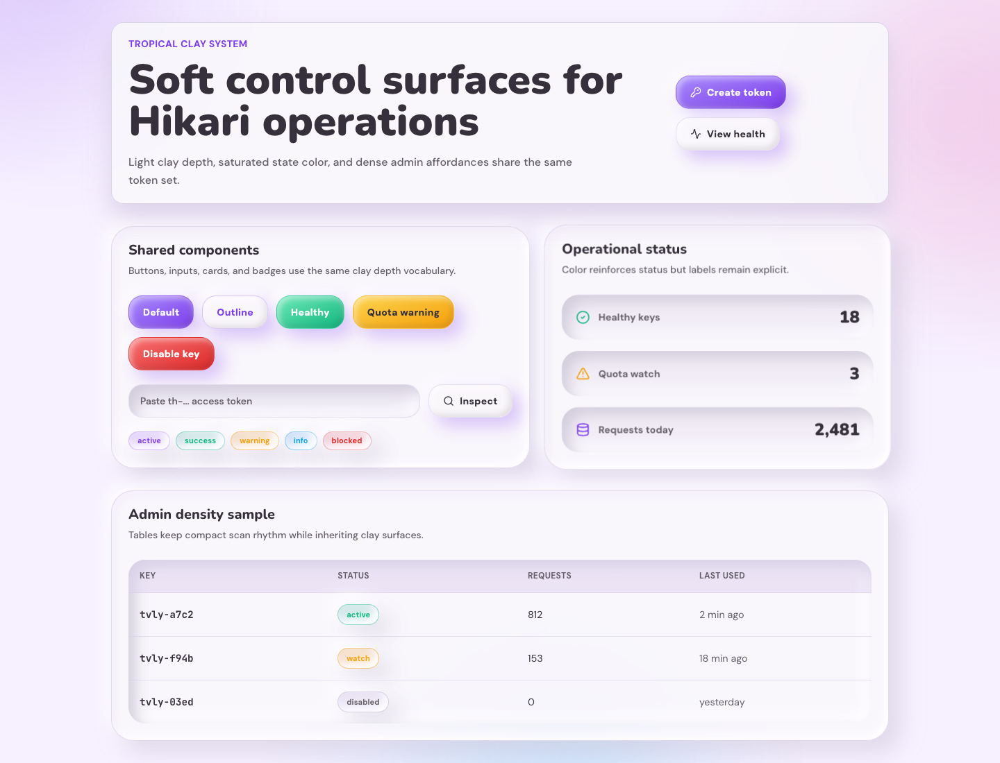

- source_type: storybook_canvas
  target_program: mock-only
  capture_scope: browser-viewport
  requested_viewport: 1440x1200
  viewport_strategy: browser-resize-fallback
  sensitive_exclusion: N/A
  submission_gate: pending-owner-approval
  story_id_or_title: admin-pages--dashboard
  state: admin dashboard density
  evidence_note: verifies the restrained clay treatment for the admin shell and data-dense dashboard cards.
  PR: include
  image:
  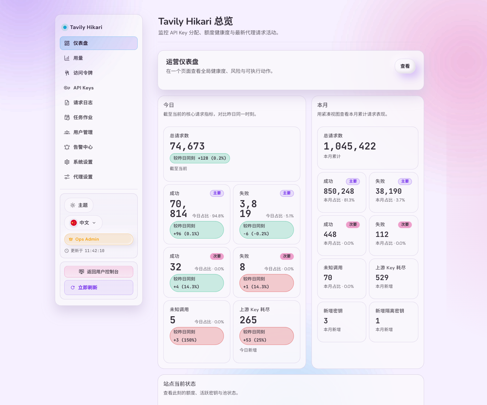

- source_type: storybook_canvas
  target_program: mock-only
  capture_scope: browser-viewport
  requested_viewport: 390x1100
  viewport_strategy: browser-resize-fallback
  sensitive_exclusion: N/A
  submission_gate: pending-owner-approval
  story_id_or_title: public-publichomeherocard--logged-out-no-token
  state: mobile public hero
  evidence_note: verifies the mobile public homepage clay hero, buttons, metrics, and solid readable headline.
  PR: include
  image:
  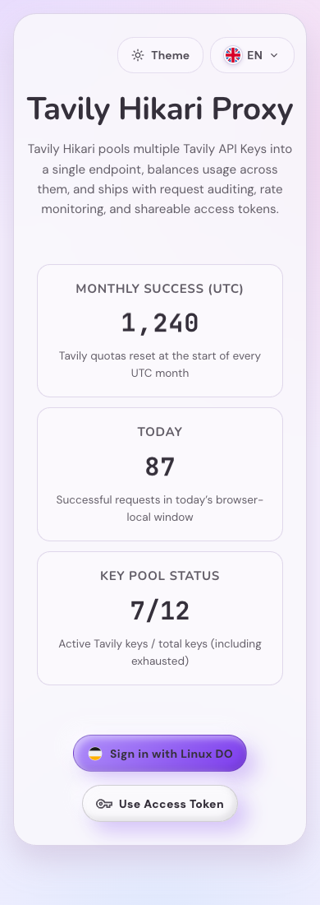

- source_type: storybook_canvas
  target_program: mock-only
  capture_scope: browser-viewport
  requested_viewport: 390x900
  viewport_strategy: browser-resize-fallback
  sensitive_exclusion: N/A
  submission_gate: pending-owner-approval
  story_id_or_title: public-pages-registrationpaused--default
  state: mobile registration paused
  evidence_note: verifies the clay treatment for the registration paused route and fallback action.
  PR: include
  image:
  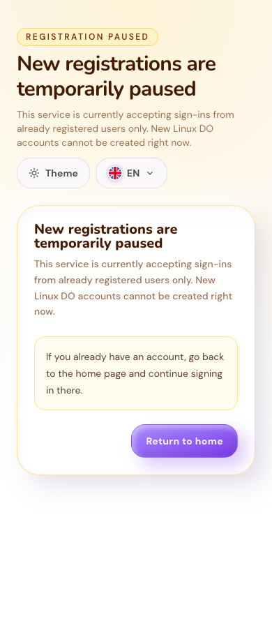

- source_type: web_demo
  target_program: mock-only
  capture_scope: browser-viewport
  requested_viewport: 1440x1000
  viewport_strategy: playwright-chrome
  sensitive_exclusion: mock API runtime only
  submission_gate: pending-owner-approval
  route: /?demo=1
  state: public route board
  evidence_note: verifies the non-template public hero with reduced card elevation, traffic routing board, metric rail, and demo-mode badge.
  PR: include
  image:
  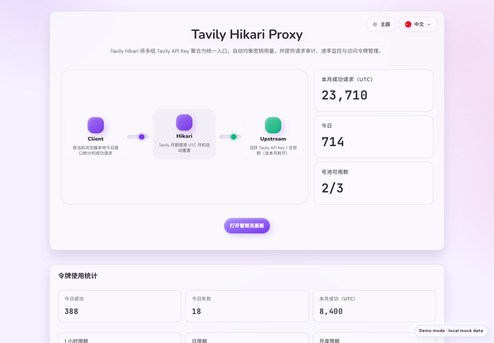

- source_type: web_demo
  target_program: mock-only
  capture_scope: browser-viewport
  requested_viewport: 1440x1000
  viewport_strategy: playwright-chrome
  sensitive_exclusion: mock API runtime only
  submission_gate: pending-owner-approval
  route: /admin.html?demo=1
  state: admin priority panel
  evidence_note: verifies the admin overview leads with operational priority while repeated cards use calmer borders and minimal elevation.
  PR: include
  image:
  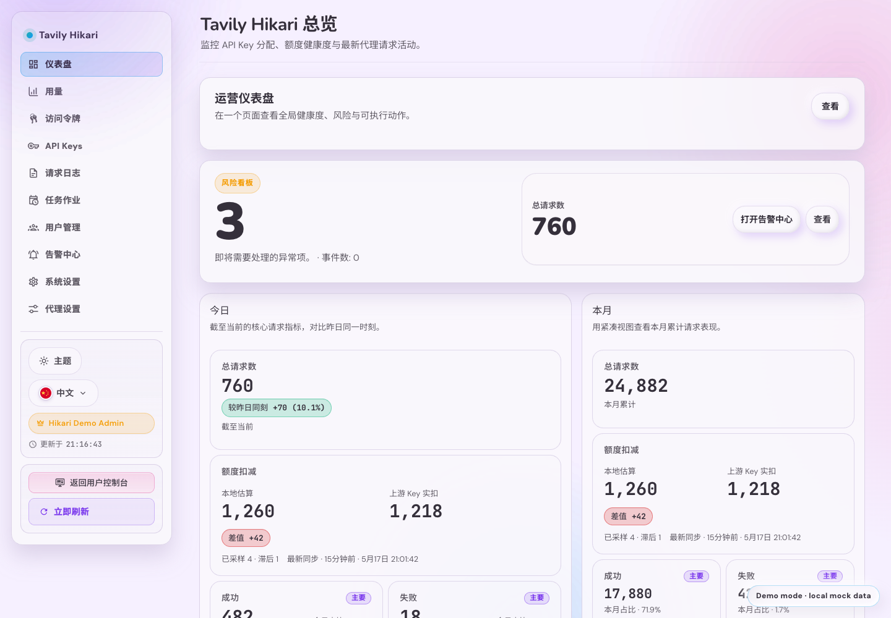

- source_type: web_demo
  target_program: mock-only
  capture_scope: browser-viewport
  requested_viewport: 1440x1100
  viewport_strategy: headless-chrome-cdp
  sensitive_exclusion: mock API runtime only
  submission_gate: pending-owner-approval
  route: /admin
  state: clay material rebalance admin desktop
  evidence_note: verifies the Admin dashboard keeps dense data grouping while restoring visible clay material shadows, rim lights, recessed priority surfaces, and tactile buttons.
  PR: include
  image:
  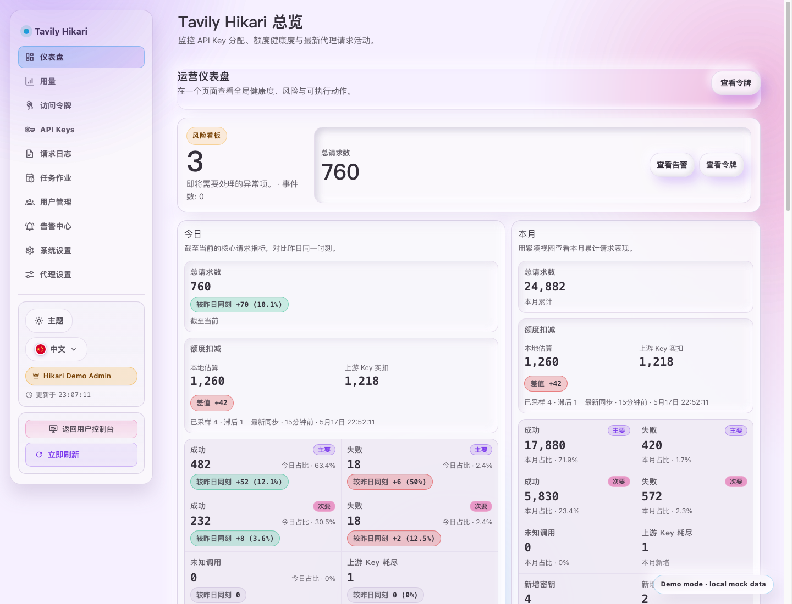

- source_type: web_demo
  target_program: mock-only
  capture_scope: browser-viewport
  requested_viewport: 390x900
  viewport_strategy: headless-chrome-cdp
  sensitive_exclusion: mock API runtime only
  submission_gate: pending-owner-approval
  route: /admin
  state: clay material rebalance admin mobile
  evidence_note: verifies the stronger clay material treatment does not reintroduce mobile header overlap, horizontal overflow, console warnings, or small mobile touch targets.
  PR: include
  image:
  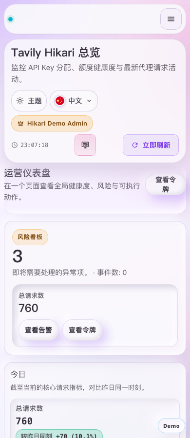

- source_type: web_demo
  target_program: mock-only
  capture_scope: browser-viewport
  requested_viewport: 1440x1100
  viewport_strategy: headless-chrome-cdp
  sensitive_exclusion: mock API runtime only
  submission_gate: pending-owner-approval
  route: /
  state: clay material rebalance public desktop
  evidence_note: verifies the public page now carries a more recognizable clay material through stronger ambient blobs, convex routing nodes, tactile buttons, and soft outer surfaces.
  PR: include
  image:
  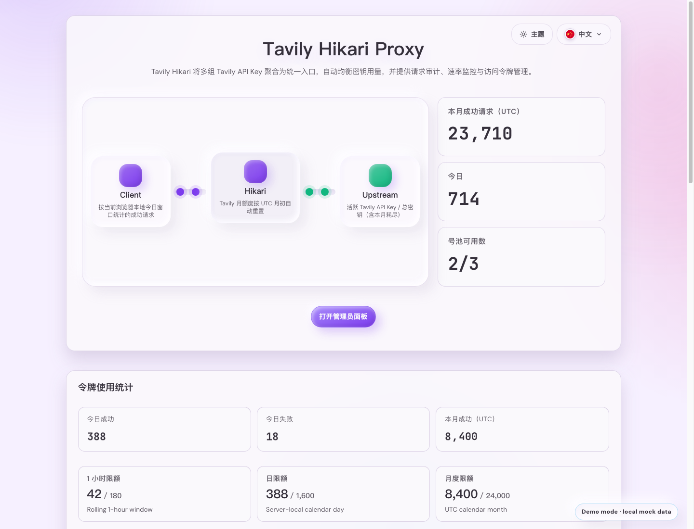

- source_type: web_demo
  target_program: mock-only
  capture_scope: browser-viewport
  requested_viewport: 1440x1100
  viewport_strategy: headless-chrome-cdp
  sensitive_exclusion: mock API runtime only
  submission_gate: pending-owner-approval
  route: /admin
  state: critique fix dense admin dashboard
  evidence_note: verifies the Admin homepage uses a denser operations-console hierarchy, less nested card elevation, clearer action labels, and no visible duplicate H1.
  PR: include
  image:
  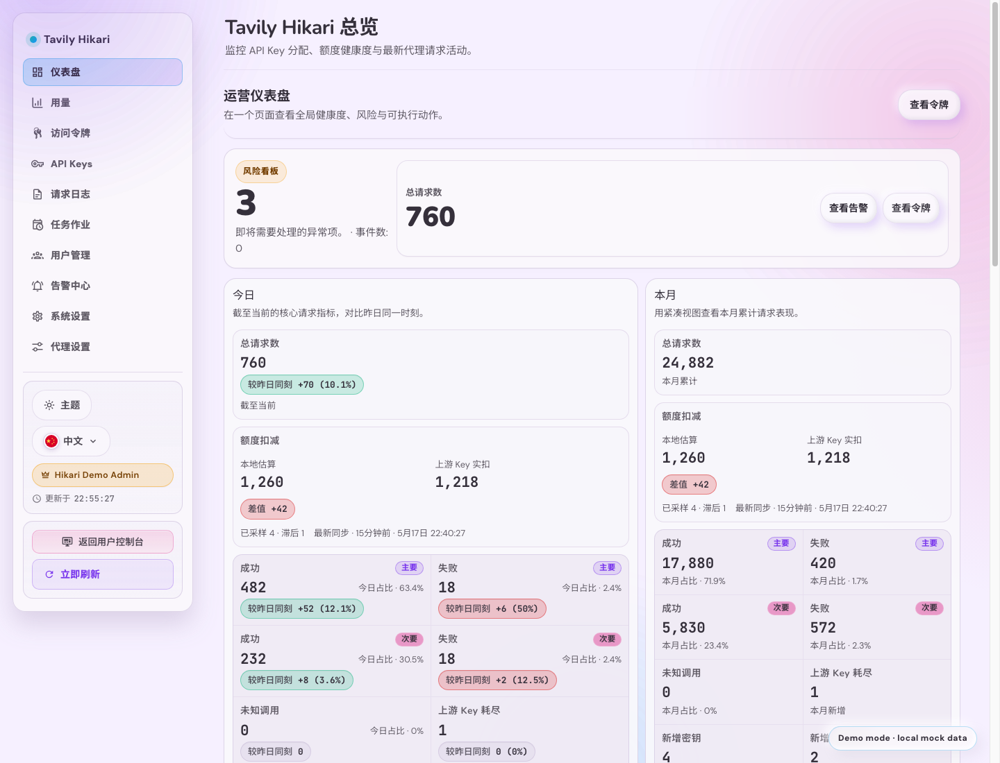

- source_type: web_demo
  target_program: mock-only
  capture_scope: browser-viewport
  requested_viewport: 390x900
  viewport_strategy: headless-chrome-cdp
  sensitive_exclusion: mock API runtime only
  submission_gate: pending-owner-approval
  route: /admin
  state: critique fix mobile admin header
  evidence_note: verifies the mobile Admin sidebar control no longer collides with the page header, with no horizontal overflow and no small mobile touch targets.
  PR: include
  image:
  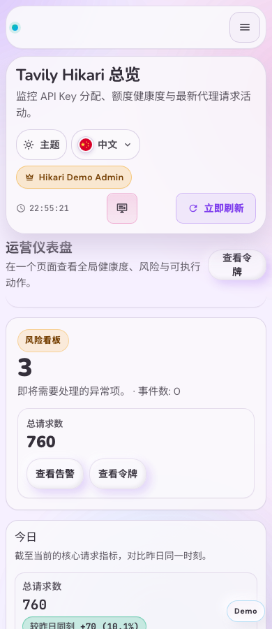

- source_type: web_demo
  target_program: mock-only
  capture_scope: browser-viewport
  requested_viewport: 1440x1100
  viewport_strategy: headless-chrome-cdp
  sensitive_exclusion: mock API runtime only
  submission_gate: pending-owner-approval
  route: /
  state: critique fix condensed public guide
  evidence_note: verifies the public guide exposes the primary clients first and moves secondary clients behind a compact menu.
  PR: include
  image:
  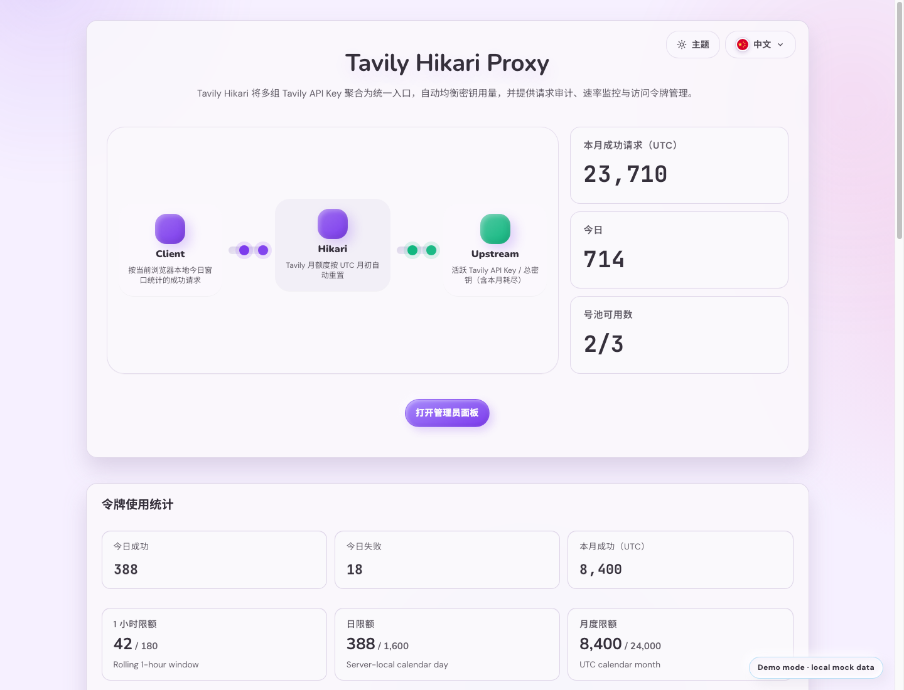

- source_type: web_demo
  target_program: mock-only
  capture_scope: browser-viewport
  requested_viewport: 390x900
  viewport_strategy: headless-chrome-cdp
  sensitive_exclusion: mock API runtime only
  submission_gate: pending-owner-approval
  route: /login.html
  state: critique fix login title hierarchy
  evidence_note: verifies the login page no longer repeats the same Admin Login heading and keeps the mobile form compact with no small touch targets.
  PR: include
  image:
  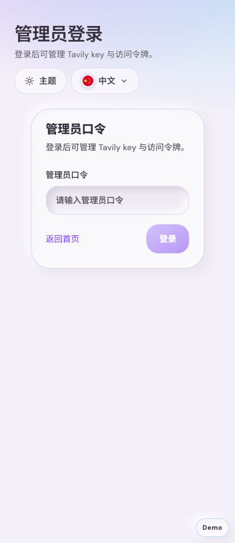

- source_type: web_demo
  target_program: mock-only
  capture_scope: browser-viewport
  requested_viewport: 390x920
  viewport_strategy: playwright-chrome
  sensitive_exclusion: mock API runtime only
  submission_gate: pending-owner-approval
  route: /?demo=1
  state: mobile demo badge
  evidence_note: verifies the mobile route-board layout, reduced card treatment, and compact demo marker without blocking key content.
  PR: include
  image:
  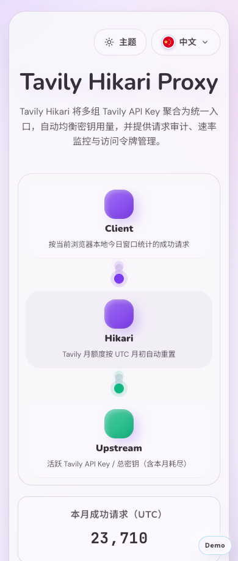

- source_type: web_demo
  target_program: mock-only
  capture_scope: browser-viewport
  requested_viewport: 390x920
  viewport_strategy: playwright-chrome
  sensitive_exclusion: mock API runtime only
  submission_gate: pending-owner-approval
  route: /admin.html?demo=1
  state: audit fix mobile admin
  evidence_note: verifies the mobile admin route has no horizontal overflow and keeps touch targets reachable after the audit fixes.
  PR: include
  image:
  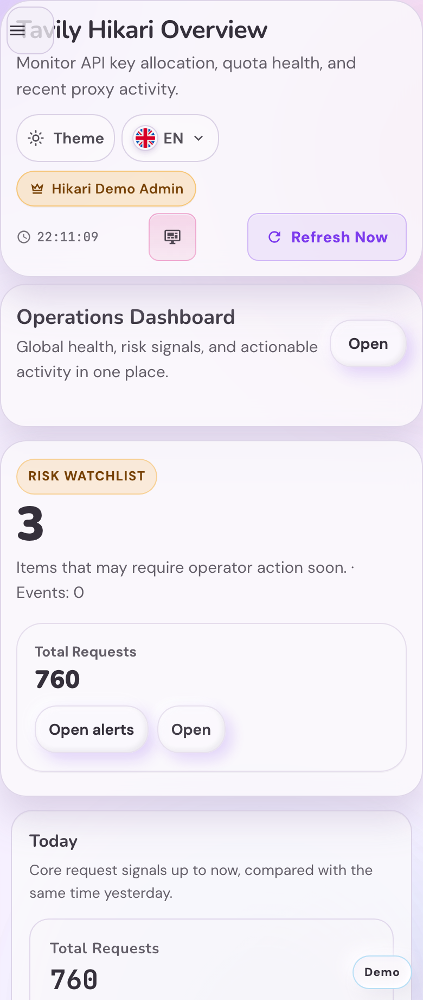

- source_type: web_demo
  target_program: mock-only
  capture_scope: browser-viewport
  requested_viewport: 390x920
  viewport_strategy: playwright-chrome
  sensitive_exclusion: mock API runtime only
  submission_gate: pending-owner-approval
  route: /?demo=1
  state: audit fix mobile public
  evidence_note: verifies public mobile links and guide controls meet the mobile touch-target fixes without reintroducing overflow.
  PR: include
  image:
  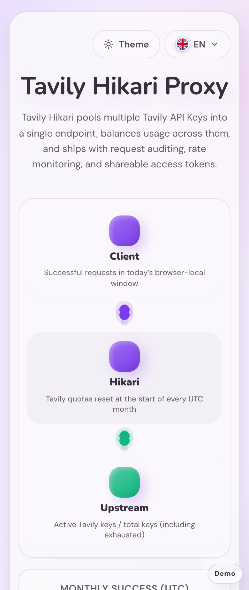
